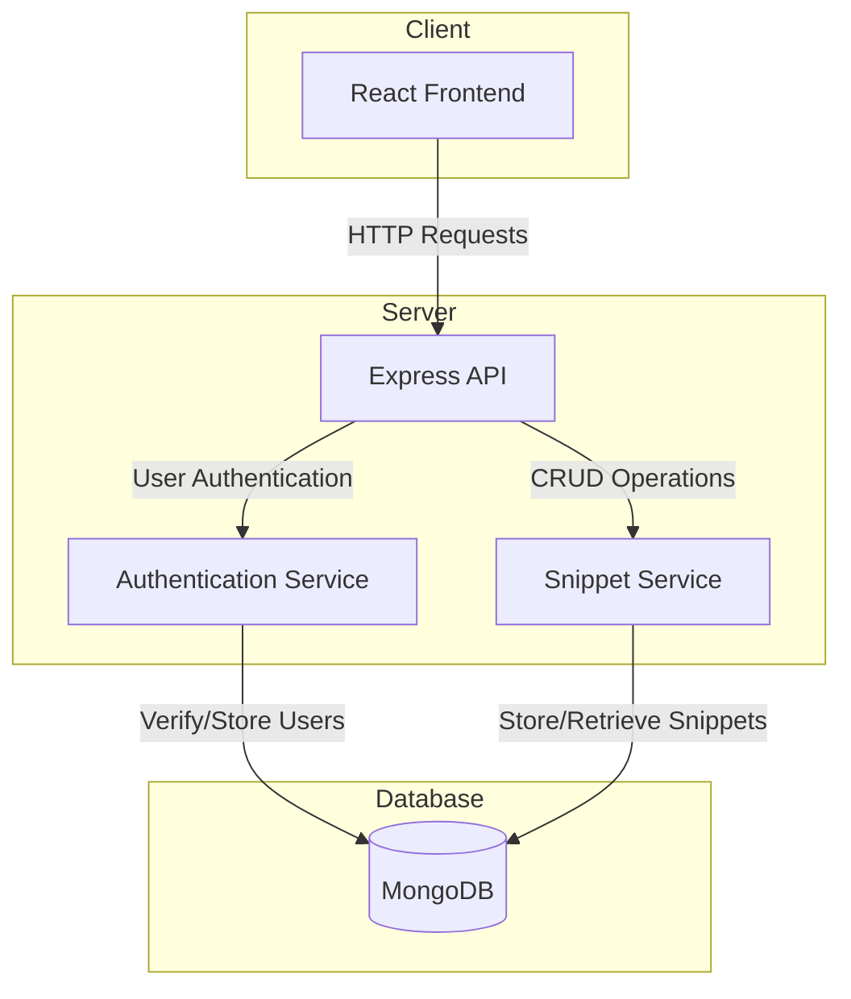
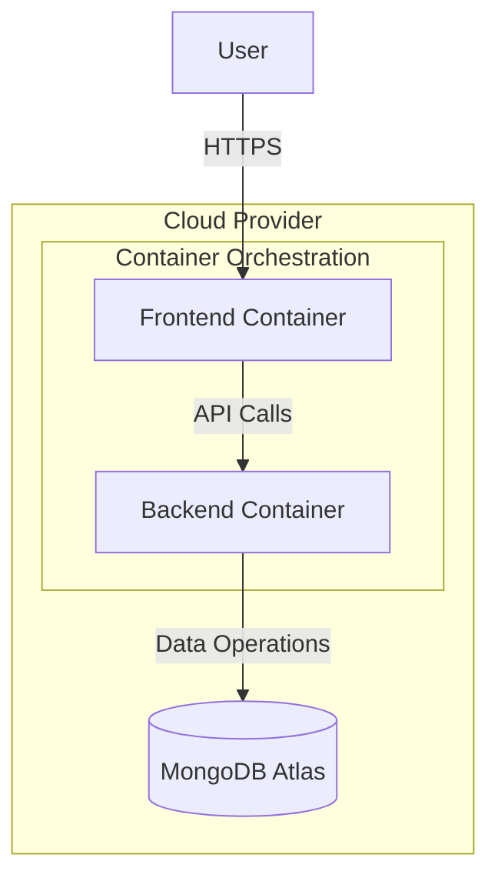

# TinyNotes System Architecture

## Overview
TinyNotes is a minimal text-sharing application where users can create, view, and manage text snippets via a simple web interface. The application allows users to create accounts, create text snippets, mark them as public or private, and share them via unique URLs.

## System Architecture Diagram



## Stack Selection

### Frontend
- **Framework**: React.js
- **State Management**: React Context API
- **Routing**: React Router
- **UI Components**: Material-UI
- **HTTP Client**: Axios

React.js is chosen for its component-based architecture, which makes it easy to build and maintain the UI components required for TinyNotes. The application has relatively simple state management needs, so the Context API should be sufficient without requiring Redux.

### Backend
- **Runtime**: Node.js
- **Framework**: Express.js
- **Authentication**: JWT (JSON Web Tokens)
- **Validation**: Joi
- **API Documentation**: Swagger/OpenAPI

Express.js provides a lightweight and flexible framework for building the REST API. JWT is used for stateless authentication, which works well with the application's requirements.

### Database
- **Database**: MongoDB
- **ODM**: Mongoose

MongoDB is selected as the database because:
1. The data structure (users and snippets) fits well with a document-based model
2. Schema flexibility allows for easy evolution of the application
3. Good performance for read-heavy operations
4. Mongoose ODM provides schema validation and simplifies interactions with the database

## Component Details

### User Authentication Service
- Handles user registration and login
- Issues and validates JWT tokens
- Manages password hashing and security

### Snippet Service
- Creates, retrieves, updates, and deletes snippets
- Enforces access control based on snippet privacy settings
- Generates unique IDs for public snippet URLs

### Database Schema

#### User Collection
```
{
  _id: ObjectId,
  email: String,
  password: String (hashed),
  createdAt: Date,
  updatedAt: Date
}
```

#### Snippet Collection
```
{
  _id: ObjectId,
  userId: ObjectId (reference to User),
  title: String,
  content: String,
  isPublic: Boolean,
  createdAt: Date,
  updatedAt: Date
}
```

## API Endpoints

### Authentication
- `POST /api/auth/register` - Register a new user
- `POST /api/auth/login` - Login and receive JWT

### Snippets
- `GET /api/snippets` - Get all snippets for the logged-in user
- `GET /api/snippets/:id` - Get a specific snippet (checks authorization)
- `POST /api/snippets` - Create a new snippet
- `DELETE /api/snippets/:id` - Delete a snippet (checks ownership)

### Public Access
- `GET /public/snippets/:id` - Access a public snippet without authentication

## Security Considerations
- All API endpoints (except public snippet access) require authentication
- Private snippets are only accessible to their owners
- Password hashing using bcrypt
- HTTPS for all communications
- Input validation on all API endpoints
- CORS configuration to restrict access to the API

## Deployment Architecture
The application can be deployed using a containerized approach:



- Frontend: Containerized React application served via Nginx
- Backend: Containerized Node.js/Express application
- Database: MongoDB Atlas (managed MongoDB service)
- Deployment: Docker containers orchestrated with Kubernetes or simpler alternatives like Docker Compose

## Scalability Considerations
- Horizontal scaling of frontend and backend containers
- Database indexing for frequently accessed fields
- Caching layer could be added for frequently accessed snippets
- CDN for static assets
