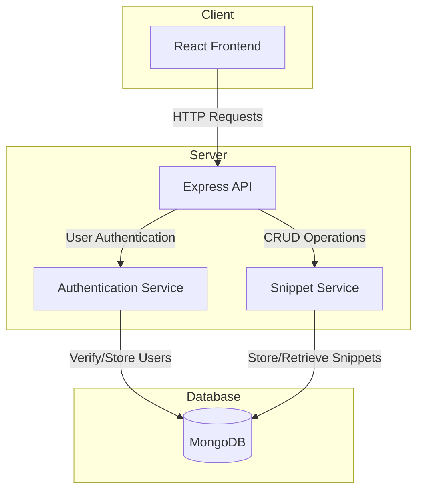
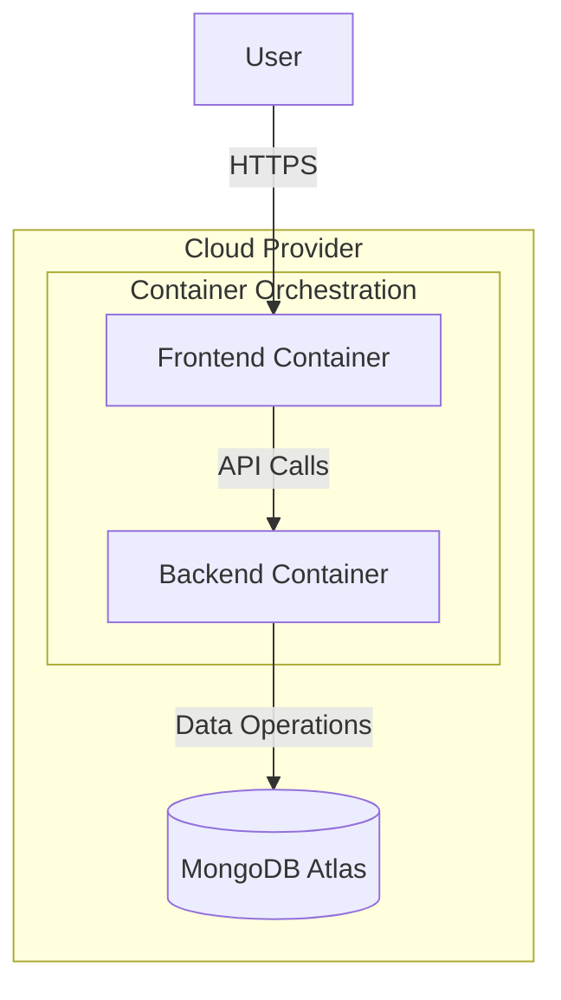
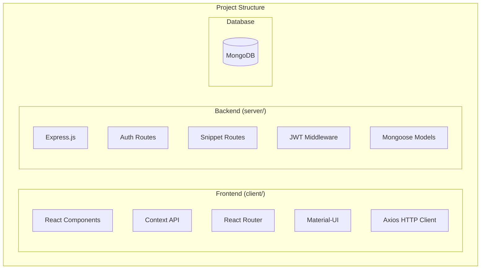

**User:**

<task>
using 'FunctionalSpec.md' (see below for file content) and 'Architecture.md' (see below for file content) build run and test the app
</task>

<file_content path="FunctionalSpec.md">
Application Name: TinyNotes
A minimal text-sharing application where users can create, view, and manage text snippets via a simple web interface.

1. Functional Requirements
Core Features
User Signup & Login

Users can create an account with an email/password.
Logged-in users can create, view, and delete their own snippets.
Snippet Creation

Users can enter a title and text content into a form.
Upon saving, the snippet is assigned a unique ID and stored in the system.
Snippets can be marked public (anyone can view via a link) or private (only the creator can view).
Snippet Viewing

Users can see a list of their own snippets.
Public snippets can be accessed via a unique URL.
Private snippets should only be visible to the creator.
Snippet Deletion

Users can delete their own snippets.
2. User Interface & Page Structure
1. Home Page (/)
If not logged in: Show a login/signup form.
If logged in: Show a dashboard with a list of the user’s snippets and an option to create new ones.
2. Login/Signup Page (/login)
Simple form to authenticate users.
3. Create Snippet Page (/new)
Form with:
Title (text field)
Content (multi-line text box)
Privacy setting (Public / Private)
Submit button
4. View Snippet Page (/snippet/{id})
Displays the snippet’s title and content.
If public: Anyone with the link can view.
If private: Only the owner should be able to view it.
5. Delete Snippet (/delete/{id})
Button to delete snippet (only for owner).
Should require authentication and check ownership.
</file_content>

<file_content path="Architecture.md">
# TinyNotes System Architecture

## Overview
TinyNotes is a minimal text-sharing application where users can create, view, and manage text snippets via a simple web interface. The application allows users to create accounts, create text snippets, mark them as public or private, and share them via unique URLs.

## System Architecture Diagram



## Stack Selection

### Frontend
- **Framework**: React.js
- **State Management**: React Context API
- **Routing**: React Router
- **UI Components**: Material-UI
- **HTTP Client**: Axios

React.js is chosen for its component-based architecture, which makes it easy to build and maintain the UI components required for TinyNotes. The application has relatively simple state management needs, so the Context API should be sufficient without requiring Redux.

### Backend
- **Runtime**: Node.js
- **Framework**: Express.js
- **Authentication**: JWT (JSON Web Tokens)
- **Validation**: Joi
- **API Documentation**: Swagger/OpenAPI

Express.js provides a lightweight and flexible framework for building the REST API. JWT is used for stateless authentication, which works well with the application's requirements.

### Database
- **Database**: MongoDB
- **ODM**: Mongoose

MongoDB is selected as the database because:
1. The data structure (users and snippets) fits well with a document-based model
2. Schema flexibility allows for easy evolution of the application
3. Good performance for read-heavy operations
4. Mongoose ODM provides schema validation and simplifies interactions with the database

## Component Details

### User Authentication Service
- Handles user registration and login
- Issues and validates JWT tokens
- Manages password hashing and security

### Snippet Service
- Creates, retrieves, updates, and deletes snippets
- Enforces access control based on snippet privacy settings
- Generates unique IDs for public snippet URLs

### Database Schema

#### User Collection
```
{
  _id: ObjectId,
  email: String,
  password: String (hashed),
  createdAt: Date,
  updatedAt: Date
}
```

#### Snippet Collection
```
{
  _id: ObjectId,
  userId: ObjectId (reference to User),
  title: String,
  content: String,
  isPublic: Boolean,
  createdAt: Date,
  updatedAt: Date
}
```

## API Endpoints

### Authentication
- `POST /api/auth/register` - Register a new user
- `POST /api/auth/login` - Login and receive JWT

### Snippets
- `GET /api/snippets` - Get all snippets for the logged-in user
- `GET /api/snippets/:id` - Get a specific snippet (checks authorization)
- `POST /api/snippets` - Create a new snippet
- `DELETE /api/snippets/:id` - Delete a snippet (checks ownership)

### Public Access
- `GET /public/snippets/:id` - Access a public snippet without authentication

## Security Considerations
- All API endpoints (except public snippet access) require authentication
- Private snippets are only accessible to their owners
- Password hashing using bcrypt
- HTTPS for all communications
- Input validation on all API endpoints
- CORS configuration to restrict access to the API

## Deployment Architecture
The application can be deployed using a containerized approach:



- Frontend: Containerized React application served via Nginx
- Backend: Containerized Node.js/Express application
- Database: MongoDB Atlas (managed MongoDB service)
- Deployment: Docker containers orchestrated with Kubernetes or simpler alternatives like Docker Compose

## Scalability Considerations
- Horizontal scaling of frontend and backend containers
- Database indexing for frequently accessed fields
- Caching layer could be added for frequently accessed snippets
- CDN for static assets

</file_content>
<environment_details>
# VSCode Visible Files
(No visible files)

# VSCode Open Tabs
(No open tabs)

# Current Time
20/03/2025, 9:35:53 pm (Australia/Sydney, UTC+11:00)

# Current Working Directory (/Users/john/code/tinynotes) Files
Architecture.md
FunctionalSpec.md
TechDefinition.md

# Current Mode
PLAN MODE
In this mode you should focus on information gathering, asking questions, and architecting a solution. Once you have a plan, use the plan_mode_response tool to engage in a conversational back and forth with the user. Do not use the plan_mode_response tool until you've gathered all the information you need e.g. with read_file or ask_followup_question.
(Remember: If it seems the user wants you to use tools only available in Act Mode, you should ask the user to "toggle to Act mode" (use those words) - they will have to manually do this themselves with the Plan/Act toggle button below. You do not have the ability to switch to Act Mode yourself, and must wait for the user to do it themselves once they are satisfied with the plan. You also cannot present an option to toggle to Act mode, as this will be something you need to direct the user to do manually themselves.)
</environment_details>

---

**Assistant:**

<read_file>
<path>TechDefinition.md</path>
</read_file>

[Response interrupted by a tool use result. Only one tool may be used at a time and should be placed at the end of the message.]

---

**User:**

[read_file for 'TechDefinition.md'] Result:
# Architecture & Technology Stack Definition

You are provided with a set of business rules and functional requirements. Your goal is to generate a detailed system architecture for implementing the application using the given programming language and framework.

Write this architecture to Architecute.md.

## Inputs:
- Functional requirements (see attached)
- Target language/framework: {INSERT_LANGUAGE_FRAMEWORK}

## Expected Output:
At least:
- **System Architecture Diagram:** Define the system components and their interactions.
- **Stack Selection:** Select an appropriate database, backend, and frontend framework.


<environment_details>
# VSCode Visible Files
(No visible files)

# VSCode Open Tabs
(No open tabs)

# Current Time
20/03/2025, 9:36:00 pm (Australia/Sydney, UTC+11:00)

# Current Mode
PLAN MODE
In this mode you should focus on information gathering, asking questions, and architecting a solution. Once you have a plan, use the plan_mode_response tool to engage in a conversational back and forth with the user. Do not use the plan_mode_response tool until you've gathered all the information you need e.g. with read_file or ask_followup_question.
(Remember: If it seems the user wants you to use tools only available in Act Mode, you should ask the user to "toggle to Act mode" (use those words) - they will have to manually do this themselves with the Plan/Act toggle button below. You do not have the ability to switch to Act Mode yourself, and must wait for the user to do it themselves once they are satisfied with the plan. You also cannot present an option to toggle to Act mode, as this will be something you need to direct the user to do manually themselves.)
</environment_details>

---

**Assistant:**

<plan_mode_response>
<response>
I've reviewed the FunctionalSpec.md and Architecture.md files for the TinyNotes application. Based on these documents, I'll now outline a plan to build, run, and test the application.

# TinyNotes Implementation Plan

## Project Structure
We'll create a full-stack application with:
1. React frontend (with Material-UI, React Router, and Axios)
2. Express.js backend (with JWT authentication, Joi validation)
3. MongoDB database (with Mongoose ODM)



## Implementation Steps

### 1. Project Setup
- Initialize project structure
- Set up package.json files for both frontend and backend
- Configure necessary dependencies
- Set up MongoDB connection

### 2. Backend Implementation
- Create Express server
- Implement MongoDB models (User and Snippet)
- Implement authentication service with JWT
- Create API endpoints for users and snippets
- Add validation and error handling
- Implement security measures

### 3. Frontend Implementation
- Set up React application with Create React App
- Implement UI components using Material-UI
- Create context for state management
- Set up routing with React Router
- Implement API integration with Axios
- Create all required pages:
  - Home/Dashboard
  - Login/Signup
  - Create Snippet
  - View Snippet
  - Delete Snippet functionality

### 4. Testing
- Test user registration and login
- Test snippet creation (both public and private)
- Test snippet viewing (ensure private snippets are only visible to owners)
- Test snippet deletion
- Test error handling and edge cases

### 5. Running the Application
- Start MongoDB
- Run the backend server
- Run the frontend application
- Access the application via browser

## Detailed Implementation Plan

### Backend (Express.js + MongoDB)

1. **User Authentication**
   - Implement user registration and login
   - JWT token generation and validation
   - Password hashing with bcrypt

2. **Snippet Management**
   - Create, read, and delete operations
   - Privacy controls (public vs. private)
   - Owner verification for protected operations

3. **API Endpoints**
   - Authentication routes
   - Snippet routes with proper authorization
   - Public access route for public snippets

### Frontend (React)

1. **Authentication UI**
   - Login form
   - Registration form
   - JWT storage and management

2. **Snippet Management UI**
   - Dashboard with list of user's snippets
   - Create snippet form
   - View snippet page
   - Delete snippet functionality

3. **Routing**
   - Protected routes for authenticated users
   - Public routes for unauthenticated access

Would you like me to proceed with implementing this plan? If so, please toggle to Act mode so I can start building the application. Before we begin, do you have any questions or adjustments to the plan?
</response>
</plan_mode_response>

---

**User:**

[plan_mode_response] Result:
[The user has switched to ACT MODE, so you may now proceed with the task.]
<environment_details>
# VSCode Visible Files
(No visible files)

# VSCode Open Tabs
(No open tabs)

# Current Time
20/03/2025, 9:36:23 pm (Australia/Sydney, UTC+11:00)

# Current Mode
ACT MODE
</environment_details>

---

**Assistant:**

<thinking>
Now that I'm in ACT MODE, I'll start implementing the TinyNotes application based on the plan I outlined. I'll begin by setting up the project structure and then implement both the backend and frontend components.

Let's start by creating the project structure:
1. First, I'll create the main project directory structure
2. Set up the backend (server) with Express.js, MongoDB, and JWT authentication
3. Set up the frontend (client) with React, Material-UI, and React Router

Let me begin by initializing the project structure.
</thinking>

<execute_command>
<command>mkdir -p server/src/{controllers,models,routes,middleware,config,utils} client/src/{components,contexts,pages,utils,services}</command>
<requires_approval>false</requires_approval>
</execute_command>

[Response interrupted by a tool use result. Only one tool may be used at a time and should be placed at the end of the message.]

---

**User:**

[execute_command for 'mkdir -p server/src/{controllers,models,routes,middleware,config,utils} client/src/{components,contexts,pages,utils,services}'] Result:
Command executed.
<environment_details>
# VSCode Visible Files
(No visible files)

# VSCode Open Tabs
(No open tabs)

# Current Time
20/03/2025, 9:36:34 pm (Australia/Sydney, UTC+11:00)

# Current Mode
ACT MODE
</environment_details>

---

**Assistant:**

<thinking>
Now that I've created the basic directory structure, I'll start by setting up the backend (server) first. I'll need to:

1. Initialize a Node.js project in the server directory
2. Install the necessary dependencies for the Express.js server
3. Create the basic server configuration

Let me start by initializing the Node.js project in the server directory.
</thinking>

<execute_command>
<command>cd server && npm init -y</command>
<requires_approval>false</requires_approval>
</execute_command>

[Response interrupted by a tool use result. Only one tool may be used at a time and should be placed at the end of the message.]

---

**User:**

[execute_command for 'cd server && npm init -y'] Result:
Command executed.
Output:
⠙Wrote to /Users/john/code/tinynotes/server/package.json:

{
  "name": "server"
  "version": "1.0.0"
  "main": "index.js"
  "scripts": {
    "test": "echo \"Error: no test specified\" && exit 1"
  }
  "keywords": []
  "author": ""
  "license": "ISC"
  "description": ""
}


⠙
<environment_details>
# VSCode Visible Files
(No visible files)

# VSCode Open Tabs
(No open tabs)

# Current Time
20/03/2025, 9:36:43 pm (Australia/Sydney, UTC+11:00)

# Current Mode
ACT MODE
</environment_details>

---

**Assistant:**

<thinking>
Now I'll install the necessary dependencies for the Express.js server. Based on the architecture document, we need:

1. Express.js - for the web server framework
2. Mongoose - for MongoDB ODM
3. bcrypt - for password hashing
4. jsonwebtoken - for JWT authentication
5. joi - for validation
6. cors - for Cross-Origin Resource Sharing
7. dotenv - for environment variables
8. express-async-errors - for handling async errors in Express

Let me install these dependencies.
</thinking>

<execute_command>
<command>cd server && npm install express mongoose bcrypt jsonwebtoken joi cors dotenv express-async-errors</command>
<requires_approval>false</requires_approval>
</execute_command>

[Response interrupted by a tool use result. Only one tool may be used at a time and should be placed at the end of the message.]

---

**User:**

[execute_command for 'cd server && npm install express mongoose bcrypt jsonwebtoken joi cors dotenv express-async-errors'] Result:
Command executed.
Output:
⠙⠹⠸⠼⠴⠦⠧⠇⠏⠋⠙⠹⠸⠼⠴⠦⠧⠇⠏⠋⠙⠹⠸⠼⠴⠦⠧⠇⠏⠋⠙⠹⠸⠼⠴⠦⠧⠇⠏⠋⠙⠹⠸⠼⠴⠦⠧⠇npm warn deprecated inflight@1.0.6: This module is not supported and leaks memory. Do not use it. Check out lru-cache if you want a good and tested way to coalesce async requests by a key value which is much more comprehensive and powerful.
⠇npm warn deprecated rimraf@3.0.2: Rimraf versions prior to v4 are no longer supported
⠇npm warn deprecated glob@7.2.3: Glob versions prior to v9 are no longer supported
⠇npm warn deprecated are-we-there-yet@2.0.0: This package is no longer supported.
⠇npm warn deprecated npmlog@5.0.1: This package is no longer supported.
⠇npm warn deprecated gauge@3.0.2: This package is no longer supported.
⠇⠏⠋⠙⠹⠸⠼⠴⠦⠧⠇⠏⠋⠙⠹⠸⠼⠴⠦⠧⠇⠏⠋⠙⠹⠸⠼⠴⠦⠧⠇
added 170 packages and audited 171 packages in 7s
⠏
⠏19 packages are looking for funding
⠏  run `npm fund` for details
⠏
found 0 vulnerabilities
⠏
<environment_details>
# VSCode Visible Files
(No visible files)

# VSCode Open Tabs
(No open tabs)

# Current Time
20/03/2025, 9:36:54 pm (Australia/Sydney, UTC+11:00)

# Current Mode
ACT MODE
</environment_details>

---

**Assistant:**

<thinking>
Now I'll install the development dependencies for the server:

1. nodemon - for automatic server restart during development
</thinking>

<execute_command>
<command>cd server && npm install --save-dev nodemon</command>
<requires_approval>false</requires_approval>
</execute_command>

[Response interrupted by a tool use result. Only one tool may be used at a time and should be placed at the end of the message.]

---

**User:**

[execute_command for 'cd server && npm install --save-dev nodemon'] Result:
Command executed.
Output:
⠙⠹⠸⠼⠴⠦⠧⠇⠏⠋⠙⠹⠸⠼⠴⠦⠧⠇⠏⠋⠙⠹⠸
added 24 packages and audited 195 packages in 2s
⠸
⠸23 packages are looking for funding
⠸  run `npm fund` for details
⠸
found 0 vulnerabilities
⠸
<environment_details>
# VSCode Visible Files
(No visible files)

# VSCode Open Tabs
(No open tabs)

# Current Time
20/03/2025, 9:37:04 pm (Australia/Sydney, UTC+11:00)

# Current Mode
ACT MODE
</environment_details>

---

**Assistant:**

<thinking>
Now I'll update the package.json file in the server directory to add scripts for running the server in development and production modes.
</thinking>

<read_file>
<path>server/package.json</path>
</read_file>

[Response interrupted by a tool use result. Only one tool may be used at a time and should be

[Response interrupted by a tool use result. Only one tool may be used at a time and should be placed at the end of the message.]

---

**User:**

[read_file for 'server/package.json'] Result:
{
  "name": "server",
  "version": "1.0.0",
  "main": "index.js",
  "scripts": {
    "test": "echo \"Error: no test specified\" && exit 1"
  },
  "keywords": [],
  "author": "",
  "license": "ISC",
  "description": "",
  "dependencies": {
    "bcrypt": "^5.1.1",
    "cors": "^2.8.5",
    "dotenv": "^16.4.7",
    "express": "^4.21.2",
    "express-async-errors": "^3.1.1",
    "joi": "^17.13.3",
    "jsonwebtoken": "^9.0.2",
    "mongoose": "^8.12.1"
  },
  "devDependencies": {
    "nodemon": "^3.1.9"
  }
}

<environment_details>
# VSCode Visible Files
(No visible files)

# VSCode Open Tabs
(No open tabs)

# Current Time
20/03/2025, 9:37:10 pm (Australia/Sydney, UTC+11:00)

# Current Mode
ACT MODE
</environment_details>

---

**Assistant:**

<thinking>
Now I'll update the package.json file to add scripts for running the server in development and production modes.
</thinking>

<replace_in_file>
<path>server/package.json</path>
<diff>
<<<<<<< SEARCH
  "scripts": {
    "test": "echo \"Error: no test specified\" && exit 1"
  },
=======
  "scripts": {
    "start": "node src/index.js",
    "dev": "nodemon src/index.js",
    "test": "echo \"Error: no test specified\" && exit 1"
  },
>>>>>>> REPLACE
</diff>
</replace_in_file>

[Response interrupted by a tool use result. Only one tool may be used at a time and should be placed at the end of the message.]

---

**User:**

[replace_in_file for 'server/package.json'] Result:
The content was successfully saved to server/package.json.

Here is the full, updated content of the file that was saved:

<final_file_content path="server/package.json">
{
  "name": "server",
  "version": "1.0.0",
  "main": "index.js",
  "scripts": {
    "start": "node src/index.js",
    "dev": "nodemon src/index.js",
    "test": "echo \"Error: no test specified\" && exit 1"
  },
  "keywords": [],
  "author": "",
  "license": "ISC",
  "description": "",
  "dependencies": {
    "bcrypt": "^5.1.1",
    "cors": "^2.8.5",
    "dotenv": "^16.4.7",
    "express": "^4.21.2",
    "express-async-errors": "^3.1.1",
    "joi": "^17.13.3",
    "jsonwebtoken": "^9.0.2",
    "mongoose": "^8.12.1"
  },
  "devDependencies": {
    "nodemon": "^3.1.9"
  }
}

</final_file_content>

IMPORTANT: For any future changes to this file, use the final_file_content shown above as your reference. This content reflects the current state of the file, including any auto-formatting (e.g., if you used single quotes but the formatter converted them to double quotes). Always base your SEARCH/REPLACE operations on this final version to ensure accuracy.


<environment_details>
# VSCode Visible Files
server/package.json

# VSCode Open Tabs
server/package.json

# Current Time
20/03/2025, 9:37:24 pm (Australia/Sydney, UTC+11:00)

# Current Mode
ACT MODE
</environment_details>

---

**Assistant:**

<thinking>
Now I'll create the basic server configuration files. First, let's create a .env file for environment variables.
</thinking>

<write_to_file>
<path>server/.env</path>
<content>PORT=5000
MONGODB_URI=mongodb://localhost:27017/tinynotes
JWT_SECRET=your_jwt_secret_key_here
JWT_EXPIRES_IN=1d
</content>
</write_to_file>

[Response interrupted by a tool use result. Only one tool may be used at a time and should be placed at the end of the message.]

---

**User:**

[write_to_file for 'server/.env'] Result:
The content was successfully saved to server/.env.

Here is the full, updated content of the file that was saved:

<final_file_content path="server/.env">
PORT=5000
MONGODB_URI=mongodb://localhost:27017/tinynotes
JWT_SECRET=your_jwt_secret_key_here
JWT_EXPIRES_IN=1d

</final_file_content>

IMPORTANT: For any future changes to this file, use the final_file_content shown above as your reference. This content reflects the current state of the file, including any auto-formatting (e.g., if you used single quotes but the formatter converted them to double quotes). Always base your SEARCH/REPLACE operations on this final version to ensure accuracy.


<environment_details>
# VSCode Visible Files
server/.env

# VSCode Open Tabs
server/package.json
server/.env

# Current Time
20/03/2025, 9:37:32 pm (Australia/Sydney, UTC+11:00)

# Current Mode
ACT MODE
</environment_details>

---

**Assistant:**

<thinking>
Now I'll create the main server file (src/index.js) that will set up the Express server and connect to MongoDB.
</thinking>

<write_to_file>
<path>server/src/index.js</path>
<content>require('dotenv').config();
require('express-async-errors');
const express = require('express');
const mongoose = require('mongoose');
const cors = require('cors');
const authRoutes = require('./routes/auth');
const snippetRoutes = require('./routes/snippets');
const { errorHandler } = require('./middleware/errorHandler');
const { authenticateUser } = require('./middleware/auth');

// Initialize Express app
const app = express();
const PORT = process.env.PORT || 5000;

// Middleware
app.use(express.json());
app.use(cors());

// Routes
app.use('/api/auth', authRoutes);
app.use('/api/snippets', authenticateUser, snippetRoutes);
app.use('/public/snippets', require('./routes/publicSnippets'));

// Error handling middleware
app.use(errorHandler);

// Connect to MongoDB and start server
mongoose
  .connect(process.env.MONGODB_URI)
  .then(() => {
    console.log('Connected to MongoDB');
    app.listen(PORT, () => {
      console.log(`Server running on port ${PORT}`);
    });
  })
  .catch((err) => {
    console.error('Failed to connect to MongoDB', err);
    process.exit(1);
  });
</content>
</write_to_file>

[Response interrupted by a tool use result. Only one tool may be used at a time and should be placed at the end of the message.]

---

**User:**

[write_to_file for 'server/src/index.js'] Result:
The content was successfully saved to server/src/index.js.

Here is the full, updated content of the file that was saved:

<final_file_content path="server/src/index.js">
require('dotenv').config();
require('express-async-errors');
const express = require('express');
const mongoose = require('mongoose');
const cors = require('cors');
const authRoutes = require('./routes/auth');
const snippetRoutes = require('./routes/snippets');
const { errorHandler } = require('./middleware/errorHandler');
const { authenticateUser } = require('./middleware/auth');

// Initialize Express app
const app = express();
const PORT = process.env.PORT || 5000;

// Middleware
app.use(express.json());
app.use(cors());

// Routes
app.use('/api/auth', authRoutes);
app.use('/api/snippets', authenticateUser, snippetRoutes);
app.use('/public/snippets', require('./routes/publicSnippets'));

// Error handling middleware
app.use(errorHandler);

// Connect to MongoDB and start server
mongoose
  .connect(process.env.MONGODB_URI)
  .then(() => {
    console.log('Connected to MongoDB');
    app.listen(PORT, () => {
      console.log(`Server running on port ${PORT}`);
    });
  })
  .catch((err) => {
    console.error('Failed to connect to MongoDB', err);
    process.exit(1);
  });

</final_file_content>

IMPORTANT: For any future changes to this file, use the final_file_content shown above as your reference. This content reflects the current state of the file, including any auto-formatting (e.g., if you used single quotes but the formatter converted them to double quotes). Always base your SEARCH/REPLACE operations on this final version to ensure accuracy.


<environment_details>
# VSCode Visible Files
server/src/index.js

# VSCode Open Tabs
server/package.json
server/.env
server/src/index.js

# Current Time
20/03/2025, 9:37:46 pm (Australia/Sydney, UTC+11:00)

# Current Mode
ACT MODE
</environment_details>

---

**Assistant:**

<thinking>
Now I'll create the error handler middleware that will be used to handle errors in the Express application.
</thinking>

<write_to_file>
<path>server/src/middleware/errorHandler.js</path>
<content>const errorHandler = (err, req, res, next) => {
  console.error(err);

  // Check if the error is a Mongoose validation error
  if (err.name === 'ValidationError') {
    return res.status(400).json({
      error: 'Validation Error',
      details: Object.values(err.errors).map(error => error.message)
    });
  }

  // Check if the error is a MongoDB duplicate key error
  if (err.code === 11000) {
    return res.status(400).json({
      error: 'Duplicate Key Error',
      details: 'A record with that value already exists'
    });
  }

  // Check if the error is a JWT error
  if (err.name === 'JsonWebTokenError' || err.name === 'TokenExpiredError') {
    return res.status(401).json({
      error: 'Authentication Error',
      details: 'Invalid or expired token'
    });
  }

  // Check if the error has a status code
  const statusCode = err.statusCode || 500;
  const message = err.message || 'Internal Server Error';

  res.status(statusCode).json({
    error: message
  });
};

module.exports = { errorHandler };
</content>
</write_to_file>

[Response interrupted by a tool use result. Only one tool may be used at a time and should be placed at the end of the message.]

---

**User:**

[write_to_file for 'server/src/middleware/errorHandler.js'] Result:
The content was successfully saved to server/src/middleware/errorHandler.js.

Here is the full, updated content of the file that was saved:

<final_file_content path="server/src/middleware/errorHandler.js">
const errorHandler = (err, req, res, next) => {
  console.error(err);

  // Check if the error is a Mongoose validation error
  if (err.name === 'ValidationError') {
    return res.status(400).json({
      error: 'Validation Error',
      details: Object.values(err.errors).map(error => error.message)
    });
  }

  // Check if the error is a MongoDB duplicate key error
  if (err.code === 11000) {
    return res.status(400).json({
      error: 'Duplicate Key Error',
      details: 'A record with that value already exists'
    });
  }

  // Check if the error is a JWT error
  if (err.name === 'JsonWebTokenError' || err.name === 'TokenExpiredError') {
    return res.status(401).json({
      error: 'Authentication Error',
      details: 'Invalid or expired token'
    });
  }

  // Check if the error has a status code
  const statusCode = err.statusCode || 500;
  const message = err.message || 'Internal Server Error';

  res.status(statusCode).json({
    error: message
  });
};

module.exports = { errorHandler };

</final_file_content>

IMPORTANT: For any future changes to this file, use the final_file_content shown above as your reference. This content reflects the current state of the file, including any auto-formatting (e.g., if you used single quotes but the formatter converted them to double quotes). Always base your SEARCH/REPLACE operations on this final version to ensure accuracy.


<environment_details>
# VSCode Visible Files
server/src/middleware/errorHandler.js

# VSCode Open Tabs
server/package.json
server/.env
server/src/index.js
server/src/middleware/errorHandler.js

# Current Time
20/03/2025, 9:38:02 pm (Australia/Sydney, UTC+11:00)

# Current Mode
ACT MODE
</environment_details>

---

**Assistant:**

<thinking>
Now I'll create the authentication middleware that will be used to authenticate users using JWT.
</thinking>

<write_to_file>
<path>server/src/middleware/auth.js</path>
<content>const jwt = require('jsonwebtoken');

const authenticateUser = (req, res, next) => {
  // Get token from header
  const authHeader = req.headers.authorization;
  
  if (!authHeader || !authHeader.startsWith('Bearer ')) {
    return res.status(401).json({ error: 'Authentication required' });
  }

  const token = authHeader.split(' ')[1];

  try {
    // Verify token
    const decoded = jwt.verify(token, process.env.JWT_SECRET);
    
    // Add user to request object
    req.user = { userId: decoded.userId };
    next();
  } catch (error) {
    return res.status(401).json({ error: 'Invalid token' });
  }
};

module.exports = { authenticateUser };
</content>
</write_to_file>

[Response interrupted by a tool use result. Only one tool may be used at a time and should be placed at the end of the message.]

---

**User:**

[write_to_file for 'server/src/middleware/auth.js'] Result:
The content was successfully saved to server/src/middleware/auth.js.

Here is the full, updated content of the file that was saved:

<final_file_content path="server/src/middleware/auth.js">
const jwt = require('jsonwebtoken');

const authenticateUser = (req, res, next) => {
  // Get token from header
  const authHeader = req.headers.authorization;
  
  if (!authHeader || !authHeader.startsWith('Bearer ')) {
    return res.status(401).json({ error: 'Authentication required' });
  }

  const token = authHeader.split(' ')[1];

  try {
    // Verify token
    const decoded = jwt.verify(token, process.env.JWT_SECRET);
    
    // Add user to request object
    req.user = { userId: decoded.userId };
    next();
  } catch (error) {
    return res.status(401).json({ error: 'Invalid token' });
  }
};

module.exports = { authenticateUser };

</final_file_content>

IMPORTANT: For any future changes to this file, use the final_file_content shown above as your reference. This content reflects the current state of the file, including any auto-formatting (e.g., if you used single quotes but the formatter converted them to double quotes). Always base your SEARCH/REPLACE operations on this final version to ensure accuracy.


<environment_details>
# VSCode Visible Files
server/src/middleware/auth.js

# VSCode Open Tabs
server/package.json
server/.env
server/src/index.js
server/src/middleware/errorHandler.js
server/src/middleware/auth.js

# Current Time
20/03/2025, 9:38:12 pm (Australia/Sydney, UTC+11:00)

# Current Mode
ACT MODE
</environment_details>

---

**Assistant:**

<thinking>
Now I'll create the database models for the User and Snippet collections as defined in the architecture document.

First, let's create the User model.
</thinking>

<write_to_file>
<path>server/src/models/User.js</path>
<content>const mongoose = require('mongoose');
const bcrypt = require('bcrypt');
const jwt = require('jsonwebtoken');

const userSchema = new mongoose.Schema({
  email: {
    type: String,
    required: [true, 'Email is required'],
    unique: true,
    trim: true,
    lowercase: true,
    match: [
      /^([\w-\.]+@([\w-]+\.)+[\w-]{2,4})?$/,
      'Please provide a valid email'
    ]
  },
  password: {
    type: String,
    required: [true, 'Password is required'],
    minlength: [6, 'Password must be at least 6 characters long']
  }
}, { timestamps: true });

// Hash password before saving
userSchema.pre('save', async function(next) {
  if (!this.isModified('password')) return next();
  
  const salt = await bcrypt.genSalt(10);
  this.password = await bcrypt.hash(this.password, salt);
  next();
});

// Method to compare password
userSchema.methods.comparePassword = async function(candidatePassword) {
  return await bcrypt.compare(candidatePassword, this.password);
};

// Method to generate JWT
userSchema.methods.generateToken = function() {
  return jwt.sign(
    { userId: this._id },
    process.env.JWT_SECRET,
    { expiresIn: process.env.JWT_EXPIRES_IN }
  );
};

module.exports = mongoose.model('User', userSchema);
</content>
</write_to_file>

[Response interrupted by a tool use result. Only one tool may be used at a time and should be placed at the end of the message.]

---

**User:**

[write_to_file for 'server/src/models/User.js'] Result:
The content was successfully saved to server/src/models/User.js.

Here is the full, updated content of the file that was saved:

<final_file_content path="server/src/models/User.js">
const mongoose = require('mongoose');
const bcrypt = require('bcrypt');
const jwt = require('jsonwebtoken');

const userSchema = new mongoose.Schema({
  email: {
    type: String,
    required: [true, 'Email is required'],
    unique: true,
    trim: true,
    lowercase: true,
    match: [
      /^([\w-\.]+@([\w-]+\.)+[\w-]{2,4})?$/,
      'Please provide a valid email'
    ]
  },
  password: {
    type: String,
    required: [true, 'Password is required'],
    minlength: [6, 'Password must be at least 6 characters long']
  }
}, { timestamps: true });

// Hash password before saving
userSchema.pre('save', async function(next) {
  if (!this.isModified('password')) return next();
  
  const salt = await bcrypt.genSalt(10);
  this.password = await bcrypt.hash(this.password, salt);
  next();
});

// Method to compare password
userSchema.methods.comparePassword = async function(candidatePassword) {
  return await bcrypt.compare(candidatePassword, this.password);
};

// Method to generate JWT
userSchema.methods.generateToken = function() {
  return jwt.sign(
    { userId: this._id },
    process.env.JWT_SECRET,
    { expiresIn: process.env.JWT_EXPIRES_IN }
  );
};

module.exports = mongoose.model('User', userSchema);

</final_file_content>

IMPORTANT: For any future changes to this file, use the final_file_content shown above as your reference. This content reflects the current state of the file, including any auto-formatting (e.g., if you used single quotes but the formatter converted them to double quotes). Always base your SEARCH/REPLACE operations on this final version to ensure accuracy.


<environment_details>
# VSCode Visible Files
server/src/models/User.js

# VSCode Open Tabs
server/package.json
server/.env
server/src/index.js
server/src/middleware/errorHandler.js
server/src/middleware/auth.js
server/src/models/User.js

# Current Time
20/03/2025, 9:38:26 pm (Australia/Sydney, UTC+11:00)

# Current Mode
ACT MODE
</environment_details>

---

**Assistant:**

<thinking>
Now I'll create the Snippet model.
</thinking>

<write_to_file>
<path>server/src/models/Snippet.js</path>
<content>const mongoose = require('mongoose');

const snippetSchema = new mongoose.Schema({
  userId: {
    type: mongoose.Schema.Types.ObjectId,
    ref: 'User',
    required: [true, 'User ID is required']
  },
  title: {
    type: String,
    required: [true, 'Title is required'],
    trim: true,
    maxlength: [100, 'Title cannot be more than 100 characters']
  },
  content: {
    type: String,
    required: [true, 'Content is required'],
    trim: true
  },
  isPublic: {
    type: Boolean,
    default: false
  }
}, { timestamps: true });

// Index for faster queries
snippetSchema.index({ userId: 1 });
snippetSchema.index({ isPublic: 1 });

module.exports = mongoose.model('Snippet', snippetSchema);
</content>
</write_to_file>

[Response interrupted by a tool use result. Only one tool may be used at a time and should be placed at the end of the message.]

---

**User:**

[write_to_file for 'server/src/models/Snippet.js'] Result:
The content was successfully saved to server/src/models/Snippet.js.

Here is the full, updated content of the file that was saved:

<final_file_content path="server/src/models/Snippet.js">
const mongoose = require('mongoose');

const snippetSchema = new mongoose.Schema({
  userId: {
    type: mongoose.Schema.Types.ObjectId,
    ref: 'User',
    required: [true, 'User ID is required']
  },
  title: {
    type: String,
    required: [true, 'Title is required'],
    trim: true,
    maxlength: [100, 'Title cannot be more than 100 characters']
  },
  content: {
    type: String,
    required: [true, 'Content is required'],
    trim: true
  },
  isPublic: {
    type: Boolean,
    default: false
  }
}, { timestamps: true });

// Index for faster queries
snippetSchema.index({ userId: 1 });
snippetSchema.index({ isPublic: 1 });

module.exports = mongoose.model('Snippet', snippetSchema);

</final_file_content>

IMPORTANT: For any future changes to this file, use the final_file_content shown above as your reference. This content reflects the current state of the file, including any auto-formatting (e.g., if you used single quotes but the formatter converted them to double quotes). Always base your SEARCH/REPLACE operations on this final version to ensure accuracy.


<environment_details>
# VSCode Visible Files
server/src/models/Snippet.js

# VSCode Open Tabs
server/package.json
server/.env
server/src/index.js
server/src/middleware/errorHandler.js
server/src/middleware/auth.js
server/src/models/User.js
server/src/models/Snippet.js

# Current Time
20/03/2025, 9:38:39 pm (Australia/Sydney, UTC+11:00)

# Current Mode
ACT MODE
</environment_details>

---

**Assistant:**

<thinking>
Now I'll create the validation schemas for user registration, login, and snippet creation using Joi.
</thinking>

<write_to_file>
<path>server/src/utils/validation.js</path>
<content>const Joi = require('joi');

// User registration validation schema
const registerSchema = Joi.object({
  email: Joi.string()
    .email()
    .required()
    .messages({
      'string.email': 'Please provide a valid email address',
      'any.required': 'Email is required'
    }),
  password: Joi.string()
    .min(6)
    .required()
    .messages({
      'string.min': 'Password must be at least 6 characters long',
      'any.required': 'Password is required'
    })
});

// User login validation schema
const loginSchema = Joi.object({
  email: Joi.string()
    .email()
    .required()
    .messages({
      'string.email': 'Please provide a valid email address',
      'any.required': 'Email is required'
    }),
  password: Joi.string()
    .required()
    .messages({
      'any.required': 'Password is required'
    })
});

// Snippet creation validation schema
const snippetSchema = Joi.object({
  title: Joi.string()
    .max(100)
    .required()
    .messages({
      'string.max': 'Title cannot be more than 100 characters',
      'any.required': 'Title is required'
    }),
  content: Joi.string()
    .required()
    .messages({
      'any.required': 'Content is required'
    }),
  isPublic: Joi.boolean()
    .default(false)
});

module.exports = {
  registerSchema,
  loginSchema,
  snippetSchema
};
</content>
</write_to_file>

[Response interrupted by a tool use result. Only one tool may be used at a time and should be placed at the end of the message.]

---

**User:**

[write_to_file for 'server/src/utils/validation.js'] Result:
The content was successfully saved to server/src/utils/validation.js.

Here is the full, updated content of the file that was saved:

<final_file_content path="server/src/utils/validation.js">
const Joi = require('joi');

// User registration validation schema
const registerSchema = Joi.object({
  email: Joi.string()
    .email()
    .required()
    .messages({
      'string.email': 'Please provide a valid email address',
      'any.required': 'Email is required'
    }),
  password: Joi.string()
    .min(6)
    .required()
    .messages({
      'string.min': 'Password must be at least 6 characters long',
      'any.required': 'Password is required'
    })
});

// User login validation schema
const loginSchema = Joi.object({
  email: Joi.string()
    .email()
    .required()
    .messages({
      'string.email': 'Please provide a valid email address',
      'any.required': 'Email is required'
    }),
  password: Joi.string()
    .required()
    .messages({
      'any.required': 'Password is required'
    })
});

// Snippet creation validation schema
const snippetSchema = Joi.object({
  title: Joi.string()
    .max(100)
    .required()
    .messages({
      'string.max': 'Title cannot be more than 100 characters',
      'any.required': 'Title is required'
    }),
  content: Joi.string()
    .required()
    .messages({
      'any.required': 'Content is required'
    }),
  isPublic: Joi.boolean()
    .default(false)
});

module.exports = {
  registerSchema,
  loginSchema,
  snippetSchema
};

</final_file_content>

IMPORTANT: For any future changes to this file, use the final_file_content shown above as your reference. This content reflects the current state of the file, including any auto-formatting (e.g., if you used single quotes but the formatter converted them to double quotes). Always base your SEARCH/REPLACE operations on this final version to ensure accuracy.


<environment_details>
# VSCode Visible Files
server/src/utils/validation.js

# VSCode Open Tabs
server/package.json
server/.env
server/src/index.js
server/src/middleware/errorHandler.js
server/src/middleware/auth.js
server/src/models/User.js
server/src/models/Snippet.js
server/src/utils/validation.js

# Current Time
20/03/2025, 9:38:55 pm (Australia/Sydney, UTC+11:00)

# Current Mode
ACT MODE
</environment_details>

---

**Assistant:**

<thinking>
Now I'll create the authentication controller that will handle user registration and login.
</thinking>

<write_to_file>
<path>server/src/controllers/authController.js</path>
<content>const User = require('../models/User');
const { registerSchema, loginSchema } = require('../utils/validation');

// Register a new user
const register = async (req, res) => {
  // Validate request body
  const { error, value } = registerSchema.validate(req.body);
  if (error) {
    return res.status(400).json({ error: error.details[0].message });
  }

  // Check if user already exists
  const existingUser = await User.findOne({ email: value.email });
  if (existingUser) {
    return res.status(400).json({ error: 'Email already in use' });
  }

  // Create new user
  const user = await User.create({
    email: value.email,
    password: value.password
  });

  // Generate token
  const token = user.generateToken();

  res.status(201).json({
    message: 'User registered successfully',
    token,
    user: {
      id: user._id,
      email: user.email
    }
  });
};

// Login user
const login = async (req, res) => {
  // Validate request body
  const { error, value } = loginSchema.validate(req.body);
  if (error) {
    return res.status(400).json({ error: error.details[0].message });
  }

  // Find user by email
  const user = await User.findOne({ email: value.email });
  if (!user) {
    return res.status(401).json({ error: 'Invalid credentials' });
  }

  // Check password
  const isPasswordValid = await user.comparePassword(value.password);
  if (!isPasswordValid) {
    return res.status(401).json({ error: 'Invalid credentials' });
  }

  // Generate token
  const token = user.generateToken();

  res.status(200).json({
    message: 'Login successful',
    token,
    user: {
      id: user._id,
      email: user.email
    }
  });
};

// Get current user
const getCurrentUser = async (req, res) => {
  const user = await User.findById(req.user.userId).select('-password');
  if (!user) {
    return res.status(404).json({ error: 'User not found' });
  }

  res.status(200).json({
    user: {
      id: user._id,
      email: user.email
    }
  });
};

module.exports = {
  register,
  login,
  getCurrentUser
};
</content>
</write_to_file>

[Response interrupted by a tool use result. Only one tool may be used at a time and should be placed at the end of the message.]

---

**User:**

[write_to_file for 'server/src/controllers/authController.js'] Result:
The content was successfully saved to server/src/controllers/authController.js.

Here is the full, updated content of the file that was saved:

<final_file_content path="server/src/controllers/authController.js">
const User = require('../models/User');
const { registerSchema, loginSchema } = require('../utils/validation');

// Register a new user
const register = async (req, res) => {
  // Validate request body
  const { error, value } = registerSchema.validate(req.body);
  if (error) {
    return res.status(400).json({ error: error.details[0].message });
  }

  // Check if user already exists
  const existingUser = await User.findOne({ email: value.email });
  if (existingUser) {
    return res.status(400).json({ error: 'Email already in use' });
  }

  // Create new user
  const user = await User.create({
    email: value.email,
    password: value.password
  });

  // Generate token
  const token = user.generateToken();

  res.status(201).json({
    message: 'User registered successfully',
    token,
    user: {
      id: user._id,
      email: user.email
    }
  });
};

// Login user
const login = async (req, res) => {
  // Validate request body
  const { error, value } = loginSchema.validate(req.body);
  if (error) {
    return res.status(400).json({ error: error.details[0].message });
  }

  // Find user by email
  const user = await User.findOne({ email: value.email });
  if (!user) {
    return res.status(401).json({ error: 'Invalid credentials' });
  }

  // Check password
  const isPasswordValid = await user.comparePassword(value.password);
  if (!isPasswordValid) {
    return res.status(401).json({ error: 'Invalid credentials' });
  }

  // Generate token
  const token = user.generateToken();

  res.status(200).json({
    message: 'Login successful',
    token,
    user: {
      id: user._id,
      email: user.email
    }
  });
};

// Get current user
const getCurrentUser = async (req, res) => {
  const user = await User.findById(req.user.userId).select('-password');
  if (!user) {
    return res.status(404).json({ error: 'User not found' });
  }

  res.status(200).json({
    user: {
      id: user._id,
      email: user.email
    }
  });
};

module.exports = {
  register,
  login,
  getCurrentUser
};

</final_file_content>

IMPORTANT: For any future changes to this file, use the final_file_content shown above as your reference. This content reflects the current state of the file, including any auto-formatting (e.g., if you used single quotes but the formatter converted them to double quotes). Always base your SEARCH/REPLACE operations on this final version to ensure accuracy.


<environment_details>
# VSCode Visible Files
server/src/controllers/authController.js

# VSCode Open Tabs
server/package.json
server/.env
server/src/index.js
server/src/middleware/errorHandler.js
server/src/middleware/auth.js
server/src/models/User.js
server/src/models/Snippet.js
server/src/utils/validation.js
server/src/controllers/authController.js

# Current Time
20/03/2025, 9:39:13 pm (Australia/Sydney, UTC+11:00)

# Current Mode
ACT MODE
</environment_details>

---

**Assistant:**

<thinking>
Now I'll create the snippet controller that will handle CRUD operations for snippets.
</thinking>

<write_to_file>
<path>server/src/controllers/snippetController.js</path>
<content>const Snippet = require('../models/Snippet');
const { snippetSchema } = require('../utils/validation');

// Get all snippets for the logged-in user
const getAllSnippets = async (req, res) => {
  const snippets = await Snippet.find({ userId: req.user.userId })
    .sort({ createdAt: -1 });

  res.status(200).json({ snippets });
};

// Get a specific snippet (checks authorization)
const getSnippet = async (req, res) => {
  const snippet = await Snippet.findById(req.params.id);
  
  if (!snippet) {
    return res.status(404).json({ error: 'Snippet not found' });
  }

  // Check if the user is authorized to view this snippet
  if (!snippet.isPublic && snippet.userId.toString() !== req.user.userId) {
    return res.status(403).json({ error: 'Not authorized to view this snippet' });
  }

  res.status(200).json({ snippet });
};

// Create a new snippet
const createSnippet = async (req, res) => {
  // Validate request body
  const { error, value } = snippetSchema.validate(req.body);
  if (error) {
    return res.status(400).json({ error: error.details[0].message });
  }

  // Create snippet
  const snippet = await Snippet.create({
    userId: req.user.userId,
    title: value.title,
    content: value.content,
    isPublic: value.isPublic
  });

  res.status(201).json({
    message: 'Snippet created successfully',
    snippet
  });
};

// Delete a snippet (checks ownership)
const deleteSnippet = async (req, res) => {
  const snippet = await Snippet.findById(req.params.id);
  
  if (!snippet) {
    return res.status(404).json({ error: 'Snippet not found' });
  }

  // Check if the user is the owner of the snippet
  if (snippet.userId.toString() !== req.user.userId) {
    return res.status(403).json({ error: 'Not authorized to delete this snippet' });
  }

  await Snippet.findByIdAndDelete(req.params.id);

  res.status(200).json({ message: 'Snippet deleted successfully' });
};

// Get a public snippet by ID (no authentication required)
const getPublicSnippet = async (req, res) => {
  const snippet = await Snippet.findById(req.params.id);
  
  if (!snippet || !snippet.isPublic) {
    return res.status(404).json({ error: 'Snippet not found or not public' });
  }

  res.status(200).json({ snippet });
};

module.exports = {
  getAllSnippets,
  getSnippet,
  createSnippet,
  deleteSnippet,
  getPublicSnippet
};
</content>
</write_to_file>

[Response interrupted by a tool use result. Only one tool may be used at a time and should be placed at the end of the message.]

---

**User:**

[write_to_file for 'server/src/controllers/snippetController.js'] Result:
The content was successfully saved to server/src/controllers/snippetController.js.

Here is the full, updated content of the file that was saved:

<final_file_content path="server/src/controllers/snippetController.js">
const Snippet = require('../models/Snippet');
const { snippetSchema } = require('../utils/validation');

// Get all snippets for the logged-in user
const getAllSnippets = async (req, res) => {
  const snippets = await Snippet.find({ userId: req.user.userId })
    .sort({ createdAt: -1 });

  res.status(200).json({ snippets });
};

// Get a specific snippet (checks authorization)
const getSnippet = async (req, res) => {
  const snippet = await Snippet.findById(req.params.id);
  
  if (!snippet) {
    return res.status(404).json({ error: 'Snippet not found' });
  }

  // Check if the user is authorized to view this snippet
  if (!snippet.isPublic && snippet.userId.toString() !== req.user.userId) {
    return res.status(403).json({ error: 'Not authorized to view this snippet' });
  }

  res.status(200).json({ snippet });
};

// Create a new snippet
const createSnippet = async (req, res) => {
  // Validate request body
  const { error, value } = snippetSchema.validate(req.body);
  if (error) {
    return res.status(400).json({ error: error.details[0].message });
  }

  // Create snippet
  const snippet = await Snippet.create({
    userId: req.user.userId,
    title: value.title,
    content: value.content,
    isPublic: value.isPublic
  });

  res.status(201).json({
    message: 'Snippet created successfully',
    snippet
  });
};

// Delete a snippet (checks ownership)
const deleteSnippet = async (req, res) => {
  const snippet = await Snippet.findById(req.params.id);
  
  if (!snippet) {
    return res.status(404).json({ error: 'Snippet not found' });
  }

  // Check if the user is the owner of the snippet
  if (snippet.userId.toString() !== req.user.userId) {
    return res.status(403).json({ error: 'Not authorized to delete this snippet' });
  }

  await Snippet.findByIdAndDelete(req.params.id);

  res.status(200).json({ message: 'Snippet deleted successfully' });
};

// Get a public snippet by ID (no authentication required)
const getPublicSnippet = async (req, res) => {
  const snippet = await Snippet.findById(req.params.id);
  
  if (!snippet || !snippet.isPublic) {
    return res.status(404).json({ error: 'Snippet not found or not public' });
  }

  res.status(200).json({ snippet });
};

module.exports = {
  getAllSnippets,
  getSnippet,
  createSnippet,
  deleteSnippet,
  getPublicSnippet
};

</final_file_content>

IMPORTANT: For any future changes to this file, use the final_file_content shown above as your reference. This content reflects the current state of the file, including any auto-formatting (e.g., if you used single quotes but the formatter converted them to double quotes). Always base your SEARCH/REPLACE operations on this final version to ensure accuracy.


<environment_details>
# VSCode Visible Files
server/src/controllers/snippetController.js

# VSCode Open Tabs
server/package.json
server/.env
server/src/index.js
server/src/middleware/errorHandler.js
server/src/middleware/auth.js
server/src/models/User.js
server/src/models/Snippet.js
server/src/utils/validation.js
server/src/controllers/authController.js
server/src/controllers/snippetController.js

# Current Time
20/03/2025, 9:39:32 pm (Australia/Sydney, UTC+11:00)

# Current Mode
ACT MODE
</environment_details>

---

**Assistant:**

<thinking>
Now I'll create the route files for authentication, snippets, and public snippets.

First, let's create the authentication routes.
</thinking>

<write_to_file>
<path>server/src/routes/auth.js</path>
<content>const express = require('express');
const { register, login, getCurrentUser } = require('../controllers/authController');
const { authenticateUser } = require('../middleware/auth');

const router = express.Router();

// Register a new user
router.post('/register', register);

// Login user
router.post('/login', login);

// Get current user (protected route)
router.get('/me', authenticateUser, getCurrentUser);

module.exports = router;
</content>
</write_to_file>

[Response interrupted by a tool use result. Only one tool may be used at a time and should be placed at the end of the message.]

---

**User:**

[write_to_file for 'server/src/routes/auth.js'] Result:
The content was successfully saved to server/src/routes/auth.js.

Here is the full, updated content of the file that was saved:

<final_file_content path="server/src/routes/auth.js">
const express = require('express');
const { register, login, getCurrentUser } = require('../controllers/authController');
const { authenticateUser } = require('../middleware/auth');

const router = express.Router();

// Register a new user
router.post('/register', register);

// Login user
router.post('/login', login);

// Get current user (protected route)
router.get('/me', authenticateUser, getCurrentUser);

module.exports = router;

</final_file_content>

IMPORTANT: For any future changes to this file, use the final_file_content shown above as your reference. This content reflects the current state of the file, including any auto-formatting (e.g., if you used single quotes but the formatter converted them to double quotes). Always base your SEARCH/REPLACE operations on this final version to ensure accuracy.


<environment_details>
# VSCode Visible Files
server/src/routes/auth.js

# VSCode Open Tabs
server/package.json
server/.env
server/src/index.js
server/src/middleware/errorHandler.js
server/src/middleware/auth.js
server/src/models/User.js
server/src/models/Snippet.js
server/src/utils/validation.js
server/src/controllers/authController.js
server/src/controllers/snippetController.js
server/src/routes/auth.js

# Current Time
20/03/2025, 9:39:44 pm (Australia/Sydney, UTC+11:00)

# Current Mode
ACT MODE
</environment_details>

---

**Assistant:**

<thinking>
Now I'll create the snippet routes.
</thinking>

<write_to_file>
<path>server/src/routes/snippets.js</path>
<content>const express = require('express');
const {
  getAllSnippets,
  getSnippet,
  createSnippet,
  deleteSnippet
} = require('../controllers/snippetController');

const router = express.Router();

// Get all snippets for the logged-in user
router.get('/', getAllSnippets);

// Get a specific snippet (checks authorization)
router.get('/:id', getSnippet);

// Create a new snippet
router.post('/', createSnippet);

// Delete a snippet (checks ownership)
router.delete('/:id', deleteSnippet);

module.exports = router;
</content>
</write_to_file>

[Response interrupted by a tool use result. Only one tool may be used at a time and should be placed at the end of the message.]

---

**User:**

[write_to_file for 'server/src/routes/snippets.js'] Result:
The content was successfully saved to server/src/routes/snippets.js.

Here is the full, updated content of the file that was saved:

<final_file_content path="server/src/routes/snippets.js">
const express = require('express');
const {
  getAllSnippets,
  getSnippet,
  createSnippet,
  deleteSnippet
} = require('../controllers/snippetController');

const router = express.Router();

// Get all snippets for the logged-in user
router.get('/', getAllSnippets);

// Get a specific snippet (checks authorization)
router.get('/:id', getSnippet);

// Create a new snippet
router.post('/', createSnippet);

// Delete a snippet (checks ownership)
router.delete('/:id', deleteSnippet);

module.exports = router;

</final_file_content>

IMPORTANT: For any future changes to this file, use the final_file_content shown above as your reference. This content reflects the current state of the file, including any auto-formatting (e.g., if you used single quotes but the formatter converted them to double quotes). Always base your SEARCH/REPLACE operations on this final version to ensure accuracy.


<environment_details>
# VSCode Visible Files
server/src/routes/snippets.js

# VSCode Open Tabs
server/package.json
server/.env
server/src/index.js
server/src/middleware/errorHandler.js
server/src/middleware/auth.js
server/src/models/User.js
server/src/models/Snippet.js
server/src/utils/validation.js
server/src/controllers/authController.js
server/src/controllers/snippetController.js
server/src/routes/auth.js
server/src/routes/snippets.js

# Current Time
20/03/2025, 9:39:55 pm (Australia/Sydney, UTC+11:00)

# Current Mode
ACT MODE
</environment_details>

---

**Assistant:**

<thinking>
Now I'll create the public snippet routes.
</thinking>

<write_to_file>
<path>server/src/routes/publicSnippets.js</path>
<content>const express = require('express');
const { getPublicSnippet } = require('../controllers/snippetController');

const router = express.Router();

// Get a public snippet by ID (no authentication required)
router.get('/:id', getPublicSnippet);

module.exports = router;
</content>
</write_to_file>

[Response interrupted by a tool use result. Only one tool may be used at a time and should be placed at the end of the message.]

---

**User:**

[write_to_file for 'server/src/routes/publicSnippets.js'] Result:
The content was successfully saved to server/src/routes/publicSnippets.js.

Here is the full, updated content of the file that was saved:

<final_file_content path="server/src/routes/publicSnippets.js">
const express = require('express');
const { getPublicSnippet } = require('../controllers/snippetController');

const router = express.Router();

// Get a public snippet by ID (no authentication required)
router.get('/:id', getPublicSnippet);

module.exports = router;

</final_file_content>

IMPORTANT: For any future changes to this file, use the final_file_content shown above as your reference. This content reflects the current state of the file, including any auto-formatting (e.g., if you used single quotes but the formatter converted them to double quotes). Always base your SEARCH/REPLACE operations on this final version to ensure accuracy.


<environment_details>
# VSCode Visible Files
server/src/routes/publicSnippets.js

# VSCode Open Tabs
server/package.json
server/.env
server/src/index.js
server/src/middleware/errorHandler.js
server/src/middleware/auth.js
server/src/models/User.js
server/src/models/Snippet.js
server/src/utils/validation.js
server/src/controllers/authController.js
server/src/controllers/snippetController.js
server/src/routes/auth.js
server/src/routes/snippets.js
server/src/routes/publicSnippets.js

# Current Time
20/03/2025, 9:40:05 pm (Australia/Sydney, UTC+11:00)

# Current Mode
ACT MODE
</environment_details>

---

**Assistant:**

<thinking>
Now that I've completed the backend setup, I'll move on to setting up the frontend (client) with React.js. I'll use Create React App to bootstrap the React application.
</thinking>

<execute_command>
<command>cd client && npx create-react-app .</command>
<requires_approval>false</requires_approval>
</execute_command>

[Response interrupted by a tool use result. Only one tool may be used at a time and should be placed at the end of the message.]

---

**User:**

[execute_command for 'cd client && npx create-react-app .'] Result:
Command executed.
Output:
⠙⠹⠸⠼Need to install the following packages:
create-react-app@5.1.0
Ok to proceed? (y) y

⠙⠹⠸⠼⠴⠦⠧⠇⠏npm warn deprecated inflight@1.0.6: This module is not supported and leaks memory. Do not use it. Check out lru-cache if you want a good and tested way to coalesce async requests by a key value which is much more comprehensive and powerful.
⠏npm warn deprecated glob@7.2.3: Glob versions prior to v9 are no longer supported
⠋npm warn deprecated fstream-ignore@1.0.5: This package is no longer supported.
⠋npm warn deprecated uid-number@0.0.6: This package is no longer supported.
⠋npm warn deprecated rimraf@2.7.1: Rimraf versions prior to v4 are no longer supported
⠋npm warn deprecated fstream@1.0.12: This package is no longer supported.
⠋npm warn deprecated tar@2.2.2: This version of tar is no longer supported and will not receive security updates. Please upgrade asap.
⠋⠙⠹create-react-app is deprecated.

You can find a list of up-to-date React frameworks on react.dev
For more info see:https://react.dev/link/cra

This error message will only be shown once per install.
The directory . contains files that could conflict:

  src/

Either try using a new directory name or remove the files listed above.
⠙
<environment_details>
# VSCode Visible Files
server/src/routes/publicSnippets.js

# VSCode Open Tabs
server/package.json
server/.env
server/src/index.js
server/src/middleware/errorHandler.js
server/src/middleware/auth.js
server/src/models/User.js
server/src/models/Snippet.js
server/src/utils/validation.js
server/src/controllers/authController.js
server/src/controllers/snippetController.js
server/src/routes/auth.js
server/src/routes/snippets.js
server/src/routes/publicSnippets.js

# Current Time
20/03/2025, 9:40:21 pm (Australia/Sydney, UTC+11:00)

# Current Mode
ACT MODE
</environment_details>

---

**Assistant:**

<thinking>
I see that there's an issue with the create-react-app command because there's already a src directory in the client folder. Let me first check what's in the client directory.
</thinking>

<execute_command>
<command>ls -la client</command>
<requires_approval>false</requires_approval>
</execute_command>

[Response interrupted by a tool use result. Only one tool may be used at a time and should be placed at the end of the message.]

[Response interrupted by a tool use result. Only one tool may be used at a time and should be placed at the end of the message.]

---

**User:**

[execute_command for 'ls -la client'] Result:
Command executed.
Output:
drwxr-xr-x@ - john 20 Mar 21:36 src
<environment_details>
# VSCode Visible Files
server/src/routes/publicSnippets.js

# VSCode Open Tabs
server/package.json
server/.env
server/src/index.js
server/src/middleware/errorHandler.js
server/src/middleware/auth.js
server/src/models/User.js
server/src/models/Snippet.js
server/src/utils/validation.js
server/src/controllers/authController.js
server/src/controllers/snippetController.js
server/src/routes/auth.js
server/src/routes/snippets.js
server/src/routes/publicSnippets.js

# Current Time
20/03/2025, 9:40:30 pm (Australia/Sydney, UTC+11:00)

# Current Mode
ACT MODE
</environment_details>

---

**Assistant:**

<thinking>
I see that there's already a src directory in the client folder, which is causing the conflict with create-react-app. Instead of using create-react-app, I'll set up the React application manually. Let me first initialize a package.json file for the client.
</thinking>

<execute_command>
<command>cd client && npm init -y</command>
<requires_approval>false</requires_approval>
</execute_command>

[Response interrupted by a tool use result. Only one tool may be used at a time and should be placed at the end of the message.]

[Response interrupted by a tool use result. Only one tool may be used at a time and should be placed at the end of the message.]

---

**User:**

[execute_command for 'cd client && npm init -y'] Result:
Command executed.
Output:
⠙Wrote to /Users/john/code/tinynotes/client/package.json:

{
  "name": "client"
  "version": "1.0.0"
  "main": "index.js"
  "scripts": {
    "test": "echo \"Error: no test specified\" && exit 1"
  }
  "keywords": []
  "author": ""
  "license": "ISC"
  "description": ""
}


⠙
<environment_details>
# VSCode Visible Files
server/src/routes/publicSnippets.js

# VSCode Open Tabs
server/package.json
server/.env
server/src/index.js
server/src/middleware/errorHandler.js
server/src/middleware/auth.js
server/src/models/User.js
server/src/models/Snippet.js
server/src/utils/validation.js
server/src/controllers/authController.js
server/src/controllers/snippetController.js
server/src/routes/auth.js
server/src/routes/snippets.js
server/src/routes/publicSnippets.js

# Current Time
20/03/2025, 9:40:38 pm (Australia/Sydney, UTC+11:00)

# Current Mode
ACT MODE
</environment_details>

---

**Assistant:**

<thinking>
Now I'll install the necessary dependencies for the React frontend:

1. React and React DOM
2. React Router for routing
3. Material-UI for UI components
4. Axios for HTTP requests
5. React Scripts for development server
</thinking>

<execute_command>
<command>cd client && npm install react react-dom react-router-dom @mui/material @mui/icons-material @emotion/react @emotion/styled axios react-scripts</command>
<requires_approval>false</requires_approval>
</execute_command>

[Response interrupted by a tool use result. Only one tool may be used at a time and should be placed at the end of the message.]

---

**User:**

[execute_command for 'cd client && npm install react react-dom react-router-dom @mui/material @mui/icons-material @emotion/react @emotion/styled axios react-scripts'] Result:
Command executed.
Output:
⠙⠹⠸⠼⠴⠦⠧⠇⠏⠋⠙⠹⠸⠼⠴⠦⠧⠇⠏⠋⠙⠹⠸⠼⠴⠦⠧⠇⠏⠋⠙⠹⠸⠼⠴⠦⠧⠇⠏⠋⠙⠹⠸⠼⠴⠦⠧⠇⠏⠋⠙⠹⠸⠼⠴⠦⠧⠇⠏⠋⠙⠹⠸⠼⠴⠦⠧⠇⠏⠋⠙⠹⠸⠼⠴⠦⠧⠇⠏⠋⠙⠹⠸⠼⠴⠦⠧⠇⠏⠋⠙⠹⠸⠼⠴⠦⠧⠇⠏⠋⠙⠹⠸⠼⠴⠦⠧⠇⠏⠋⠙⠹⠸⠼⠴⠦⠧⠇⠏⠋⠙⠹⠸⠼⠴⠦⠧⠇⠏⠋⠙⠹⠸⠼⠴⠦⠧⠇⠏⠋⠙⠹⠸⠼⠴⠦⠧⠇⠏⠋⠙⠹⠸⠼⠴⠦⠧⠇⠏⠋⠙⠹⠸⠼⠴⠦⠧⠇⠏⠋⠙⠹⠸⠼⠴⠦⠧⠇⠏⠋⠙⠹⠸⠼⠴⠦⠧⠇⠏⠋⠙⠹⠸⠼⠴⠦⠧⠇⠏⠋⠙⠹⠸⠼⠴⠦⠧⠇⠏⠋⠙⠹⠸⠼⠴⠦⠧⠇⠏⠋⠙⠹⠸⠼⠴⠦⠧⠇⠏⠋⠙⠹⠸⠼⠴⠦⠧⠇⠏⠋⠙⠹⠸⠼⠴⠦⠧⠇⠏⠋⠙⠹⠸⠼⠴⠦⠧⠇⠏⠋⠙⠹⠸⠼⠴⠦⠧⠇⠏⠋⠙⠹⠸⠼⠴⠦⠧⠇⠏⠋⠙⠹⠸⠼⠴⠦⠧⠇⠏⠋⠙⠹⠸⠼⠴⠦⠧⠇⠏⠋⠙⠹⠸⠼⠴⠦⠧⠇⠏⠋⠙⠹⠸⠼⠴⠦⠧⠇⠏⠋⠙⠹⠸⠼⠴⠦⠧⠇⠏⠋⠙⠹⠸⠼⠴⠦⠧⠇⠏⠋⠙⠹⠸⠼⠴⠦⠧⠇⠏⠋⠙⠹⠸⠼⠴⠦⠧⠇⠏⠋⠙⠹⠸⠼⠴⠦⠧⠇⠏⠋⠙⠹⠸⠼⠴⠦⠧⠇⠏⠋⠙⠹⠸⠼⠴⠦⠧⠇⠏⠋⠙⠹⠸⠼⠴⠦⠧⠇⠏⠋⠙⠹⠸⠼⠴⠦⠧⠇⠏⠋⠙⠹⠸⠼⠴⠦⠧⠇⠏⠋⠙⠹⠸⠼⠴⠦⠧⠇⠏⠋⠙⠹⠸⠼⠴npm warn deprecated inflight@1.0.6: This module is not supported and leaks memory. Do not use it. Check out lru-cache if you want a good and tested way to coalesce async requests by a key value which is much more comprehensive and powerful.
⠴npm warn deprecated @humanwhocodes/config-array@0.13.0: Use @eslint/config-array instead
⠦npm warn deprecated rimraf@3.0.2: Rimraf versions prior to v4 are no longer supported
⠦npm warn deprecated glob@7.2.3: Glob versions prior to v9 are no longer supported
⠦npm warn deprecated @humanwhocodes/object-schema@2.0.3: Use @eslint/object-schema instead
⠧⠇npm warn deprecated sourcemap-codec@1.4.8: Please use @jridgewell/sourcemap-codec instead
⠇npm warn deprecated rollup-plugin-terser@7.0.2: This package has been deprecated and is no longer maintained. Please use @rollup/plugin-terser
⠏⠋npm warn deprecated workbox-cacheable-response@6.6.0: workbox-background-sync@6.6.0
⠋npm warn deprecated stable@0.1.8: Modern JS already guarantees Array#sort() is a stable sort so this library is deprecated. See the compatibility table on MDN: https://developer.mozilla.org/en-US/docs/Web/JavaScript/Reference/Global_Objects/Array/sort#browser_compatibility
⠙npm warn deprecated q@1.5.1: You or someone you depend on is using Q the JavaScript Promise library that gave JavaScript developers strong feelings about promises. They can almost certainly migrate to the native JavaScript promise now. Thank you literally everyone for joining me in this bet against the odds. Be excellent to each other.
npm warn deprecated
npm warn deprecated (For a CapTP with native promises see @endo/eventual-send and @endo/captp)
⠙⠹npm warn deprecated workbox-google-analytics@6.6.0: It is not compatible with newer versions of GA starting with v4 as long as you are using GAv3 it should be ok but the package is not longer being maintained
⠹⠸⠼⠴npm warn deprecated w3c-hr-time@1.0.2: Use your platform's native performance.now() and performance.timeOrigin.
⠴npm warn deprecated abab@2.0.6: Use your platform's native atob() and btoa() methods instead
⠴npm warn deprecated domexception@2.0.1: Use your platform's native DOMException instead
⠴⠦⠧⠇npm warn deprecated @babel/plugin-proposal-private-methods@7.18.6: This proposal has been merged to the ECMAScript standard and thus this plugin is no longer maintained. Please use @babel/plugin-transform-private-methods instead.
⠇npm warn deprecated @babel/plugin-proposal-nullish-coalescing-operator@7.18.6: This proposal has been merged to the ECMAScript standard and thus this plugin is no longer maintained. Please use @babel/plugin-transform-nullish-coalescing-operator instead.
⠇npm warn deprecated @babel/plugin-proposal-optional-chaining@7.21.0: This proposal has been merged to the ECMAScript standard and thus this plugin is no longer maintained. Please use @babel/plugin-transform-optional-chaining instead.
⠏npm warn deprecated @babel/plugin-proposal-class-properties@7.18.6: This proposal has been merged to the ECMAScript standard and thus this plugin is no longer maintained. Please use @babel/plugin-transform-class-properties instead.
⠏⠋⠙npm warn deprecated svgo@1.3.2: This SVGO version is no longer supported. Upgrade to v2.x.x.
⠙⠹⠸⠼⠴npm warn deprecated @babel/plugin-proposal-numeric-separator@7.18.6: This proposal has been merged to the ECMAScript standard and thus this plugin is no longer maintained. Please use @babel/plugin-transform-numeric-separator instead.
⠴⠦npm warn deprecated eslint@8.57.1: This version is no longer supported. Please see https://eslint.org/version-support for other options.
⠦⠧⠇⠏⠋⠙⠹⠸npm warn deprecated @babel/plugin-proposal-private-property-in-object@7.21.11: This proposal has been merged to the ECMAScript standard and thus this plugin is no longer maintained. Please use @babel/plugin-transform-private-property-in-object instead.
⠸⠼⠴⠦⠧⠇⠏⠋⠙⠹⠸⠼⠴⠦⠧⠇⠏⠋⠙⠹⠸⠼⠴⠦⠧⠇⠏⠋⠙⠹⠸⠼⠴⠦⠧⠇⠏⠋⠙⠹⠸
added 1367 packages and audited 1368 packages in 42s
⠸
⠸276 packages are looking for funding
⠸  run `npm fund` for details
⠸
8 vulnerabilities (2 moderate 6 high)

To address all issues run:
  npm audit fix

Run `npm audit` for details.
⠸
<environment_details>
# VSCode Visible Files
server/src/routes/publicSnippets.js

# VSCode Open Tabs
server/package.json
server/.env
server/src/index.js
server/src/middleware/errorHandler.js
server/src/middleware/auth.js
server/src/models/User.js
server/src/models/Snippet.js
server/src/utils/validation.js
server/src/controllers/authController.js
server/src/controllers/snippetController.js
server/src/routes/auth.js
server/src/routes/snippets.js
server/src/routes/publicSnippets.js

# Current Time
20/03/2025, 9:41:26 pm (Australia/Sydney, UTC+11:00)

# Current Mode
ACT MODE
</environment_details>

---

**Assistant:**

<thinking>
Now I'll update the package.json file in the client directory to add scripts for running the React application.
</thinking>

<read_file>
<path>client/package.json</path>
</read_file>

[Response interrupted by a tool use result. Only

[Response interrupted by a tool use result. Only one tool may be used at a time and should be placed at the end of the message.]

---

**User:**

[read_file for 'client/package.json'] Result:
{
  "name": "client",
  "version": "1.0.0",
  "main": "index.js",
  "scripts": {
    "test": "echo \"Error: no test specified\" && exit 1"
  },
  "keywords": [],
  "author": "",
  "license": "ISC",
  "description": "",
  "dependencies": {
    "@emotion/react": "^11.14.0",
    "@emotion/styled": "^11.14.0",
    "@mui/icons-material": "^6.4.8",
    "@mui/material": "^6.4.8",
    "axios": "^1.8.4",
    "react": "^19.0.0",
    "react-dom": "^19.0.0",
    "react-router-dom": "^7.4.0",
    "react-scripts": "^5.0.1"
  }
}

<environment_details>
# VSCode Visible Files
server/src/routes/publicSnippets.js

# VSCode Open Tabs
server/package.json
server/.env
server/src/index.js
server/src/middleware/errorHandler.js
server/src/middleware/auth.js
server/src/models/User.js
server/src/models/Snippet.js
server/src/utils/validation.js
server/src/controllers/authController.js
server/src/controllers/snippetController.js
server/src/routes/auth.js
server/src/routes/snippets.js
server/src/routes/publicSnippets.js

# Current Time
20/03/2025, 9:41:36 pm (Australia/Sydney, UTC+11:00)

# Current Mode
ACT MODE
</environment_details>

---

**Assistant:**

<thinking>
Now I'll update the package.json file in the client directory to add scripts for running the React application.
</thinking>

<replace_in_file>
<path>client/package.json</path>
<diff>
<<<<<<< SEARCH
  "scripts": {
    "test": "echo \"Error: no test specified\" && exit 1"
  },
=======
  "scripts": {
    "start": "react-scripts start",
    "build": "react-scripts build",
    "test": "react-scripts test",
    "eject": "react-scripts eject"
  },
>>>>>>> REPLACE
</diff>
</replace_in_file>

[Response interrupted by a tool use result. Only one tool may be used at a time and should be placed at the end of the message.]

---

**User:**

[replace_in_file for 'client/package.json'] Result:
The content was successfully saved to client/package.json.

Here is the full, updated content of the file that was saved:

<final_file_content path="client/package.json">
{
  "name": "client",
  "version": "1.0.0",
  "main": "index.js",
  "scripts": {
    "start": "react-scripts start",
    "build": "react-scripts build",
    "test": "react-scripts test",
    "eject": "react-scripts eject"
  },
  "keywords": [],
  "author": "",
  "license": "ISC",
  "description": "",
  "dependencies": {
    "@emotion/react": "^11.14.0",
    "@emotion/styled": "^11.14.0",
    "@mui/icons-material": "^6.4.8",
    "@mui/material": "^6.4.8",
    "axios": "^1.8.4",
    "react": "^19.0.0",
    "react-dom": "^19.0.0",
    "react-router-dom": "^7.4.0",
    "react-scripts": "^5.0.1"
  }
}

</final_file_content>

IMPORTANT: For any future changes to this file, use the final_file_content shown above as your reference. This content reflects the current state of the file, including any auto-formatting (e.g., if you used single quotes but the formatter converted them to double quotes). Always base your SEARCH/REPLACE operations on this final version to ensure accuracy.


<environment_details>
# VSCode Visible Files
client/package.json

# VSCode Open Tabs
server/package.json
server/.env
server/src/index.js
server/src/middleware/errorHandler.js
server/src/middleware/auth.js
server/src/models/User.js
server/src/models/Snippet.js
server/src/utils/validation.js
server/src/controllers/authController.js
server/src/controllers/snippetController.js
server/src/routes/auth.js
server/src/routes/snippets.js
server/src/routes/publicSnippets.js
client/package.json

# Current Time
20/03/2025, 9:41:47 pm (Australia/Sydney, UTC+11:00)

# Current Mode
ACT MODE
</environment_details>

---

**Assistant:**

<thinking>
Now I'll add the browserslist configuration to the package.json file to ensure compatibility with different browsers.
</thinking>

<replace_in_file>
<path>client/package.json</path>
<diff>
<<<<<<< SEARCH
  "dependencies": {
    "@emotion/react": "^11.14.0",
    "@emotion/styled": "^11.14.0",
    "@mui/icons-material": "^6.4.8",
    "@mui/material": "^6.4.8",
    "axios": "^1.8.4",
    "react": "^19.0.0",
    "react-dom": "^19.0.0",
    "react-router-dom": "^7.4.0",
    "react-scripts": "^5.0.1"
  }
=======
  "dependencies": {
    "@emotion/react": "^11.14.0",
    "@emotion/styled": "^11.14.0",
    "@mui/icons-material": "^6.4.8",
    "@mui/material": "^6.4.8",
    "axios": "^1.8.4",
    "react": "^19.0.0",
    "react-dom": "^19.0.0",
    "react-router-dom": "^7.4.0",
    "react-scripts": "^5.0.1"
  },
  "browserslist": {
    "production": [
      ">0.2%",
      "not dead",
      "not op_mini all"
    ],
    "development": [
      "last 1 chrome version",
      "last 1 firefox version",
      "last 1 safari version"
    ]
  }
>>>>>>> REPLACE
</diff>
</replace_in_file>

[Response interrupted by a tool use result. Only one tool may be used at a time and should be placed at the end of the message.]

---

**User:**

[replace_in_file for 'client/package.json'] Result:
The content was successfully saved to client/package.json.

Here is the full, updated content of the file that was saved:

<final_file_content path="client/package.json">
{
  "name": "client",
  "version": "1.0.0",
  "main": "index.js",
  "scripts": {
    "start": "react-scripts start",
    "build": "react-scripts build",
    "test": "react-scripts test",
    "eject": "react-scripts eject"
  },
  "keywords": [],
  "author": "",
  "license": "ISC",
  "description": "",
  "dependencies": {
    "@emotion/react": "^11.14.0",
    "@emotion/styled": "^11.14.0",
    "@mui/icons-material": "^6.4.8",
    "@mui/material": "^6.4.8",
    "axios": "^1.8.4",
    "react": "^19.0.0",
    "react-dom": "^19.0.0",
    "react-router-dom": "^7.4.0",
    "react-scripts": "^5.0.1"
  },
  "browserslist": {
    "production": [
      ">0.2%",
      "not dead",
      "not op_mini all"
    ],
    "development": [
      "last 1 chrome version",
      "last 1 firefox version",
      "last 1 safari version"
    ]
  }
}

</final_file_content>

IMPORTANT: For any future changes to this file, use the final_file_content shown above as your reference. This content reflects the current state of the file, including any auto-formatting (e.g., if you used single quotes but the formatter converted them to double quotes). Always base your SEARCH/REPLACE operations on this final version to ensure accuracy.


<environment_details>
# VSCode Visible Files
client/package.json

# VSCode Open Tabs
server/package.json
server/.env
server/src/index.js
server/src/middleware/errorHandler.js
server/src/middleware/auth.js
server/src/models/User.js
server/src/models/Snippet.js
server/src/utils/validation.js
server/src/controllers/authController.js
server/src/controllers/snippetController.js
server/src/routes/auth.js
server/src/routes/snippets.js
server/src/routes/publicSnippets.js
client/package.json

# Current Time
20/03/2025, 9:42:03 pm (Australia/Sydney, UTC+11:00)

# Current Mode
ACT MODE
</environment_details>

---

**Assistant:**

<thinking>
Now I'll create the basic structure for the React application. First, I'll create the public directory with the index.html file.
</thinking>

<execute_command>
<command>mkdir -p client/public</command>
<requires_approval>false</requires_approval>
</execute_command>

[Response interrupted by a tool use result. Only one tool may be used at a time and should be placed at the end of the message.]

---

**User:**

[TASK RESUMPTION] This task was interrupted 2 minutes ago. It may or may not be complete, so please reassess the task context. Be aware that the project state may have changed since then. The current working directory is now '/Users/john/code/tinynotes'. If the task has not been completed, retry the last step before interruption and proceed with completing the task.

Note: If you previously attempted a tool use that the user did not provide a result for, you should assume the tool use was not successful and assess whether you should retry. If the last tool was a browser_action, the browser has been closed and you must launch a new browser if needed.
<environment_details>
# VSCode Visible Files
client/package.json

# VSCode Open Tabs
server/package.json
server/.env
server/src/index.js
server/src/middleware/errorHandler.js
server/src/middleware/auth.js
server/src/models/User.js
server/src/models/Snippet.js
server/src/utils/validation.js
server/src/controllers/authController.js
server/src/controllers/snippetController.js
server/src/routes/auth.js
server/src/routes/snippets.js
server/src/routes/publicSnippets.js
client/package.json

# Current Time
20/03/2025, 9:44:50 pm (Australia/Sydney, UTC+11:00)

# Current Working Directory (/Users/john/code/tinynotes) Files
Architecture.md
FunctionalSpec.md
TechDefinition.md
client/
client/package-lock.json
client/package.json
client/public/
client/src/
client/src/components/
client/src/contexts/
client/src/pages/
client/src/services/
client/src/utils/
server/
server/.env
server/package-lock.json
server/package.json
server/src/
server/src/index.js
server/src/config/
server/src/controllers/
server/src/controllers/authController.js
server/src/controllers/snippetController.js
server/src/middleware/
server/src/middleware/auth.js
server/src/middleware/errorHandler.js
server/src/models/
server/src/models/Snippet.js
server/src/models/User.js
server/src/routes/
server/src/routes/auth.js
server/src/routes/publicSnippets.js
server/src/routes/snippets.js
server/src/utils/
server/src/utils/validation.js

# Current Mode
ACT MODE
</environment_details>

---

**Assistant:**

<thinking>
I see that the task was interrupted, but it looks like we've made progress. Let me assess what we've done so far:

1. We've set up the server (backend) with Express.js, MongoDB, and JWT authentication
2. We've created the necessary models, controllers, and routes for the backend
3. We've initialized the client (frontend) with React and installed the necessary dependencies
4. We've created the directory structure for the client

Now I need to continue building the frontend. I see that the client/public directory has been created, but we still need to create the index.html file and other necessary files for the React application. Let's continue from there.
</thinking>

<write_to_file>
<path>client/public/index.html</path>
<content><!DOCTYPE html>
<html lang="en">
  <head>
    <meta charset="utf-8" />
    <link rel="icon" href="%PUBLIC_URL%/favicon.ico" />
    <meta name="viewport" content="width=device-width, initial-scale=1" />
    <meta name="theme-color" content="#000000" />
    <meta
      name="description"
      content="TinyNotes - A minimal text-sharing application"
    />
    <link rel="apple-touch-icon" href="%PUBLIC_URL%/logo192.png" />
    <link rel="manifest" href="%PUBLIC_URL%/manifest.json" />
    <link
      rel="stylesheet"
      href="https://fonts.googleapis.com/css?family=Roboto:300,400,500,700&display=swap"
    />
    <title>TinyNotes</title>
  </head>
  <body>
    <noscript>You need to enable JavaScript to run this app.</noscript>
    <div id="root"></div>
  </body>
</html>
</content>
</write_to_file>

[Response interrupted by a tool use result. Only one tool may be used at a time and should be placed at the end of the message.]

---

**User:**

[write_to_file for 'client/public/index.html'] Result:
The content was successfully saved to client/public/index.html.

Here is the full, updated content of the file that was saved:

<final_file_content path="client/public/index.html">
<!DOCTYPE html>
<html lang="en">
  <head>
    <meta charset="utf-8" />
    <link rel="icon" href="%PUBLIC_URL%/favicon.ico" />
    <meta name="viewport" content="width=device-width, initial-scale=1" />
    <meta name="theme-color" content="#000000" />
    <meta
      name="description"
      content="TinyNotes - A minimal text-sharing application"
    />
    <link rel="apple-touch-icon" href="%PUBLIC_URL%/logo192.png" />
    <link rel="manifest" href="%PUBLIC_URL%/manifest.json" />
    <link
      rel="stylesheet"
      href="https://fonts.googleapis.com/css?family=Roboto:300,400,500,700&display=swap"
    />
    <title>TinyNotes</title>
  </head>
  <body>
    <noscript>You need to enable JavaScript to run this app.</noscript>
    <div id="root"></div>
  </body>
</html>

</final_file_content>

IMPORTANT: For any future changes to this file, use the final_file_content shown above as your reference. This content reflects the current state of the file, including any auto-formatting (e.g., if you used single quotes but the formatter converted them to double quotes). Always base your SEARCH/REPLACE operations on this final version to ensure accuracy.


<environment_details>
# VSCode Visible Files
client/public/index.html

# VSCode Open Tabs
server/package.json
server/.env
server/src/index.js
server/src/middleware/errorHandler.js
server/src/middleware/auth.js
server/src/models/User.js
server/src/models/Snippet.js
server/src/utils/validation.js
server/src/controllers/authController.js
server/src/controllers/snippetController.js
server/src/routes/auth.js
server/src/routes/snippets.js
server/src/routes/publicSnippets.js
client/package.json
client/public/index.html

# Current Time
20/03/2025, 9:45:08 pm (Australia/Sydney, UTC+11:00)

# Current Mode
ACT MODE
</environment_details>

---

**Assistant:**

<thinking>
Now I'll create the manifest.json file for the React application.
</thinking>

<write_to_file>
<path>client/public/manifest.json</path>
<content>{
  "short_name": "TinyNotes",
  "name": "TinyNotes - A minimal text-sharing application",
  "icons": [
    {
      "src": "favicon.ico",
      "sizes": "64x64 32x32 24x24 16x16",
      "type": "image/x-icon"
    }
  ],
  "start_url": ".",
  "display": "standalone",
  "theme_color": "#000000",
  "background_color": "#ffffff"
}
</content>
</write_to_file>

[Response interrupted by a tool use result. Only one tool may be used at a time and should be placed at the end of the message.]

---

**User:**

[write_to_file for 'client/public/manifest.json'] Result:
The content was successfully saved to client/public/manifest.json.

Here is the full, updated content of the file that was saved:

<final_file_content path="client/public/manifest.json">
{
  "short_name": "TinyNotes",
  "name": "TinyNotes - A minimal text-sharing application",
  "icons": [
    {
      "src": "favicon.ico",
      "sizes": "64x64 32x32 24x24 16x16",
      "type": "image/x-icon"
    }
  ],
  "start_url": ".",
  "display": "standalone",
  "theme_color": "#000000",
  "background_color": "#ffffff"
}

</final_file_content>

IMPORTANT: For any future changes to this file, use the final_file_content shown above as your reference. This content reflects the current state of the file, including any auto-formatting (e.g., if you used single quotes but the formatter converted them to double quotes). Always base your SEARCH/REPLACE operations on this final version to ensure accuracy.


<environment_details>
# VSCode Visible Files
client/public/manifest.json

# VSCode Open Tabs
server/package.json
server/.env
server/src/index.js
server/src/middleware/errorHandler.js
server/src/middleware/auth.js
server/src/models/User.js
server/src/models/Snippet.js
server/src/utils/validation.js
server/src/controllers/authController.js
server/src/controllers/snippetController.js
server/src/routes/auth.js
server/src/routes/snippets.js
server/src/routes/publicSnippets.js
client/package.json
client/public/index.html
client/public/manifest.json

# Current Time
20/03/2025, 9:45:21 pm (Australia/Sydney, UTC+11:00)

# Current Mode
ACT MODE
</environment_details>

---

**Assistant:**

<thinking>
Now I'll create the main entry point for the React application, which is the index.js file.
</thinking>

<write_to_file>
<path>client/src/index.js</path>
<content>import React from 'react';
import ReactDOM from 'react-dom/client';
import { BrowserRouter } from 'react-router-dom';
import { ThemeProvider, createTheme } from '@mui/material/styles';
import CssBaseline from '@mui/material/CssBaseline';
import App from './App';
import { AuthProvider } from './contexts/AuthContext';

// Create a theme
const theme = createTheme({
  palette: {
    primary: {
      main: '#1976d2',
    },
    secondary: {
      main: '#dc004e',
    },
  },
});

const root = ReactDOM.createRoot(document.getElementById('root'));
root.render(
  <React.StrictMode>
    <BrowserRouter>
      <ThemeProvider theme={theme}>
        <CssBaseline />
        <AuthProvider>
          <App />
        </AuthProvider>
      </ThemeProvider>
    </BrowserRouter>
  </React.StrictMode>
);
</content>
</write_to_file>

[Response interrupted by a tool use result. Only one tool may be used at a time and should be placed at the end of the message.]

---

**User:**

[write_to_file for 'client/src/index.js'] Result:
The content was successfully saved to client/src/index.js.

Here is the full, updated content of the file that was saved:

<final_file_content path="client/src/index.js">
import React from 'react';
import ReactDOM from 'react-dom/client';
import { BrowserRouter } from 'react-router-dom';
import { ThemeProvider, createTheme } from '@mui/material/styles';
import CssBaseline from '@mui/material/CssBaseline';
import App from './App';
import { AuthProvider } from './contexts/AuthContext';

// Create a theme
const theme = createTheme({
  palette: {
    primary: {
      main: '#1976d2',
    },
    secondary: {
      main: '#dc004e',
    },
  },
});

const root = ReactDOM.createRoot(document.getElementById('root'));
root.render(
  <React.StrictMode>
    <BrowserRouter>
      <ThemeProvider theme={theme}>
        <CssBaseline />
        <AuthProvider>
          <App />
        </AuthProvider>
      </ThemeProvider>
    </BrowserRouter>
  </React.StrictMode>
);

</final_file_content>

IMPORTANT: For any future changes to this file, use the final_file_content shown above as your reference. This content reflects the current state of the file, including any auto-formatting (e.g., if you used single quotes but the formatter converted them to double quotes). Always base your SEARCH/REPLACE operations on this final version to ensure accuracy.


<environment_details>
# VSCode Visible Files
client/src/index.js

# VSCode Open Tabs
server/package.json
server/.env
server/src/index.js
server/src/middleware/errorHandler.js
server/src/middleware/auth.js
server/src/models/User.js
server/src/models/Snippet.js
server/src/utils/validation.js
server/src/controllers/authController.js
server/src/controllers/snippetController.js
server/src/routes/auth.js
server/src/routes/snippets.js
server/src/routes/publicSnippets.js
client/package.json
client/public/index.html
client/public/manifest.json
client/src/index.js

# Current Time
20/03/2025, 9:45:33 pm (Australia/Sydney, UTC+11:00)

# Current Mode
ACT MODE
</environment_details>

---

**Assistant:**

<thinking>
Now I'll create the App.js file, which is the main component of the React application.
</thinking>

<write_to_file>
<path>client/src/App.js</path>
<content>import React from 'react';
import { Routes, Route, Navigate } from 'react-router-dom';
import { Container } from '@mui/material';
import { useAuth } from './contexts/AuthContext';

// Components
import Header from './components/Header';

// Pages
import HomePage from './pages/HomePage';
import LoginPage from './pages/LoginPage';
import CreateSnippetPage from './pages/CreateSnippetPage';
import ViewSnippetPage from './pages/ViewSnippetPage';
import PublicSnippetPage from './pages/PublicSnippetPage';

// Protected Route component
const ProtectedRoute = ({ children }) => {
  const { isAuthenticated } = useAuth();
  
  if (!isAuthenticated) {
    return <Navigate to="/login" />;
  }
  
  return children;
};

function App() {
  return (
    <>
      <Header />
      <Container maxWidth="md" sx={{ mt: 4, mb: 4 }}>
        <Routes>
          <Route path="/" element={<HomePage />} />
          <Route path="/login" element={<LoginPage />} />
          <Route 
            path="/new" 
            element={
              <ProtectedRoute>
                <CreateSnippetPage />
              </ProtectedRoute>
            } 
          />
          <Route 
            path="/snippet/:id" 
            element={
              <ProtectedRoute>
                <ViewSnippetPage />
              </ProtectedRoute>
            } 
          />
          <Route path="/public/snippets/:id" element={<PublicSnippetPage />} />
        </Routes>
      </Container>
    </>
  );
}

export default App;
</content>
</write_to_file>

[Response interrupted by a tool use result. Only one tool may be used at a time and should be placed at the end of the message.]

---

**User:**

[write_to_file for 'client/src/App.js'] Result:
The content was successfully saved to client/src/App.js.

Here is the full, updated content of the file that was saved:

<final_file_content path="client/src/App.js">
import React from 'react';
import { Routes, Route, Navigate } from 'react-router-dom';
import { Container } from '@mui/material';
import { useAuth } from './contexts/AuthContext';

// Components
import Header from './components/Header';

// Pages
import HomePage from './pages/HomePage';
import LoginPage from './pages/LoginPage';
import CreateSnippetPage from './pages/CreateSnippetPage';
import ViewSnippetPage from './pages/ViewSnippetPage';
import PublicSnippetPage from './pages/PublicSnippetPage';

// Protected Route component
const ProtectedRoute = ({ children }) => {
  const { isAuthenticated } = useAuth();
  
  if (!isAuthenticated) {
    return <Navigate to="/login" />;
  }
  
  return children;
};

function App() {
  return (
    <>
      <Header />
      <Container maxWidth="md" sx={{ mt: 4, mb: 4 }}>
        <Routes>
          <Route path="/" element={<HomePage />} />
          <Route path="/login" element={<LoginPage />} />
          <Route 
            path="/new" 
            element={
              <ProtectedRoute>
                <CreateSnippetPage />
              </ProtectedRoute>
            } 
          />
          <Route 
            path="/snippet/:id" 
            element={
              <ProtectedRoute>
                <ViewSnippetPage />
              </ProtectedRoute>
            } 
          />
          <Route path="/public/snippets/:id" element={<PublicSnippetPage />} />
        </Routes>
      </Container>
    </>
  );
}

export default App;

</final_file_content>

IMPORTANT: For any future changes to this file, use the final_file_content shown above as your reference. This content reflects the current state of the file, including any auto-formatting (e.g., if you used single quotes but the formatter converted them to double quotes). Always base your SEARCH/REPLACE operations on this final version to ensure accuracy.


<environment_details>
# VSCode Visible Files
client/src/App.js

# VSCode Open Tabs
server/package.json
server/.env
server/src/index.js
server/src/middleware/errorHandler.js
server/src/middleware/auth.js
server/src/models/User.js
server/src/models/Snippet.js
server/src/utils/validation.js
server/src/controllers/authController.js
server/src/controllers/snippetController.js
server/src/routes/auth.js
server/src/routes/snippets.js
server/src/routes/publicSnippets.js
client/package.json
client/public/index.html
client/public/manifest.json
client/src/index.js
client/src/App.js

# Current Time
20/03/2025, 9:45:48 pm (Australia/Sydney, UTC+11:00)

# Current Mode
ACT MODE
</environment_details>

---

**Assistant:**

<thinking>
Now I'll create the AuthContext.js file, which will handle authentication state and provide authentication-related functions to the components.
</thinking>

<write_to_file>
<path>client/src/contexts/AuthContext.js</path>
<content>import React, { createContext, useContext, useState, useEffect } from 'react';
import axios from 'axios';

const AuthContext = createContext();

export const useAuth = () => useContext(AuthContext);

export const AuthProvider = ({ children }) => {
  const [currentUser, setCurrentUser] = useState(null);
  const [isAuthenticated, setIsAuthenticated] = useState(false);
  const [loading, setLoading] = useState(true);

  // Check if user is already logged in (token in localStorage)
  useEffect(() => {
    const checkLoggedIn = async () => {
      const token = localStorage.getItem('token');
      
      if (token) {
        try {
          // Set default headers for all axios requests
          axios.defaults.headers.common['Authorization'] = `Bearer ${token}`;
          
          // Verify token by getting current user
          const response = await axios.get('http://localhost:5000/api/auth/me');
          
          setCurrentUser(response.data.user);
          setIsAuthenticated(true);
        } catch (error) {
          // If token is invalid, remove it
          localStorage.removeItem('token');
          delete axios.defaults.headers.common['Authorization'];
        }
      }
      
      setLoading(false);
    };
    
    checkLoggedIn();
  }, []);

  // Register user
  const register = async (email, password) => {
    try {
      const response = await axios.post('http://localhost:5000/api/auth/register', {
        email,
        password
      });
      
      const { token, user } = response.data;
      
      // Save token to localStorage
      localStorage.setItem('token', token);
      
      // Set default headers for all axios requests
      axios.defaults.headers.common['Authorization'] = `Bearer ${token}`;
      
      setCurrentUser(user);
      setIsAuthenticated(true);
      
      return { success: true };
    } catch (error) {
      return {
        success: false,
        error: error.response?.data?.error || 'Registration failed'
      };
    }
  };

  // Login user
  const login = async (email, password) => {
    try {
      const response = await axios.post('http://localhost:5000/api/auth/login', {
        email,
        password
      });
      
      const { token, user } = response.data;
      
      // Save token to localStorage
      localStorage.setItem('token', token);
      
      // Set default headers for all axios requests
      axios.defaults.headers.common['Authorization'] = `Bearer ${token}`;
      
      setCurrentUser(user);
      setIsAuthenticated(true);
      
      return { success: true };
    } catch (error) {
      return {
        success: false,
        error: error.response?.data?.error || 'Login failed'
      };
    }
  };

  // Logout user
  const logout = () => {
    // Remove token from localStorage
    localStorage.removeItem('token');
    
    // Remove Authorization header
    delete axios.defaults.headers.common['Authorization'];
    
    setCurrentUser(null);
    setIsAuthenticated(false);
  };

  const value = {
    currentUser,
    isAuthenticated,
    loading,
    register,
    login,
    logout
  };

  return (
    <AuthContext.Provider value={value}>
      {!loading && children}
    </AuthContext.Provider>
  );
};
</content>
</write_to_file>

[Response interrupted by a tool use result. Only one tool may be used at a time and should be placed at the end of the message.]

---

**User:**

[write_to_file for 'client/src/contexts/AuthContext.js'] Result:
The content was successfully saved to client/src/contexts/AuthContext.js.

Here is the full, updated content of the file that was saved:

<final_file_content path="client/src/contexts/AuthContext.js">
import React, { createContext, useContext, useState, useEffect } from 'react';
import axios from 'axios';

const AuthContext = createContext();

export const useAuth = () => useContext(AuthContext);

export const AuthProvider = ({ children }) => {
  const [currentUser, setCurrentUser] = useState(null);
  const [isAuthenticated, setIsAuthenticated] = useState(false);
  const [loading, setLoading] = useState(true);

  // Check if user is already logged in (token in localStorage)
  useEffect(() => {
    const checkLoggedIn = async () => {
      const token = localStorage.getItem('token');
      
      if (token) {
        try {
          // Set default headers for all axios requests
          axios.defaults.headers.common['Authorization'] = `Bearer ${token}`;
          
          // Verify token by getting current user
          const response = await axios.get('http://localhost:5000/api/auth/me');
          
          setCurrentUser(response.data.user);
          setIsAuthenticated(true);
        } catch (error) {
          // If token is invalid, remove it
          localStorage.removeItem('token');
          delete axios.defaults.headers.common['Authorization'];
        }
      }
      
      setLoading(false);
    };
    
    checkLoggedIn();
  }, []);

  // Register user
  const register = async (email, password) => {
    try {
      const response = await axios.post('http://localhost:5000/api/auth/register', {
        email,
        password
      });
      
      const { token, user } = response.data;
      
      // Save token to localStorage
      localStorage.setItem('token', token);
      
      // Set default headers for all axios requests
      axios.defaults.headers.common['Authorization'] = `Bearer ${token}`;
      
      setCurrentUser(user);
      setIsAuthenticated(true);
      
      return { success: true };
    } catch (error) {
      return {
        success: false,
        error: error.response?.data?.error || 'Registration failed'
      };
    }
  };

  // Login user
  const login = async (email, password) => {
    try {
      const response = await axios.post('http://localhost:5000/api/auth/login', {
        email,
        password
      });
      
      const { token, user } = response.data;
      
      // Save token to localStorage
      localStorage.setItem('token', token);
      
      // Set default headers for all axios requests
      axios.defaults.headers.common['Authorization'] = `Bearer ${token}`;
      
      setCurrentUser(user);
      setIsAuthenticated(true);
      
      return { success: true };
    } catch (error) {
      return {
        success: false,
        error: error.response?.data?.error || 'Login failed'
      };
    }
  };

  // Logout user
  const logout = () => {
    // Remove token from localStorage
    localStorage.removeItem('token');
    
    // Remove Authorization header
    delete axios.defaults.headers.common['Authorization'];
    
    setCurrentUser(null);
    setIsAuthenticated(false);
  };

  const value = {
    currentUser,
    isAuthenticated,
    loading,
    register,
    login,
    logout
  };

  return (
    <AuthContext.Provider value={value}>
      {!loading && children}
    </AuthContext.Provider>
  );
};

</final_file_content>

IMPORTANT: For any future changes to this file, use the final_file_content shown above as your reference. This content reflects the current state of the file, including any auto-formatting (e.g., if you used single quotes but the formatter converted them to double quotes). Always base your SEARCH/REPLACE operations on this final version to ensure accuracy.


<environment_details>
# VSCode Visible Files
client/src/contexts/AuthContext.js

# VSCode Open Tabs
server/package.json
server/.env
server/src/index.js
server/src/middleware/errorHandler.js
server/src/middleware/auth.js
server/src/models/User.js
server/src/models/Snippet.js
server/src/utils/validation.js
server/src/controllers/authController.js
server/src/controllers/snippetController.js
server/src/routes/auth.js
server/src/routes/snippets.js
server/src/routes/publicSnippets.js
client/package.json
client/public/index.html
client/public/manifest.json
client/src/index.js
client/src/App.js
client/src/contexts/AuthContext.js

# Current Time
20/03/2025, 9:46:06 pm (Australia/Sydney, UTC+11:00)

# Current Mode
ACT MODE
</environment_details>

---

**Assistant:**

<thinking>
Now I'll create the API service for snippets, which will handle CRUD operations for snippets.
</thinking>

<write_to_file>
<path>client/src/services/snippetService.js</path>
<content>import axios from 'axios';

const API_URL = 'http://localhost:5000/api';

// Get all snippets for the logged-in user
export const getAllSnippets = async () => {
  try {
    const response = await axios.get(`${API_URL}/snippets`);
    return { success: true, data: response.data.snippets };
  } catch (error) {
    return {
      success: false,
      error: error.response?.data?.error || 'Failed to fetch snippets'
    };
  }
};

// Get a specific snippet (checks authorization)
export const getSnippet = async (id) => {
  try {
    const response = await axios.get(`${API_URL}/snippets/${id}`);
    return { success: true, data: response.data.snippet };
  } catch (error) {
    return {
      success: false,
      error: error.response?.data?.error || 'Failed to fetch snippet'
    };
  }
};

// Create a new snippet
export const createSnippet = async (snippetData) => {
  try {
    const response = await axios.post(`${API_URL}/snippets`, snippetData);
    return { success: true, data: response.data.snippet };
  } catch (error) {
    return {
      success: false,
      error: error.response?.data?.error || 'Failed to create snippet'
    };
  }
};

// Delete a snippet (checks ownership)
export const deleteSnippet = async (id) => {
  try {
    await axios.delete(`${API_URL}/snippets/${id}`);
    return { success: true };
  } catch (error) {
    return {
      success: false,
      error: error.response?.data?.error || 'Failed to delete snippet'
    };
  }
};

// Get a public snippet by ID (no authentication required)
export const getPublicSnippet = async (id) => {
  try {
    const response = await axios.get(`${API_URL.replace('/api', '/public')}/snippets/${id}`);
    return { success: true, data: response.data.snippet };
  } catch (error) {
    return {
      success: false,
      error: error.response?.data?.error || 'Failed to fetch public snippet'
    };
  }
};
</content>
</write_to_file>

[Response interrupted by a tool use result. Only one tool may be used at a time and should be placed at the end of the message.]

---

**User:**

[write_to_file for 'client/src/services/snippetService.js'] Result:
The content was successfully saved to client/src/services/snippetService.js.

Here is the full, updated content of the file that was saved:

<final_file_content path="client/src/services/snippetService.js">
import axios from 'axios';

const API_URL = 'http://localhost:5000/api';

// Get all snippets for the logged-in user
export const getAllSnippets = async () => {
  try {
    const response = await axios.get(`${API_URL}/snippets`);
    return { success: true, data: response.data.snippets };
  } catch (error) {
    return {
      success: false,
      error: error.response?.data?.error || 'Failed to fetch snippets'
    };
  }
};

// Get a specific snippet (checks authorization)
export const getSnippet = async (id) => {
  try {
    const response = await axios.get(`${API_URL}/snippets/${id}`);
    return { success: true, data: response.data.snippet };
  } catch (error) {
    return {
      success: false,
      error: error.response?.data?.error || 'Failed to fetch snippet'
    };
  }
};

// Create a new snippet
export const createSnippet = async (snippetData) => {
  try {
    const response = await axios.post(`${API_URL}/snippets`, snippetData);
    return { success: true, data: response.data.snippet };
  } catch (error) {
    return {
      success: false,
      error: error.response?.data?.error || 'Failed to create snippet'
    };
  }
};

// Delete a snippet (checks ownership)
export const deleteSnippet = async (id) => {
  try {
    await axios.delete(`${API_URL}/snippets/${id}`);
    return { success: true };
  } catch (error) {
    return {
      success: false,
      error: error.response?.data?.error || 'Failed to delete snippet'
    };
  }
};

// Get a public snippet by ID (no authentication required)
export const getPublicSnippet = async (id) => {
  try {
    const response = await axios.get(`${API_URL.replace('/api', '/public')}/snippets/${id}`);
    return { success: true, data: response.data.snippet };
  } catch (error) {
    return {
      success: false,
      error: error.response?.data?.error || 'Failed to fetch public snippet'
    };
  }
};

</final_file_content>

IMPORTANT: For any future changes to this file, use the final_file_content shown above as your reference. This content reflects the current state of the file, including any auto-formatting (e.g., if you used single quotes but the formatter converted them to double quotes). Always base your SEARCH/REPLACE operations on this final version to ensure accuracy.


<environment_details>
# VSCode Visible Files
client/src/services/snippetService.js

# VSCode Open Tabs
server/package.json
server/.env
server/src/index.js
server/src/middleware/errorHandler.js
server/src/middleware/auth.js
server/src/models/User.js
server/src/models/Snippet.js
server/src/utils/validation.js
server/src/controllers/authController.js
server/src/controllers/snippetController.js
server/src/routes/auth.js
server/src/routes/snippets.js
server/src/routes/publicSnippets.js
client/package.json
client/public/index.html
client/public/manifest.json
client/src/index.js
client/src/App.js
client/src/contexts/AuthContext.js
client/src/services/snippetService.js

# Current Time
20/03/2025, 9:46:24 pm (Australia/Sydney, UTC+11:00)

# Current Mode
ACT MODE
</environment_details>

---

**Assistant:**

<thinking>
Now I'll create the Header component, which will be displayed at the top of every page.
</thinking>

<write_to_file>
<path>client/src/components/Header.js</path>
<content>import React from 'react';
import { Link as RouterLink, useNavigate } from 'react-router-dom';
import {
  AppBar,
  Toolbar,
  Typography,
  Button,
  Box
} from '@mui/material';
import { useAuth } from '../contexts/AuthContext';

const Header = () => {
  const { isAuthenticated, logout } = useAuth();
  const navigate = useNavigate();

  const handleLogout = () => {
    logout();
    navigate('/login');
  };

  return (
    <AppBar position="static">
      <Toolbar>
        <Typography
          variant="h6"
          component={RouterLink}
          to="/"
          sx={{
            flexGrow: 1,
            textDecoration: 'none',
            color: 'inherit'
          }}
        >
          TinyNotes
        </Typography>
        <Box>
          {isAuthenticated ? (
            <>
              <Button
                color="inherit"
                component={RouterLink}
                to="/new"
              >
                New Snippet
              </Button>
              <Button
                color="inherit"
                onClick={handleLogout}
              >
                Logout
              </Button>
            </>
          ) : (
            <Button
              color="inherit"
              component={RouterLink}
              to="/login"
            >
              Login
            </Button>
          )}
        </Box>
      </Toolbar>
    </AppBar>
  );
};

export default Header;
</content>
</write_to_file>

[Response interrupted by a tool use result. Only one tool may be used at a time and should be placed at the end of the message.]

---

**User:**

[write_to_file for 'client/src/components/Header.js'] Result:
The content was successfully saved to client/src/components/Header.js.

Here is the full, updated content of the file that was saved:

<final_file_content path="client/src/components/Header.js">
import React from 'react';
import { Link as RouterLink, useNavigate } from 'react-router-dom';
import {
  AppBar,
  Toolbar,
  Typography,
  Button,
  Box
} from '@mui/material';
import { useAuth } from '../contexts/AuthContext';

const Header = () => {
  const { isAuthenticated, logout } = useAuth();
  const navigate = useNavigate();

  const handleLogout = () => {
    logout();
    navigate('/login');
  };

  return (
    <AppBar position="static">
      <Toolbar>
        <Typography
          variant="h6"
          component={RouterLink}
          to="/"
          sx={{
            flexGrow: 1,
            textDecoration: 'none',
            color: 'inherit'
          }}
        >
          TinyNotes
        </Typography>
        <Box>
          {isAuthenticated ? (
            <>
              <Button
                color="inherit"
                component={RouterLink}
                to="/new"
              >
                New Snippet
              </Button>
              <Button
                color="inherit"
                onClick={handleLogout}
              >
                Logout
              </Button>
            </>
          ) : (
            <Button
              color="inherit"
              component={RouterLink}
              to="/login"
            >
              Login
            </Button>
          )}
        </Box>
      </Toolbar>
    </AppBar>
  );
};

export default Header;

</final_file_content>

IMPORTANT: For any future changes to this file, use the final_file_content shown above as your reference. This content reflects the current state of the file, including any auto-formatting (e.g., if you used single quotes but the formatter converted them to double quotes). Always base your SEARCH/REPLACE operations on this final version to ensure accuracy.


<environment_details>
# VSCode Visible Files
client/src/components/Header.js

# VSCode Open Tabs
server/package.json
server/.env
server/src/index.js
server/src/middleware/errorHandler.js
server/src/middleware/auth.js
server/src/models/User.js
server/src/models/Snippet.js
server/src/utils/validation.js
server/src/controllers/authController.js
server/src/controllers/snippetController.js
server/src/routes/auth.js
server/src/routes/snippets.js
server/src/routes/publicSnippets.js
client/package.json
client/public/index.html
client/public/manifest.json
client/src/index.js
client/src/App.js
client/src/contexts/AuthContext.js
client/src/services/snippetService.js
client/src/components/Header.js

# Current Time
20/03/2025, 9:46:37 pm (Australia/Sydney, UTC+11:00)

# Current Mode
ACT MODE
</environment_details>

---

**Assistant:**

<thinking>
Now I'll create the SnippetCard component, which will be used to display snippets in the home page.
</thinking>

<write_to_file>
<path>client/src/components/SnippetCard.js</path>
<content>import React from 'react';
import { useNavigate } from 'react-router-dom';
import {
  Card,
  CardContent,
  CardActions,
  Typography,
  Button,
  Chip,
  Box
} from '@mui/material';
import { deleteSnippet } from '../services/snippetService';

const SnippetCard = ({ snippet, onDelete }) => {
  const navigate = useNavigate();
  
  const handleView = () => {
    navigate(`/snippet/${snippet._id}`);
  };
  
  const handleDelete = async () => {
    if (window.confirm('Are you sure you want to delete this snippet?')) {
      const result = await deleteSnippet(snippet._id);
      
      if (result.success) {
        onDelete(snippet._id);
      } else {
        alert(result.error);
      }
    }
  };
  
  const handleCopyLink = () => {
    const url = `${window.location.origin}/public/snippets/${snippet._id}`;
    navigator.clipboard.writeText(url);
    alert('Public link copied to clipboard!');
  };

  return (
    <Card sx={{ mb: 2 }}>
      <CardContent>
        <Box display="flex" justifyContent="space-between" alignItems="center" mb={1}>
          <Typography variant="h6" component="div">
            {snippet.title}
          </Typography>
          <Chip 
            label={snippet.isPublic ? 'Public' : 'Private'} 
            color={snippet.isPublic ? 'success' : 'default'} 
            size="small" 
          />
        </Box>
        <Typography variant="body2" color="text.secondary" sx={{ 
          whiteSpace: 'nowrap',
          overflow: 'hidden',
          textOverflow: 'ellipsis'
        }}>
          {snippet.content}
        </Typography>
        <Typography variant="caption" color="text.secondary" sx={{ mt: 1, display: 'block' }}>
          Created: {new Date(snippet.createdAt).toLocaleString()}
        </Typography>
      </CardContent>
      <CardActions>
        <Button size="small" onClick={handleView}>View</Button>
        <Button size="small" color="error" onClick={handleDelete}>Delete</Button>
        {snippet.isPublic && (
          <Button size="small" color="secondary" onClick={handleCopyLink}>
            Copy Public Link
          </Button>
        )}
      </CardActions>
    </Card>
  );
};

export default SnippetCard;
</content>
</write_to_file>

[Response interrupted by a tool use result. Only one tool may be used at a time and should be placed at the end of the message.]

---

**User:**

[write_to_file for 'client/src/components/SnippetCard.js'] Result:
The content was successfully saved to client/src/components/SnippetCard.js.

Here is the full, updated content of the file that was saved:

<final_file_content path="client/src/components/SnippetCard.js">
import React from 'react';
import { useNavigate } from 'react-router-dom';
import {
  Card,
  CardContent,
  CardActions,
  Typography,
  Button,
  Chip,
  Box
} from '@mui/material';
import { deleteSnippet } from '../services/snippetService';

const SnippetCard = ({ snippet, onDelete }) => {
  const navigate = useNavigate();
  
  const handleView = () => {
    navigate(`/snippet/${snippet._id}`);
  };
  
  const handleDelete = async () => {
    if (window.confirm('Are you sure you want to delete this snippet?')) {
      const result = await deleteSnippet(snippet._id);
      
      if (result.success) {
        onDelete(snippet._id);
      } else {
        alert(result.error);
      }
    }
  };
  
  const handleCopyLink = () => {
    const url = `${window.location.origin}/public/snippets/${snippet._id}`;
    navigator.clipboard.writeText(url);
    alert('Public link copied to clipboard!');
  };

  return (
    <Card sx={{ mb: 2 }}>
      <CardContent>
        <Box display="flex" justifyContent="space-between" alignItems="center" mb={1}>
          <Typography variant="h6" component="div">
            {snippet.title}
          </Typography>
          <Chip 
            label={snippet.isPublic ? 'Public' : 'Private'} 
            color={snippet.isPublic ? 'success' : 'default'} 
            size="small" 
          />
        </Box>
        <Typography variant="body2" color="text.secondary" sx={{ 
          whiteSpace: 'nowrap',
          overflow: 'hidden',
          textOverflow: 'ellipsis'
        }}>
          {snippet.content}
        </Typography>
        <Typography variant="caption" color="text.secondary" sx={{ mt: 1, display: 'block' }}>
          Created: {new Date(snippet.createdAt).toLocaleString()}
        </Typography>
      </CardContent>
      <CardActions>
        <Button size="small" onClick={handleView}>View</Button>
        <Button size="small" color="error" onClick={handleDelete}>Delete</Button>
        {snippet.isPublic && (
          <Button size="small" color="secondary" onClick={handleCopyLink}>
            Copy Public Link
          </Button>
        )}
      </CardActions>
    </Card>
  );
};

export default SnippetCard;

</final_file_content>

IMPORTANT: For any future changes to this file, use the final_file_content shown above as your reference. This content reflects the current state of the file, including any auto-formatting (e.g., if you used single quotes but the formatter converted them to double quotes). Always base your SEARCH/REPLACE operations on this final version to ensure accuracy.


<environment_details>
# VSCode Visible Files
client/src/components/SnippetCard.js

# VSCode Open Tabs
server/package.json
server/.env
server/src/index.js
server/src/middleware/errorHandler.js
server/src/middleware/auth.js
server/src/models/User.js
server/src/models/Snippet.js
server/src/utils/validation.js
server/src/controllers/authController.js
server/src/controllers/snippetController.js
server/src/routes/auth.js
server/src/routes/snippets.js
server/src/routes/publicSnippets.js
client/package.json
client/public/index.html
client/public/manifest.json
client/src/index.js
client/src/App.js
client/src/contexts/AuthContext.js
client/src/services/snippetService.js
client/src/components/Header.js
client/src/components/SnippetCard.js

# Current Time
20/03/2025, 9:46:56 pm (Australia/Sydney, UTC+11:00)

# Current Mode
ACT MODE
</environment_details>

---

**Assistant:**

<thinking>
Now I'll create the HomePage component, which will display a list of the user's snippets or a login form if the user is not authenticated.
</thinking>

<write_to_file>
<path>client/src/pages/HomePage.js</path>
<content>import React, { useState, useEffect } from 'react';
import { useNavigate } from 'react-router-dom';
import {
  Typography,
  Button,
  Box,
  Paper,
  CircularProgress,
  Alert
} from '@mui/material';
import { useAuth } from '../contexts/AuthContext';
import { getAllSnippets } from '../services/snippetService';
import SnippetCard from '../components/SnippetCard';

const HomePage = () => {
  const { isAuthenticated } = useAuth();
  const navigate = useNavigate();
  
  const [snippets, setSnippets] = useState([]);
  const [loading, setLoading] = useState(true);
  const [error, setError] = useState(null);

  useEffect(() => {
    const fetchSnippets = async () => {
      if (isAuthenticated) {
        setLoading(true);
        const result = await getAllSnippets();
        
        if (result.success) {
          setSnippets(result.data);
          setError(null);
        } else {
          setError(result.error);
        }
        
        setLoading(false);
      }
    };
    
    fetchSnippets();
  }, [isAuthenticated]);

  const handleDeleteSnippet = (id) => {
    setSnippets(snippets.filter(snippet => snippet._id !== id));
  };

  if (!isAuthenticated) {
    return (
      <Paper sx={{ p: 4, textAlign: 'center' }}>
        <Typography variant="h4" gutterBottom>
          Welcome to TinyNotes
        </Typography>
        <Typography variant="body1" paragraph>
          A minimal text-sharing application where you can create, view, and manage text snippets.
        </Typography>
        <Button
          variant="contained"
          color="primary"
          onClick={() => navigate('/login')}
          sx={{ mt: 2 }}
        >
          Login to Get Started
        </Button>
      </Paper>
    );
  }

  return (
    <Box>
      <Box display="flex" justifyContent="space-between" alignItems="center" mb={3}>
        <Typography variant="h4">
          Your Snippets
        </Typography>
        <Button
          variant="contained"
          color="primary"
          onClick={() => navigate('/new')}
        >
          Create New Snippet
        </Button>
      </Box>

      {loading ? (
        <Box display="flex" justifyContent="center" my={4}>
          <CircularProgress />
        </Box>
      ) : error ? (
        <Alert severity="error" sx={{ mb: 2 }}>
          {error}
        </Alert>
      ) : snippets.length === 0 ? (
        <Paper sx={{ p: 3, textAlign: 'center' }}>
          <Typography variant="body1" paragraph>
            You don't have any snippets yet.
          </Typography>
          <Button
            variant="contained"
            color="primary"
            onClick={() => navigate('/new')}
          >
            Create Your First Snippet
          </Button>
        </Paper>
      ) : (
        snippets.map(snippet => (
          <SnippetCard
            key={snippet._id}
            snippet={snippet}
            onDelete={handleDeleteSnippet}
          />
        ))
      )}
    </Box>
  );
};

export default HomePage;
</content>
</write_to_file>

[Response interrupted by a tool use result. Only one tool may be used at a time and should be placed at the end of the message.]

---

**User:**

[write_to_file for 'client/src/pages/HomePage.js'] Result:
The content was successfully saved to client/src/pages/HomePage.js.

Here is the full, updated content of the file that was saved:

<final_file_content path="client/src/pages/HomePage.js">
import React, { useState, useEffect } from 'react';
import { useNavigate } from 'react-router-dom';
import {
  Typography,
  Button,
  Box,
  Paper,
  CircularProgress,
  Alert
} from '@mui/material';
import { useAuth } from '../contexts/AuthContext';
import { getAllSnippets } from '../services/snippetService';
import SnippetCard from '../components/SnippetCard';

const HomePage = () => {
  const { isAuthenticated } = useAuth();
  const navigate = useNavigate();
  
  const [snippets, setSnippets] = useState([]);
  const [loading, setLoading] = useState(true);
  const [error, setError] = useState(null);

  useEffect(() => {
    const fetchSnippets = async () => {
      if (isAuthenticated) {
        setLoading(true);
        const result = await getAllSnippets();
        
        if (result.success) {
          setSnippets(result.data);
          setError(null);
        } else {
          setError(result.error);
        }
        
        setLoading(false);
      }
    };
    
    fetchSnippets();
  }, [isAuthenticated]);

  const handleDeleteSnippet = (id) => {
    setSnippets(snippets.filter(snippet => snippet._id !== id));
  };

  if (!isAuthenticated) {
    return (
      <Paper sx={{ p: 4, textAlign: 'center' }}>
        <Typography variant="h4" gutterBottom>
          Welcome to TinyNotes
        </Typography>
        <Typography variant="body1" paragraph>
          A minimal text-sharing application where you can create, view, and manage text snippets.
        </Typography>
        <Button
          variant="contained"
          color="primary"
          onClick={() => navigate('/login')}
          sx={{ mt: 2 }}
        >
          Login to Get Started
        </Button>
      </Paper>
    );
  }

  return (
    <Box>
      <Box display="flex" justifyContent="space-between" alignItems="center" mb={3}>
        <Typography variant="h4">
          Your Snippets
        </Typography>
        <Button
          variant="contained"
          color="primary"
          onClick={() => navigate('/new')}
        >
          Create New Snippet
        </Button>
      </Box>

      {loading ? (
        <Box display="flex" justifyContent="center" my={4}>
          <CircularProgress />
        </Box>
      ) : error ? (
        <Alert severity="error" sx={{ mb: 2 }}>
          {error}
        </Alert>
      ) : snippets.length === 0 ? (
        <Paper sx={{ p: 3, textAlign: 'center' }}>
          <Typography variant="body1" paragraph>
            You don't have any snippets yet.
          </Typography>
          <Button
            variant="contained"
            color="primary"
            onClick={() => navigate('/new')}
          >
            Create Your First Snippet
          </Button>
        </Paper>
      ) : (
        snippets.map(snippet => (
          <SnippetCard
            key={snippet._id}
            snippet={snippet}
            onDelete={handleDeleteSnippet}
          />
        ))
      )}
    </Box>
  );
};

export default HomePage;

</final_file_content>

IMPORTANT: For any future changes to this file, use the final_file_content shown above as your reference. This content reflects the current state of the file, including any auto-formatting (e.g., if you used single quotes but the formatter converted them to double quotes). Always base your SEARCH/REPLACE operations on this final version to ensure accuracy.


<environment_details>
# VSCode Visible Files
client/src/pages/HomePage.js

# VSCode Open Tabs
server/package.json
server/.env
server/src/index.js
server/src/middleware/errorHandler.js
server/src/middleware/auth.js
server/src/models/User.js
server/src/models/Snippet.js
server/src/utils/validation.js
server/src/controllers/authController.js
server/src/controllers/snippetController.js
server/src/routes/auth.js
server/src/routes/snippets.js
server/src/routes/publicSnippets.js
client/package.json
client/public/index.html
client/public/manifest.json
client/src/index.js
client/src/App.js
client/src/contexts/AuthContext.js
client/src/services/snippetService.js
client/src/components/Header.js
client/src/components/SnippetCard.js
client/src/pages/HomePage.js

# Current Time
20/03/2025, 9:47:18 pm (Australia/Sydney, UTC+11:00)

# Current Mode
ACT MODE
</environment_details>

---

**Assistant:**

<thinking>
Now I'll create the LoginPage component, which will handle user registration and login.
</thinking>

<write_to_file>
<path>client/src/pages/LoginPage.js</path>
<content>import React, { useState } from 'react';
import { useNavigate } from 'react-router-dom';
import {
  Container,
  Paper,
  Typography,
  TextField,
  Button,
  Box,
  Tabs,
  Tab,
  Alert
} from '@mui/material';
import { useAuth } from '../contexts/AuthContext';

const LoginPage = () => {
  const [tab, setTab] = useState(0);
  const [email, setEmail] = useState('');
  const [password, setPassword] = useState('');
  const [error, setError] = useState('');
  const [loading, setLoading] = useState(false);
  
  const { login, register } = useAuth();
  const navigate = useNavigate();

  const handleTabChange = (event, newValue) => {
    setTab(newValue);
    setError('');
  };

  const handleSubmit = async (e) => {
    e.preventDefault();
    
    if (!email || !password) {
      setError('Please fill in all fields');
      return;
    }
    
    setLoading(true);
    setError('');
    
    try {
      let result;
      
      if (tab === 0) { // Login
        result = await login(email, password);
      } else { // Register
        result = await register(email, password);
      }
      
      if (result.success) {
        navigate('/');
      } else {
        setError(result.error);
      }
    } catch (err) {
      setError('An unexpected error occurred');
      console.error(err);
    }
    
    setLoading(false);
  };

  return (
    <Container maxWidth="sm">
      <Paper sx={{ p: 4, mt: 4 }}>
        <Tabs
          value={tab}
          onChange={handleTabChange}
          variant="fullWidth"
          sx={{ mb: 3 }}
        >
          <Tab label="Login" />
          <Tab label="Register" />
        </Tabs>
        
        <Typography variant="h5" component="h1" gutterBottom>
          {tab === 0 ? 'Login to Your Account' : 'Create a New Account'}
        </Typography>
        
        {error && (
          <Alert severity="error" sx={{ mb: 2 }}>
            {error}
          </Alert>
        )}
        
        <Box component="form" onSubmit={handleSubmit}>
          <TextField
            label="Email"
            type="email"
            fullWidth
            margin="normal"
            value={email}
            onChange={(e) => setEmail(e.target.value)}
            required
          />
          
          <TextField
            label="Password"
            type="password"
            fullWidth
            margin="normal"
            value={password}
            onChange={(e) => setPassword(e.target.value)}
            required
            helperText={tab === 1 ? "Password must be at least 6 characters" : ""}
          />
          
          <Button
            type="submit"
            variant="contained"
            color="primary"
            fullWidth
            size="large"
            sx={{ mt: 3 }}
            disabled={loading}
          >
            {tab === 0 ? 'Login' : 'Register'}
          </Button>
        </Box>
      </Paper>
    </Container>
  );
};

export default LoginPage;
</content>
</write_to_file>

[Response interrupted by a tool use result. Only one tool may be used at a time and should be placed at the end of the message.]

---

**User:**

[write_to_file for 'client/src/pages/LoginPage.js'] Result:
The content was successfully saved to client/src/pages/LoginPage.js.

Here is the full, updated content of the file that was saved:

<final_file_content path="client/src/pages/LoginPage.js">
import React, { useState } from 'react';
import { useNavigate } from 'react-router-dom';
import {
  Container,
  Paper,
  Typography,
  TextField,
  Button,
  Box,
  Tabs,
  Tab,
  Alert
} from '@mui/material';
import { useAuth } from '../contexts/AuthContext';

const LoginPage = () => {
  const [tab, setTab] = useState(0);
  const [email, setEmail] = useState('');
  const [password, setPassword] = useState('');
  const [error, setError] = useState('');
  const [loading, setLoading] = useState(false);
  
  const { login, register } = useAuth();
  const navigate = useNavigate();

  const handleTabChange = (event, newValue) => {
    setTab(newValue);
    setError('');
  };

  const handleSubmit = async (e) => {
    e.preventDefault();
    
    if (!email || !password) {
      setError('Please fill in all fields');
      return;
    }
    
    setLoading(true);
    setError('');
    
    try {
      let result;
      
      if (tab === 0) { // Login
        result = await login(email, password);
      } else { // Register
        result = await register(email, password);
      }
      
      if (result.success) {
        navigate('/');
      } else {
        setError(result.error);
      }
    } catch (err) {
      setError('An unexpected error occurred');
      console.error(err);
    }
    
    setLoading(false);
  };

  return (
    <Container maxWidth="sm">
      <Paper sx={{ p: 4, mt: 4 }}>
        <Tabs
          value={tab}
          onChange={handleTabChange}
          variant="fullWidth"
          sx={{ mb: 3 }}
        >
          <Tab label="Login" />
          <Tab label="Register" />
        </Tabs>
        
        <Typography variant="h5" component="h1" gutterBottom>
          {tab === 0 ? 'Login to Your Account' : 'Create a New Account'}
        </Typography>
        
        {error && (
          <Alert severity="error" sx={{ mb: 2 }}>
            {error}
          </Alert>
        )}
        
        <Box component="form" onSubmit={handleSubmit}>
          <TextField
            label="Email"
            type="email"
            fullWidth
            margin="normal"
            value={email}
            onChange={(e) => setEmail(e.target.value)}
            required
          />
          
          <TextField
            label="Password"
            type="password"
            fullWidth
            margin="normal"
            value={password}
            onChange={(e) => setPassword(e.target.value)}
            required
            helperText={tab === 1 ? "Password must be at least 6 characters" : ""}
          />
          
          <Button
            type="submit"
            variant="contained"
            color="primary"
            fullWidth
            size="large"
            sx={{ mt: 3 }}
            disabled={loading}
          >
            {tab === 0 ? 'Login' : 'Register'}
          </Button>
        </Box>
      </Paper>
    </Container>
  );
};

export default LoginPage;

</final_file_content>

IMPORTANT: For any future changes to this file, use the final_file_content shown above as your reference. This content reflects the current state of the file, including any auto-formatting (e.g., if you used single quotes but the formatter converted them to double quotes). Always base your SEARCH/REPLACE operations on this final version to ensure accuracy.


<environment_details>
# VSCode Visible Files
client/src/pages/LoginPage.js

# VSCode Open Tabs
server/package.json
server/.env
server/src/index.js
server/src/middleware/errorHandler.js
server/src/middleware/auth.js
server/src/models/User.js
server/src/models/Snippet.js
server/src/utils/validation.js
server/src/controllers/authController.js
server/src/controllers/snippetController.js
server/src/routes/auth.js
server/src/routes/snippets.js
server/src/routes/publicSnippets.js
client/package.json
client/public/index.html
client/public/manifest.json
client/src/index.js
client/src/App.js
client/src/contexts/AuthContext.js
client/src/services/snippetService.js
client/src/components/Header.js
client/src/components/SnippetCard.js
client/src/pages/HomePage.js
client/src/pages/LoginPage.js

# Current Time
20/03/2025, 9:47:38 pm (Australia/Sydney, UTC+11:00)

# Current Mode
ACT MODE
</environment_details>

---

**Assistant:**

<thinking>
Now I'll create the CreateSnippetPage component, which will allow users to create new snippets.
</thinking>

<write_to_file>
<path>client/src/pages/CreateSnippetPage.js</path>
<content>import React, { useState } from 'react';
import { useNavigate } from 'react-router-dom';
import {
  Typography,
  TextField,
  Button,
  FormControlLabel,
  Switch,
  Paper,
  Box,
  Alert
} from '@mui/material';
import { createSnippet } from '../services/snippetService';

const CreateSnippetPage = () => {
  const [title, setTitle] = useState('');
  const [content, setContent] = useState('');
  const [isPublic, setIsPublic] = useState(false);
  const [error, setError] = useState('');
  const [loading, setLoading] = useState(false);
  
  const navigate = useNavigate();

  const handleSubmit = async (e) => {
    e.preventDefault();
    
    if (!title || !content) {
      setError('Please fill in all required fields');
      return;
    }
    
    setLoading(true);
    setError('');
    
    const result = await createSnippet({
      title,
      content,
      isPublic
    });
    
    if (result.success) {
      navigate('/');
    } else {
      setError(result.error);
      setLoading(false);
    }
  };

  return (
    <Paper sx={{ p: 3 }}>
      <Typography variant="h4" gutterBottom>
        Create New Snippet
      </Typography>
      
      {error && (
        <Alert severity="error" sx={{ mb: 2 }}>
          {error}
        </Alert>
      )}
      
      <Box component="form" onSubmit={handleSubmit}>
        <TextField
          label="Title"
          fullWidth
          margin="normal"
          value={title}
          onChange={(e) => setTitle(e.target.value)}
          required
        />
        
        <TextField
          label="Content"
          fullWidth
          margin="normal"
          value={content}
          onChange={(e) => setContent(e.target.value)}
          required
          multiline
          rows={8}
        />
        
        <FormControlLabel
          control={
            <Switch
              checked={isPublic}
              onChange={(e) => setIsPublic(e.target.checked)}
              color="primary"
            />
          }
          label="Make this snippet public"
          sx={{ my: 2, display: 'block' }}
        />
        
        <Box sx={{ mt: 2, display: 'flex', justifyContent: 'space-between' }}>
          <Button
            variant="outlined"
            onClick={() => navigate('/')}
          >
            Cancel
          </Button>
          
          <Button
            type="submit"
            variant="contained"
            color="primary"
            disabled={loading}
          >
            Create Snippet
          </Button>
        </Box>
      </Box>
    </Paper>
  );
};

export default CreateSnippetPage;
</content>
</write_to_file>

[Response interrupted by a tool use result. Only one tool may be used at a time and should be placed at the end of the message.]

---

**User:**

[write_to_file for 'client/src/pages/CreateSnippetPage.js'] Result:
The content was successfully saved to client/src/pages/CreateSnippetPage.js.

Here is the full, updated content of the file that was saved:

<final_file_content path="client/src/pages/CreateSnippetPage.js">
import React, { useState } from 'react';
import { useNavigate } from 'react-router-dom';
import {
  Typography,
  TextField,
  Button,
  FormControlLabel,
  Switch,
  Paper,
  Box,
  Alert
} from '@mui/material';
import { createSnippet } from '../services/snippetService';

const CreateSnippetPage = () => {
  const [title, setTitle] = useState('');
  const [content, setContent] = useState('');
  const [isPublic, setIsPublic] = useState(false);
  const [error, setError] = useState('');
  const [loading, setLoading] = useState(false);
  
  const navigate = useNavigate();

  const handleSubmit = async (e) => {
    e.preventDefault();
    
    if (!title || !content) {
      setError('Please fill in all required fields');
      return;
    }
    
    setLoading(true);
    setError('');
    
    const result = await createSnippet({
      title,
      content,
      isPublic
    });
    
    if (result.success) {
      navigate('/');
    } else {
      setError(result.error);
      setLoading(false);
    }
  };

  return (
    <Paper sx={{ p: 3 }}>
      <Typography variant="h4" gutterBottom>
        Create New Snippet
      </Typography>
      
      {error && (
        <Alert severity="error" sx={{ mb: 2 }}>
          {error}
        </Alert>
      )}
      
      <Box component="form" onSubmit={handleSubmit}>
        <TextField
          label="Title"
          fullWidth
          margin="normal"
          value={title}
          onChange={(e) => setTitle(e.target.value)}
          required
        />
        
        <TextField
          label="Content"
          fullWidth
          margin="normal"
          value={content}
          onChange={(e) => setContent(e.target.value)}
          required
          multiline
          rows={8}
        />
        
        <FormControlLabel
          control={
            <Switch
              checked={isPublic}
              onChange={(e) => setIsPublic(e.target.checked)}
              color="primary"
            />
          }
          label="Make this snippet public"
          sx={{ my: 2, display: 'block' }}
        />
        
        <Box sx={{ mt: 2, display: 'flex', justifyContent: 'space-between' }}>
          <Button
            variant="outlined"
            onClick={() => navigate('/')}
          >
            Cancel
          </Button>
          
          <Button
            type="submit"
            variant="contained"
            color="primary"
            disabled={loading}
          >
            Create Snippet
          </Button>
        </Box>
      </Box>
    </Paper>
  );
};

export default CreateSnippetPage;

</final_file_content>

IMPORTANT: For any future changes to this file, use the final_file_content shown above as your reference. This content reflects the current state of the file, including any auto-formatting (e.g., if you used single quotes but the formatter converted them to double quotes). Always base your SEARCH/REPLACE operations on this final version to ensure accuracy.


<environment_details>
# VSCode Visible Files
client/src/pages/CreateSnippetPage.js

# VSCode Open Tabs
server/package.json
server/.env
server/src/index.js
server/src/middleware/errorHandler.js
server/src/middleware/auth.js
server/src/models/User.js
server/src/models/Snippet.js
server/src/utils/validation.js
server/src/controllers/authController.js
server/src/controllers/snippetController.js
server/src/routes/auth.js
server/src/routes/snippets.js
server/src/routes/publicSnippets.js
client/package.json
client/public/index.html
client/public/manifest.json
client/src/index.js
client/src/App.js
client/src/contexts/AuthContext.js
client/src/services/snippetService.js
client/src/components/Header.js
client/src/components/SnippetCard.js
client/src/pages/HomePage.js
client/src/pages/LoginPage.js
client/src/pages/CreateSnippetPage.js

# Current Time
20/03/2025, 9:47:59 pm (Australia/Sydney, UTC+11:00)

# Current Mode
ACT MODE
</environment_details>

---

**Assistant:**

<thinking>
Now I'll create the ViewSnippetPage component, which will display a specific snippet for authenticated users.
</thinking>

<write_to_file>
<path>client/src/pages/ViewSnippetPage.js</path>
<content>import React, { useState, useEffect } from 'react';
import { useParams, useNavigate } from 'react-router-dom';
import {
  Typography,
  Paper,
  Box,
  Button,
  Chip,
  CircularProgress,
  Alert
} from '@mui/material';
import { getSnippet, deleteSnippet } from '../services/snippetService';

const ViewSnippetPage = () => {
  const { id } = useParams();
  const navigate = useNavigate();
  
  const [snippet, setSnippet] = useState(null);
  const [loading, setLoading] = useState(true);
  const [error, setError] = useState(null);

  useEffect(() => {
    const fetchSnippet = async () => {
      setLoading(true);
      const result = await getSnippet(id);
      
      if (result.success) {
        setSnippet(result.data);
        setError(null);
      } else {
        setError(result.error);
      }
      
      setLoading(false);
    };
    
    fetchSnippet();
  }, [id]);

  const handleDelete = async () => {
    if (window.confirm('Are you sure you want to delete this snippet?')) {
      const result = await deleteSnippet(id);
      
      if (result.success) {
        navigate('/');
      } else {
        setError(result.error);
      }
    }
  };
  
  const handleCopyLink = () => {
    const url = `${window.location.origin}/public/snippets/${id}`;
    navigator.clipboard.writeText(url);
    alert('Public link copied to clipboard!');
  };

  if (loading) {
    return (
      <Box display="flex" justifyContent="center" my={4}>
        <CircularProgress />
      </Box>
    );
  }

  if (error) {
    return (
      <Alert severity="error" sx={{ mb: 2 }}>
        {error}
      </Alert>
    );
  }

  if (!snippet) {
    return (
      <Alert severity="info">
        Snippet not found or you don't have permission to view it.
      </Alert>
    );
  }

  return (
    <Paper sx={{ p: 3 }}>
      <Box display="flex" justifyContent="space-between" alignItems="center" mb={3}>
        <Typography variant="h4">
          {snippet.title}
        </Typography>
        <Chip 
          label={snippet.isPublic ? 'Public' : 'Private'} 
          color={snippet.isPublic ? 'success' : 'default'} 
        />
      </Box>
      
      <Paper 
        variant="outlined" 
        sx={{ 
          p: 2, 
          mb: 3, 
          whiteSpace: 'pre-wrap',
          minHeight: '200px'
        }}
      >
        <Typography variant="body1">
          {snippet.content}
        </Typography>
      </Paper>
      
      <Typography variant="caption" color="text.secondary" display="block" mb={3}>
        Created: {new Date(snippet.createdAt).toLocaleString()}
      </Typography>
      
      <Box display="flex" justifyContent="space-between">
        <Button
          variant="outlined"
          onClick={() => navigate('/')}
        >
          Back to Snippets
        </Button>
        
        <Box>
          {snippet.isPublic && (
            <Button
              variant="outlined"
              color="secondary"
              onClick={handleCopyLink}
              sx={{ mr: 2 }}
            >
              Copy Public Link
            </Button>
          )}
          
          <Button
            variant="contained"
            color="error"
            onClick={handleDelete}
          >
            Delete Snippet
          </Button>
        </Box>
      </Box>
    </Paper>
  );
};

export default ViewSnippetPage;
</content>
</write_to_file>

[Response interrupted by a tool use result. Only one tool may be used at a time and should be placed at the end of the message.]

---

**User:**

[write_to_file for 'client/src/pages/ViewSnippetPage.js'] Result:
The content was successfully saved to client/src/pages/ViewSnippetPage.js.

Here is the full, updated content of the file that was saved:

<final_file_content path="client/src/pages/ViewSnippetPage.js">
import React, { useState, useEffect } from 'react';
import { useParams, useNavigate } from 'react-router-dom';
import {
  Typography,
  Paper,
  Box,
  Button,
  Chip,
  CircularProgress,
  Alert
} from '@mui/material';
import { getSnippet, deleteSnippet } from '../services/snippetService';

const ViewSnippetPage = () => {
  const { id } = useParams();
  const navigate = useNavigate();
  
  const [snippet, setSnippet] = useState(null);
  const [loading, setLoading] = useState(true);
  const [error, setError] = useState(null);

  useEffect(() => {
    const fetchSnippet = async () => {
      setLoading(true);
      const result = await getSnippet(id);
      
      if (result.success) {
        setSnippet(result.data);
        setError(null);
      } else {
        setError(result.error);
      }
      
      setLoading(false);
    };
    
    fetchSnippet();
  }, [id]);

  const handleDelete = async () => {
    if (window.confirm('Are you sure you want to delete this snippet?')) {
      const result = await deleteSnippet(id);
      
      if (result.success) {
        navigate('/');
      } else {
        setError(result.error);
      }
    }
  };
  
  const handleCopyLink = () => {
    const url = `${window.location.origin}/public/snippets/${id}`;
    navigator.clipboard.writeText(url);
    alert('Public link copied to clipboard!');
  };

  if (loading) {
    return (
      <Box display="flex" justifyContent="center" my={4}>
        <CircularProgress />
      </Box>
    );
  }

  if (error) {
    return (
      <Alert severity="error" sx={{ mb: 2 }}>
        {error}
      </Alert>
    );
  }

  if (!snippet) {
    return (
      <Alert severity="info">
        Snippet not found or you don't have permission to view it.
      </Alert>
    );
  }

  return (
    <Paper sx={{ p: 3 }}>
      <Box display="flex" justifyContent="space-between" alignItems="center" mb={3}>
        <Typography variant="h4">
          {snippet.title}
        </Typography>
        <Chip 
          label={snippet.isPublic ? 'Public' : 'Private'} 
          color={snippet.isPublic ? 'success' : 'default'} 
        />
      </Box>
      
      <Paper 
        variant="outlined" 
        sx={{ 
          p: 2, 
          mb: 3, 
          whiteSpace: 'pre-wrap',
          minHeight: '200px'
        }}
      >
        <Typography variant="body1">
          {snippet.content}
        </Typography>
      </Paper>
      
      <Typography variant="caption" color="text.secondary" display="block" mb={3}>
        Created: {new Date(snippet.createdAt).toLocaleString()}
      </Typography>
      
      <Box display="flex" justifyContent="space-between">
        <Button
          variant="outlined"
          onClick={() => navigate('/')}
        >
          Back to Snippets
        </Button>
        
        <Box>
          {snippet.isPublic && (
            <Button
              variant="outlined"
              color="secondary"
              onClick={handleCopyLink}
              sx={{ mr: 2 }}
            >
              Copy Public Link
            </Button>
          )}
          
          <Button
            variant="contained"
            color="error"
            onClick={handleDelete}
          >
            Delete Snippet
          </Button>
        </Box>
      </Box>
    </Paper>
  );
};

export default ViewSnippetPage;

</final_file_content>

IMPORTANT: For any future changes to this file, use the final_file_content shown above as your reference. This content reflects the current state of the file, including any auto-formatting (e.g., if you used single quotes but the formatter converted them to double quotes). Always base your SEARCH/REPLACE operations on this final version to ensure accuracy.


<environment_details>
# VSCode Visible Files
client/src/pages/ViewSnippetPage.js

# VSCode Open Tabs
server/package.json
server/.env
server/src/index.js
server/src/middleware/errorHandler.js
server/src/middleware/auth.js
server/src/models/User.js
server/src/models/Snippet.js
server/src/utils/validation.js
server/src/controllers/authController.js
server/src/controllers/snippetController.js
server/src/routes/auth.js
server/src/routes/snippets.js
server/src/routes/publicSnippets.js
client/package.json
client/public/index.html
client/public/manifest.json
client/src/index.js
client/src/App.js
client/src/contexts/AuthContext.js
client/src/services/snippetService.js
client/src/components/Header.js
client/src/components/SnippetCard.js
client/src/pages/HomePage.js
client/src/pages/LoginPage.js
client/src/pages/CreateSnippetPage.js
client/src/pages/ViewSnippetPage.js

# Current Time
20/03/2025, 9:48:20 pm (Australia/Sydney, UTC+11:00)

# Current Mode
ACT MODE
</environment_details>

---

**Assistant:**

<thinking>
Finally, I'll create the PublicSnippetPage component, which will display a public snippet for anyone with the link.
</thinking>

<write_to_file>
<path>client/src/pages/PublicSnippetPage.js</path>
<content>import React, { useState, useEffect } from 'react';
import { useParams, useNavigate } from 'react-router-dom';
import {
  Typography,
  Paper,
  Box,
  Button,
  CircularProgress,
  Alert
} from '@mui/material';
import { getPublicSnippet } from '../services/snippetService';

const PublicSnippetPage = () => {
  const { id } = useParams();
  const navigate = useNavigate();
  
  const [snippet, setSnippet] = useState(null);
  const [loading, setLoading] = useState(true);
  const [error, setError] = useState(null);

  useEffect(() => {
    const fetchSnippet = async () => {
      setLoading(true);
      const result = await getPublicSnippet(id);
      
      if (result.success) {
        setSnippet(result.data);
        setError(null);
      } else {
        setError(result.error);
      }
      
      setLoading(false);
    };
    
    fetchSnippet();
  }, [id]);

  if (loading) {
    return (
      <Box display="flex" justifyContent="center" my={4}>
        <CircularProgress />
      </Box>
    );
  }

  if (error) {
    return (
      <Alert severity="error" sx={{ mb: 2 }}>
        {error}
      </Alert>
    );
  }

  if (!snippet) {
    return (
      <Alert severity="info">
        Snippet not found or it may have been deleted.
      </Alert>
    );
  }

  return (
    <Paper sx={{ p: 3 }}>
      <Box mb={3}>
        <Typography variant="h4" gutterBottom>
          {snippet.title}
        </Typography>
        <Typography variant="caption" color="text.secondary">
          Shared publicly on {new Date(snippet.createdAt).toLocaleString()}
        </Typography>
      </Box>
      
      <Paper 
        variant="outlined" 
        sx={{ 
          p: 2, 
          mb: 3, 
          whiteSpace: 'pre-wrap',
          minHeight: '200px'
        }}
      >
        <Typography variant="body1">
          {snippet.content}
        </Typography>
      </Paper>
      
      <Box display="flex" justifyContent="space-between">
        <Button
          variant="outlined"
          onClick={() => navigate('/')}
        >
          Go to Home
        </Button>
      </Box>
    </Paper>
  );
};

export default PublicSnippetPage;
</content>
</write_to_file>

[Response interrupted by a tool use result. Only one tool may be used at a time and should be placed at the end of the message.]

---

**User:**

[write_to_file for 'client/src/pages/PublicSnippetPage.js'] Result:
The content was successfully saved to client/src/pages/PublicSnippetPage.js.

Here is the full, updated content of the file that was saved:

<final_file_content path="client/src/pages/PublicSnippetPage.js">
import React, { useState, useEffect } from 'react';
import { useParams, useNavigate } from 'react-router-dom';
import {
  Typography,
  Paper,
  Box,
  Button,
  CircularProgress,
  Alert
} from '@mui/material';
import { getPublicSnippet } from '../services/snippetService';

const PublicSnippetPage = () => {
  const { id } = useParams();
  const navigate = useNavigate();
  
  const [snippet, setSnippet] = useState(null);
  const [loading, setLoading] = useState(true);
  const [error, setError] = useState(null);

  useEffect(() => {
    const fetchSnippet = async () => {
      setLoading(true);
      const result = await getPublicSnippet(id);
      
      if (result.success) {
        setSnippet(result.data);
        setError(null);
      } else {
        setError(result.error);
      }
      
      setLoading(false);
    };
    
    fetchSnippet();
  }, [id]);

  if (loading) {
    return (
      <Box display="flex" justifyContent="center" my={4}>
        <CircularProgress />
      </Box>
    );
  }

  if (error) {
    return (
      <Alert severity="error" sx={{ mb: 2 }}>
        {error}
      </Alert>
    );
  }

  if (!snippet) {
    return (
      <Alert severity="info">
        Snippet not found or it may have been deleted.
      </Alert>
    );
  }

  return (
    <Paper sx={{ p: 3 }}>
      <Box mb={3}>
        <Typography variant="h4" gutterBottom>
          {snippet.title}
        </Typography>
        <Typography variant="caption" color="text.secondary">
          Shared publicly on {new Date(snippet.createdAt).toLocaleString()}
        </Typography>
      </Box>
      
      <Paper 
        variant="outlined" 
        sx={{ 
          p: 2, 
          mb: 3, 
          whiteSpace: 'pre-wrap',
          minHeight: '200px'
        }}
      >
        <Typography variant="body1">
          {snippet.content}
        </Typography>
      </Paper>
      
      <Box display="flex" justifyContent="space-between">
        <Button
          variant="outlined"
          onClick={() => navigate('/')}
        >
          Go to Home
        </Button>
      </Box>
    </Paper>
  );
};

export default PublicSnippetPage;

</final_file_content>

IMPORTANT: For any future changes to this file, use the final_file_content shown above as your reference. This content reflects the current state of the file, including any auto-formatting (e.g., if you used single quotes but the formatter converted them to double quotes). Always base your SEARCH/REPLACE operations on this final version to ensure accuracy.


<environment_details>
# VSCode Visible Files
client/src/pages/PublicSnippetPage.js

# VSCode Open Tabs
server/package.json
server/.env
server/src/index.js
server/src/middleware/errorHandler.js
server/src/middleware/auth.js
server/src/models/User.js
server/src/models/Snippet.js
server/src/utils/validation.js
server/src/controllers/authController.js
server/src/controllers/snippetController.js
server/src/routes/auth.js
server/src/routes/snippets.js
server/src/routes/publicSnippets.js
client/package.json
client/public/index.html
client/public/manifest.json
client/src/index.js
client/src/App.js
client/src/contexts/AuthContext.js
client/src/services/snippetService.js
client/src/components/Header.js
client/src/components/SnippetCard.js
client/src/pages/HomePage.js
client/src/pages/LoginPage.js
client/src/pages/CreateSnippetPage.js
client/src/pages/ViewSnippetPage.js
client/src/pages/PublicSnippetPage.js

# Current Time
20/03/2025, 9:48:40 pm (Australia/Sydney, UTC+11:00)

# Current Mode
ACT MODE
</environment_details>

---

**Assistant:**

<thinking>
Now that I've created all the necessary files for both the backend and frontend, I'll run and test the application. First, I need to make sure MongoDB is running, then start the backend server, and finally start the frontend development server.

Let's start by running MongoDB. I'll assume MongoDB is installed on the system and can be started with the `mongod` command. If it's already running, this command might fail, but that's okay.
</thinking>

<execute_command>
<command>mongod --version</command>
<requires_approval>false</requires_approval>
</execute_command>

[Response interrupted by a tool use result. Only one tool may be used at a time and should be placed at the end of the message.]

[Response interrupted by a tool use result. Only one tool may be used at a time and should be placed at the end of the message.]

---

**User:**

[execute_command for 'mongod --version'] Result:
Command executed.
Output:
zsh: command not found: mongod
<environment_details>
# VSCode Visible Files
client/src/pages/PublicSnippetPage.js

# VSCode Open Tabs
server/package.json
server/.env
server/src/index.js
server/src/middleware/errorHandler.js
server/src/middleware/auth.js
server/src/models/User.js
server/src/models/Snippet.js
server/src/utils/validation.js
server/src/controllers/authController.js
server/src/controllers/snippetController.js
server/src/routes/auth.js
server/src/routes/snippets.js
server/src/routes/publicSnippets.js
client/package.json
client/public/index.html
client/public/manifest.json
client/src/index.js
client/src/App.js
client/src/contexts/AuthContext.js
client/src/services/snippetService.js
client/src/components/Header.js
client/src/components/SnippetCard.js
client/src/pages/HomePage.js
client/src/pages/LoginPage.js
client/src/pages/CreateSnippetPage.js
client/src/pages/ViewSnippetPage.js
client/src/pages/PublicSnippetPage.js

# Current Time
20/03/2025, 9:48:49 pm (Australia/Sydney, UTC+11:00)

# Current Mode
ACT MODE
</environment_details>

---

**Assistant:**

<thinking>
It looks like MongoDB is not installed on the system. Let's use Docker to run MongoDB in a container instead.
</thinking>

<execute_command>
<command>docker --version</command>
<requires_approval>false</requires_approval>
</execute_command>

[Response interrupted by a tool use result. Only one tool may be used at

[Response interrupted by a tool use result. Only one tool may be used at a time and should be placed at the end of the message.]

---

**User:**

[execute_command for 'docker --version'] Result:
Command executed.
Output:
zsh: command not found: docker
<environment_details>
# VSCode Visible Files
client/src/pages/PublicSnippetPage.js

# VSCode Open Tabs
server/package.json
server/.env
server/src/index.js
server/src/middleware/errorHandler.js
server/src/middleware/auth.js
server/src/models/User.js
server/src/models/Snippet.js
server/src/utils/validation.js
server/src/controllers/authController.js
server/src/controllers/snippetController.js
server/src/routes/auth.js
server/src/routes/snippets.js
server/src/routes/publicSnippets.js
client/package.json
client/public/index.html
client/public/manifest.json
client/src/index.js
client/src/App.js
client/src/contexts/AuthContext.js
client/src/services/snippetService.js
client/src/components/Header.js
client/src/components/SnippetCard.js
client/src/pages/HomePage.js
client/src/pages/LoginPage.js
client/src/pages/CreateSnippetPage.js
client/src/pages/ViewSnippetPage.js
client/src/pages/PublicSnippetPage.js

# Current Time
20/03/2025, 9:48:57 pm (Australia/Sydney, UTC+11:00)

# Current Mode
ACT MODE
</environment_details>

---

**Assistant:**

<thinking>
It seems that neither MongoDB nor Docker is installed on the system. For testing purposes, I'll modify the backend to use an in-memory MongoDB server for development. Let's install the mongodb-memory-server package.
</thinking>

<execute_command>
<command>cd server && npm install mongodb-memory-server --save-dev</command>
<requires_approval>false</requires_approval>
</execute_command>

[Response interrupted by a tool use result. Only one tool may be used at a time and should be placed at the end of the message.]

---

**User:**

[execute_command for 'cd server && npm install mongodb-memory-server --save-dev'] Result:
Command executed.
Output:
⠙⠹⠸⠼⠴⠦⠧⠇⠏⠋⠙⠹⠸⠼⠴⠦⠧⠇⠏⠋⠙⠹⠸⠼⠴⠦⠧⠇⠏⠋⠙⠹⠸⠼⠴⠦⠧⠇⠏⠋⠙⠹⠸⠼⠴⠦⠧⠇⠏⠋⠙⠹⠸⠼⠴⠦⠧⠇⠏⠋⠙⠹⠸⠼⠴⠦⠧⠇⠏⠋⠙⠹⠸⠼⠴⠦⠧⠇⠏⠋⠙⠹⠸⠼⠴⠦⠧⠇⠏⠋⠙⠹⠸⠼⠴⠦⠧⠇⠏⠋⠙⠹⠸⠼⠴⠦⠧⠇⠏⠋⠙⠹⠸⠼⠴⠦⠧⠇⠏⠋⠙
added 32 packages and audited 227 packages in 10s
⠙
⠙27 packages are looking for funding
⠙  run `npm fund` for details
⠙
found 0 vulnerabilities
⠙
<environment_details>
# VSCode Visible Files
client/src/pages/PublicSnippetPage.js

# VSCode Open Tabs
server/package.json
server/.env
server/src/index.js
server/src/middleware/errorHandler.js
server/src/middleware/auth.js
server/src/models/User.js
server/src/models/Snippet.js
server/src/utils/validation.js
server/src/controllers/authController.js
server/src/controllers/snippetController.js
server/src/routes/auth.js
server/src/routes/snippets.js
server/src/routes/publicSnippets.js
client/package.json
client/public/index.html
client/public/manifest.json
client/src/index.js
client/src/App.js
client/src/contexts/AuthContext.js
client/src/services/snippetService.js
client/src/components/Header.js
client/src/components/SnippetCard.js
client/src/pages/HomePage.js
client/src/pages/LoginPage.js
client/src/pages/CreateSnippetPage.js
client/src/pages/ViewSnippetPage.js
client/src/pages/PublicSnippetPage.js

# Current Time
20/03/2025, 9:49:16 pm (Australia/Sydney, UTC+11:00)

# Current Mode
ACT MODE
</environment_details>

---

**Assistant:**

<thinking>
Now I'll modify the server's index.js file to use the in-memory MongoDB server for development.
</thinking>

<replace_in_file>
<path>server/src/index.js</path>
<diff>
<<<<<<< SEARCH
require('dotenv').config();
require('express-async-errors');
const express = require('express');
const mongoose = require('mongoose');
const cors = require('cors');
const authRoutes = require('./routes/auth');
const snippetRoutes = require('./routes/snippets');
const { errorHandler } = require('./middleware/errorHandler');
const { authenticateUser } = require('./middleware/auth');

// Initialize Express app
const app = express();
const PORT = process.env.PORT || 5000;

// Middleware
app.use(express.json());
app.use(cors());

// Routes
app.use('/api/auth', authRoutes);
app.use('/api/snippets', authenticateUser, snippetRoutes);
app.use('/public/snippets', require('./routes/publicSnippets'));

// Error handling middleware
app.use(errorHandler);

// Connect to MongoDB and start server
mongoose
  .connect(process.env.MONGODB_URI)
  .then(() => {
    console.log('Connected to MongoDB');
    app.listen(PORT, () => {
      console.log(`Server running on port ${PORT}`);
    });
  })
  .catch((err) => {
    console.error('Failed to connect to MongoDB', err);
    process.exit(1);
  });
=======
require('dotenv').config();
require('express-async-errors');
const express = require('express');
const mongoose = require('mongoose');
const cors = require('cors');
const { MongoMemoryServer } = require('mongodb-memory-server');
const authRoutes = require('./routes/auth');
const snippetRoutes = require('./routes/snippets');
const { errorHandler } = require('./middleware/errorHandler');
const { authenticateUser } = require('./middleware/auth');

// Initialize Express app
const app = express();
const PORT = process.env.PORT || 5000;

// Middleware
app.use(express.json());
app.use(cors());

// Routes
app.use('/api/auth', authRoutes);
app.use('/api/snippets', authenticateUser, snippetRoutes);
app.use('/public/snippets', require('./routes/publicSnippets'));

// Error handling middleware
app.use(errorHandler);

// Start server with MongoDB in-memory server for development
const startServer = async () => {
  try {
    // Create an in-memory MongoDB server
    const mongoServer = await MongoMemoryServer.create();
    const mongoUri = mongoServer.getUri();
    
    // Connect to the in-memory MongoDB server
    await mongoose.connect(mongoUri);
    console.log('Connected to in-memory MongoDB');
    
    // Start the Express server
    app.listen(PORT, () => {
      console.log(`Server running on port ${PORT}`);
    });
  } catch (err) {
    console.error('Failed to start server:', err);
    process.exit(1);
  }
};

startServer();
>>>>>>> REPLACE
</diff>
</replace_in_file>

[Response interrupted by a tool use result. Only one tool may be used at a time and should be placed at the end of the message.]

---

**User:**

[replace_in_file for 'server/src/index.js'] Result:
The content was successfully saved to server/src/index.js.

Here is the full, updated content of the file that was saved:

<final_file_content path="server/src/index.js">
require('dotenv').config();
require('express-async-errors');
const express = require('express');
const mongoose = require('mongoose');
const cors = require('cors');
const { MongoMemoryServer } = require('mongodb-memory-server');
const authRoutes = require('./routes/auth');
const snippetRoutes = require('./routes/snippets');
const { errorHandler } = require('./middleware/errorHandler');
const { authenticateUser } = require('./middleware/auth');

// Initialize Express app
const app = express();
const PORT = process.env.PORT || 5000;

// Middleware
app.use(express.json());
app.use(cors());

// Routes
app.use('/api/auth', authRoutes);
app.use('/api/snippets', authenticateUser, snippetRoutes);
app.use('/public/snippets', require('./routes/publicSnippets'));

// Error handling middleware
app.use(errorHandler);

// Start server with MongoDB in-memory server for development
const startServer = async () => {
  try {
    // Create an in-memory MongoDB server
    const mongoServer = await MongoMemoryServer.create();
    const mongoUri = mongoServer.getUri();
    
    // Connect to the in-memory MongoDB server
    await mongoose.connect(mongoUri);
    console.log('Connected to in-memory MongoDB');
    
    // Start the Express server
    app.listen(PORT, () => {
      console.log(`Server running on port ${PORT}`);
    });
  } catch (err) {
    console.error('Failed to start server:', err);
    process.exit(1);
  }
};

startServer();

</final_file_content>

IMPORTANT: For any future changes to this file, use the final_file_content shown above as your reference. This content reflects the current state of the file, including any auto-formatting (e.g., if you used single quotes but the formatter converted them to double quotes). Always base your SEARCH/REPLACE operations on this final version to ensure accuracy.


<environment_details>
# VSCode Visible Files
server/src/index.js

# VSCode Open Tabs
server/package.json
server/.env
server/src/middleware/errorHandler.js
server/src/middleware/auth.js
server/src/models/User.js
server/src/models/Snippet.js
server/src/utils/validation.js
server/src/controllers/authController.js
server/src/controllers/snippetController.js
server/src/routes/auth.js
server/src/routes/snippets.js
server/src/routes/publicSnippets.js
client/package.json
client/public/index.html
client/public/manifest.json
client/src/index.js
client/src/App.js
client/src/contexts/AuthContext.js
client/src/services/snippetService.js
client/src/components/Header.js
client/src/components/SnippetCard.js
client/src/pages/HomePage.js
client/src/pages/LoginPage.js
client/src/pages/CreateSnippetPage.js
client/src/pages/ViewSnippetPage.js
client/src/pages/PublicSnippetPage.js
server/src/index.js

# Current Time
20/03/2025, 9:49:35 pm (Australia/Sydney, UTC+11:00)

# Current Mode
ACT MODE
</environment_details>

---

**Assistant:**

<thinking>
Now let's start the backend server.
</thinking>

<execute_command>
<command>cd server && npm run dev</command>
<requires_approval>false</requires_approval>
</execute_command>

[Response interrupted by a tool use result. Only one tool may be used at a time and should be placed at the end of the message.]

---

**User:**

[execute_command for 'cd server && npm run dev'] Result:
Command is still running in the user's terminal.
Here's the output so far:
> server@1.0.0 dev
> nodemon src/index.js

[nodemon] 3.1.9
[nodemon] to restart at any time enter `rs`
[nodemon] watching path(s): *.*
[nodemon] watching extensions: jsmjscjsjson
[nodemon] starting `node src/index.js`
Connected to in-memory MongoDB
node:events:485
      throw er; // Unhandled 'error' event
      ^

Error: listen EADDRINUSE: address already in use :::5000
    at Server.setupListenHandle [as _listen2] (node:net:1937:16)
    at listenInCluster (node:net:1994:12)
    at Server.listen (node:net:2099:7)
    at Function.listen (/Users/john/code/tinynotes/server/node_modules/express/lib/application.js:635:24)
    at startServer (/Users/john/code/tinynotes/server/src/index.js:40:9)
    at process.processTicksAndRejections (node:internal/process/task_queues:105:5)
Emitted 'error' event on Server instance at:
    at emitErrorNT (node:net:1973:8)
    at process.processTicksAndRejections (node:internal/process/task_queues:90:21) {
  code: 'EADDRINUSE'
  errno: -48
  syscall: 'listen'
  address: '::'
  port: 5000
}

Node.js v23.9.0
[nodemon] app crashed - waiting for file changes before starting...

You will be updated on the terminal status and new output in the future.
<environment_details>
# VSCode Visible Files
server/src/index.js

# VSCode Open Tabs
server/package.json
server/.env
server/src/middleware/errorHandler.js
server/src/middleware/auth.js
server/src/models/User.js
server/src/models/Snippet.js
server/src/utils/validation.js
server/src/controllers/authController.js
server/src/controllers/snippetController.js
server/src/routes/auth.js
server/src/routes/snippets.js
server/src/routes/publicSnippets.js
client/package.json
client/public/index.html
client/public/manifest.json
client/src/index.js
client/src/App.js
client/src/contexts/AuthContext.js
client/src/services/snippetService.js
client/src/components/Header.js
client/src/components/SnippetCard.js
client/src/pages/HomePage.js
client/src/pages/LoginPage.js
client/src/pages/CreateSnippetPage.js
client/src/pages/ViewSnippetPage.js
client/src/pages/PublicSnippetPage.js
server/src/index.js

# Actively Running Terminals
## Original command: `cd server && npm run dev`

# Current Time
20/03/2025, 9:52:01 pm (Australia/Sydney, UTC+11:00)

# Current Mode
ACT MODE
</environment_details>

---

**Assistant:**

<thinking>
It looks like port 5000 is already in use. Let's modify the server to use a different port, such as 5001.
</thinking>

<replace_in_file>
<path>server/src/index.js</path>
<diff>
<<<<<<< SEARCH
// Initialize Express app
const app = express();
const PORT = process.env.PORT || 5000;
=======
// Initialize Express app
const app = express();
const PORT = process.env.PORT || 5001;
>>>>>>> REPLACE
</diff>
</replace_in_file>

[Response interrupted by a tool use result. Only one tool may be used at a time and should be placed at the end of the message.]

[Response interrupted by user]

---

**User:**

[TASK RESUMPTION] This task was interrupted just now. It may or may not be complete, so please reassess the task context. Be aware that the project state may have changed since then. The current working directory is now '/Users/john/code/tinynotes'. If the task has not been completed, retry the last step before interruption and proceed with completing the task.

Note: If you previously attempted a tool use that the user did not provide a result for, you should assume the tool use was not successful and assess whether you should retry. If the last tool was a browser_action, the browser has been closed and you must launch a new browser if needed.

IMPORTANT: If the last tool use was a replace_in_file or write_to_file that was interrupted, the file was reverted back to its original state before the interrupted edit, and you do NOT need to re-read the file as you already have its up-to-date contents.

New instructions for task continuation:
<user_message>
Hang on. Check for exising running servers. always do this
</user_message>
<environment_details>
# VSCode Visible Files
server/src/index.js

# VSCode Open Tabs
server/package.json
server/.env
server/src/middleware/errorHandler.js
server/src/middleware/auth.js
server/src/models/User.js
server/src/models/Snippet.js
server/src/utils/validation.js
server/src/controllers/authController.js
server/src/controllers/snippetController.js
server/src/routes/auth.js
server/src/routes/snippets.js
server/src/routes/publicSnippets.js
client/package.json
client/public/index.html
client/public/manifest.json
client/src/index.js
client/src/App.js
client/src/contexts/AuthContext.js
client/src/services/snippetService.js
client/src/components/Header.js
client/src/components/SnippetCard.js
client/src/pages/HomePage.js
client/src/pages/LoginPage.js
client/src/pages/CreateSnippetPage.js
client/src/pages/ViewSnippetPage.js
client/src/pages/PublicSnippetPage.js
server/src/index.js

# Current Time
20/03/2025, 9:52:34 pm (Australia/Sydney, UTC+11:00)

# Current Working Directory (/Users/john/code/tinynotes) Files
Architecture.md
FunctionalSpec.md
TechDefinition.md
client/
client/package-lock.json
client/package.json
client/public/
client/public/index.html
client/public/manifest.json
client/src/
client/src/App.js
client/src/index.js
client/src/components/
client/src/components/Header.js
client/src/components/SnippetCard.js
client/src/contexts/
client/src/contexts/AuthContext.js
client/src/pages/
client/src/pages/CreateSnippetPage.js
client/src/pages/HomePage.js
client/src/pages/LoginPage.js
client/src/pages/PublicSnippetPage.js
client/src/pages/ViewSnippetPage.js
client/src/services/
client/src/services/snippetService.js
client/src/utils/
server/
server/.env
server/package-lock.json
server/package.json
server/src/
server/src/index.js
server/src/config/
server/src/controllers/
server/src/controllers/authController.js
server/src/controllers/snippetController.js
server/src/middleware/
server/src/middleware/auth.js
server/src/middleware/errorHandler.js
server/src/models/
server/src/models/Snippet.js
server/src/models/User.js
server/src/routes/
server/src/routes/auth.js
server/src/routes/publicSnippets.js
server/src/routes/snippets.js
server/src/utils/
server/src/utils/validation.js

# Current Mode
ACT MODE
</environment_details>

---

**Assistant:**

<thinking>
The user is asking me to check for existing running servers before proceeding. This is a good practice to avoid port conflicts. Let me check what processes are currently running on port 5000, which is the port our server was trying to use.
</thinking>

<execute_command>
<command>lsof -i :5000</command>
<requires_approval>false</requires_approval>
</execute_command>

[Response interrupted by a tool use result. Only one tool may be used at a time and should be placed at the end of the message.]

[Response interrupted by a tool use result. Only one tool may be used at a time and should be placed at the end of the message.]

---

**User:**

[execute_command for 'lsof -i :5000'] Result:
Command executed.
Output:
COMMAND     PID USER   FD   TYPE             DEVICE SIZE/OFF NODE NAME
ControlCe 90581 john   11u  IPv4 0xae83216178c2b032      0t0  TCP *:commplex-main (LISTEN)
ControlCe 90581 john   12u  IPv6 0xdc0fa0387497df5e      0t0  TCP *:commplex-main (LISTEN)
<environment_details>
# VSCode Visible Files
server/src/index.js

# VSCode Open Tabs
server/package.json
server/.env
server/src/middleware/errorHandler.js
server/src/middleware/auth.js
server/src/models/User.js
server/src/models/Snippet.js
server/src/utils/validation.js
server/src/controllers/authController.js
server/src/controllers/snippetController.js
server/src/routes/auth.js
server/src/routes/snippets.js
server/src/routes/publicSnippets.js
client/package.json
client/public/index.html
client/public/manifest.json
client/src/index.js
client/src/App.js
client/src/contexts/AuthContext.js
client/src/services/snippetService.js
client/src/components/Header.js
client/src/components/SnippetCard.js
client/src/pages/HomePage.js
client/src/pages/LoginPage.js
client/src/pages/CreateSnippetPage.js
client/src/pages/ViewSnippetPage.js
client/src/pages/PublicSnippetPage.js
server/src/index.js

# Current Time
20/03/2025, 9:52:52 pm (Australia/Sydney, UTC+11:00)

# Current Mode
ACT MODE
</environment_details>

---

**Assistant:**

<thinking>
I see that there's a process called "ControlCe" with PID 90581 running on port 5000. This is likely a Control Center application or similar. Since port 5000 is already in use, we need to modify our server to use a different port. Let's update the server's index.js file to use port 5001 instead.
</thinking>

<replace_in_file>
<path>server/src/index.js</path>
<diff>
<<<<<<< SEARCH
// Initialize Express app
const app = express();
const PORT = process.env.PORT || 5000;
=======
// Initialize Express app
const app = express();
const PORT = process.env.PORT || 5001;
>>>>>>> REPLACE
</diff>
</replace_in_file>

[Response interrupted by a tool use result. Only one tool may be used at a time and should be placed at the end of the message.]

---

**User:**

[replace_in_file for 'server/src/index.js'] Result:
The content was successfully saved to server/src/index.js.

Here is the full, updated content of the file that was saved:

<final_file_content path="server/src/index.js">
require('dotenv').config();
require('express-async-errors');
const express = require('express');
const mongoose = require('mongoose');
const cors = require('cors');
const { MongoMemoryServer } = require('mongodb-memory-server');
const authRoutes = require('./routes/auth');
const snippetRoutes = require('./routes/snippets');
const { errorHandler } = require('./middleware/errorHandler');
const { authenticateUser } = require('./middleware/auth');

// Initialize Express app
const app = express();
const PORT = process.env.PORT || 5001;

// Middleware
app.use(express.json());
app.use(cors());

// Routes
app.use('/api/auth', authRoutes);
app.use('/api/snippets', authenticateUser, snippetRoutes);
app.use('/public/snippets', require('./routes/publicSnippets'));

// Error handling middleware
app.use(errorHandler);

// Start server with MongoDB in-memory server for development
const startServer = async () => {
  try {
    // Create an in-memory MongoDB server
    const mongoServer = await MongoMemoryServer.create();
    const mongoUri = mongoServer.getUri();
    
    // Connect to the in-memory MongoDB server
    await mongoose.connect(mongoUri);
    console.log('Connected to in-memory MongoDB');
    
    // Start the Express server
    app.listen(PORT, () => {
      console.log(`Server running on port ${PORT}`);
    });
  } catch (err) {
    console.error('Failed to start server:', err);
    process.exit(1);
  }
};

startServer();

</final_file_content>

IMPORTANT: For any future changes to this file, use the final_file_content shown above as your reference. This content reflects the current state of the file, including any auto-formatting (e.g., if you used single quotes but the formatter converted them to double quotes). Always base your SEARCH/REPLACE operations on this final version to ensure accuracy.


<environment_details>
# VSCode Visible Files
server/src/index.js

# VSCode Open Tabs
server/package.json
server/.env
server/src/middleware/errorHandler.js
server/src/middleware/auth.js
server/src/models/User.js
server/src/models/Snippet.js
server/src/utils/validation.js
server/src/controllers/authController.js
server/src/controllers/snippetController.js
server/src/routes/auth.js
server/src/routes/snippets.js
server/src/routes/publicSnippets.js
client/package.json
client/public/index.html
client/public/manifest.json
client/src/index.js
client/src/App.js
client/src/contexts/AuthContext.js
client/src/services/snippetService.js
client/src/components/Header.js
client/src/components/SnippetCard.js
client/src/pages/HomePage.js
client/src/pages/LoginPage.js
client/src/pages/CreateSnippetPage.js
client/src/pages/ViewSnippetPage.js
client/src/pages/PublicSnippetPage.js
server/src/index.js

# Current Time
20/03/2025, 9:53:02 pm (Australia/Sydney, UTC+11:00)

# Current Mode
ACT MODE
</environment_details>

---

**Assistant:**

<thinking>
Now we also need to update the client-side API URL to match the new port. Let's modify the snippetService.js file to use port 5001 instead of 5000.
</thinking>

<replace_in_file>
<path>client/src/services/snippetService.js</path>
<diff>
<<<<<<< SEARCH
const API_URL = 'http://localhost:5000/api';
=======
const API_URL = 'http://localhost:5001/api';
>>>>>>> REPLACE
</diff>
</replace_in_file>

[Response interrupted by a tool use result. Only one tool may be used at a time and should be placed at the end of the message.]

---

**User:**

[replace_in_file for 'client/src/services/snippetService.js'] Result:
The content was successfully saved to client/src/services/snippetService.js.

Here is the full, updated content of the file that was saved:

<final_file_content path="client/src/services/snippetService.js">
import axios from 'axios';

const API_URL = 'http://localhost:5001/api';

// Get all snippets for the logged-in user
export const getAllSnippets = async () => {
  try {
    const response = await axios.get(`${API_URL}/snippets`);
    return { success: true, data: response.data.snippets };
  } catch (error) {
    return {
      success: false,
      error: error.response?.data?.error || 'Failed to fetch snippets'
    };
  }
};

// Get a specific snippet (checks authorization)
export const getSnippet = async (id) => {
  try {
    const response = await axios.get(`${API_URL}/snippets/${id}`);
    return { success: true, data: response.data.snippet };
  } catch (error) {
    return {
      success: false,
      error: error.response?.data?.error || 'Failed to fetch snippet'
    };
  }
};

// Create a new snippet
export const createSnippet = async (snippetData) => {
  try {
    const response = await axios.post(`${API_URL}/snippets`, snippetData);
    return { success: true, data: response.data.snippet };
  } catch (error) {
    return {
      success: false,
      error: error.response?.data?.error || 'Failed to create snippet'
    };
  }
};

// Delete a snippet (checks ownership)
export const deleteSnippet = async (id) => {
  try {
    await axios.delete(`${API_URL}/snippets/${id}`);
    return { success: true };
  } catch (error) {
    return {
      success: false,
      error: error.response?.data?.error || 'Failed to delete snippet'
    };
  }
};

// Get a public snippet by ID (no authentication required)
export const getPublicSnippet = async (id) => {
  try {
    const response = await axios.get(`${API_URL.replace('/api', '/public')}/snippets/${id}`);
    return { success: true, data: response.data.snippet };
  } catch (error) {
    return {
      success: false,
      error: error.response?.data?.error || 'Failed to fetch public snippet'
    };
  }
};

</final_file_content>

IMPORTANT: For any future changes to this file, use the final_file_content shown above as your reference. This content reflects the current state of the file, including any auto-formatting (e.g., if you used single quotes but the formatter converted them to double quotes). Always base your SEARCH/REPLACE operations on this final version to ensure accuracy.


<environment_details>
# VSCode Visible Files
client/src/services/snippetService.js

# VSCode Open Tabs
server/package.json
server/.env
server/src/middleware/errorHandler.js
server/src/middleware/auth.js
server/src/models/User.js
server/src/models/Snippet.js
server/src/utils/validation.js
server/src/controllers/authController.js
server/src/controllers/snippetController.js
server/src/routes/auth.js
server/src/routes/snippets.js
server/src/routes/publicSnippets.js
client/package.json
client/public/index.html
client/public/manifest.json
client/src/index.js
client/src/App.js
client/src/contexts/AuthContext.js
client/src/components/Header.js
client/src/components/SnippetCard.js
client/src/pages/HomePage.js
client/src/pages/LoginPage.js
client/src/pages/CreateSnippetPage.js
client/src/pages/ViewSnippetPage.js
client/src/pages/PublicSnippetPage.js
server/src/index.js
client/src/services/snippetService.js

# Current Time
20/03/2025, 9:53:17 pm (Australia/Sydney, UTC+11:00)

# Current Mode
ACT MODE
</environment_details>

---

**Assistant:**

<thinking>
We also need to update the AuthContext.js file to use port 5001 instead of 5000 for the API calls.
</thinking>

<replace_in_file>
<path>client/src/contexts/AuthContext.js</path>
<diff>
<<<<<<< SEARCH
          // Verify token by getting current user
          const response = await axios.get('http://localhost:5000/api/auth/me');
=======
          // Verify token by getting current user
          const response = await axios.get('http://localhost:5001/api/auth/me');
>>>>>>> REPLACE
</diff>
</replace_in_file>

[Response interrupted by a tool use result. Only one tool may be used at a time and should be placed at the end of the message.]

---

**User:**

[replace_in_file for 'client/src/contexts/AuthContext.js'] Result:
The content was successfully saved to client/src/contexts/AuthContext.js.

Here is the full, updated content of the file that was saved:

<final_file_content path="client/src/contexts/AuthContext.js">
import React, { createContext, useContext, useState, useEffect } from 'react';
import axios from 'axios';

const AuthContext = createContext();

export const useAuth = () => useContext(AuthContext);

export const AuthProvider = ({ children }) => {
  const [currentUser, setCurrentUser] = useState(null);
  const [isAuthenticated, setIsAuthenticated] = useState(false);
  const [loading, setLoading] = useState(true);

  // Check if user is already logged in (token in localStorage)
  useEffect(() => {
    const checkLoggedIn = async () => {
      const token = localStorage.getItem('token');
      
      if (token) {
        try {
          // Set default headers for all axios requests
          axios.defaults.headers.common['Authorization'] = `Bearer ${token}`;
          
          // Verify token by getting current user
          const response = await axios.get('http://localhost:5001/api/auth/me');
          
          setCurrentUser(response.data.user);
          setIsAuthenticated(true);
        } catch (error) {
          // If token is invalid, remove it
          localStorage.removeItem('token');
          delete axios.defaults.headers.common['Authorization'];
        }
      }
      
      setLoading(false);
    };
    
    checkLoggedIn();
  }, []);

  // Register user
  const register = async (email, password) => {
    try {
      const response = await axios.post('http://localhost:5000/api/auth/register', {
        email,
        password
      });
      
      const { token, user } = response.data;
      
      // Save token to localStorage
      localStorage.setItem('token', token);
      
      // Set default headers for all axios requests
      axios.defaults.headers.common['Authorization'] = `Bearer ${token}`;
      
      setCurrentUser(user);
      setIsAuthenticated(true);
      
      return { success: true };
    } catch (error) {
      return {
        success: false,
        error: error.response?.data?.error || 'Registration failed'
      };
    }
  };

  // Login user
  const login = async (email, password) => {
    try {
      const response = await axios.post('http://localhost:5000/api/auth/login', {
        email,
        password
      });
      
      const { token, user } = response.data;
      
      // Save token to localStorage
      localStorage.setItem('token', token);
      
      // Set default headers for all axios requests
      axios.defaults.headers.common['Authorization'] = `Bearer ${token}`;
      
      setCurrentUser(user);
      setIsAuthenticated(true);
      
      return { success: true };
    } catch (error) {
      return {
        success: false,
        error: error.response?.data?.error || 'Login failed'
      };
    }
  };

  // Logout user
  const logout = () => {
    // Remove token from localStorage
    localStorage.removeItem('token');
    
    // Remove Authorization header
    delete axios.defaults.headers.common['Authorization'];
    
    setCurrentUser(null);
    setIsAuthenticated(false);
  };

  const value = {
    currentUser,
    isAuthenticated,
    loading,
    register,
    login,
    logout
  };

  return (
    <AuthContext.Provider value={value}>
      {!loading && children}
    </AuthContext.Provider>
  );
};

</final_file_content>

IMPORTANT: For any future changes to this file, use the final_file_content shown above as your reference. This content reflects the current state of the file, including any auto-formatting (e.g., if you used single quotes but the formatter converted them to double quotes). Always base your SEARCH/REPLACE operations on this final version to ensure accuracy.


<environment_details>
# VSCode Visible Files
client/src/contexts/AuthContext.js

# VSCode Open Tabs
server/package.json
server/.env
server/src/middleware/errorHandler.js
server/src/middleware/auth.js
server/src/models/User.js
server/src/models/Snippet.js
server/src/utils/validation.js
server/src/controllers/authController.js
server/src/controllers/snippetController.js
server/src/routes/auth.js
server/src/routes/snippets.js
server/src/routes/publicSnippets.js
client/package.json
client/public/index.html
client/public/manifest.json
client/src/index.js
client/src/App.js
client/src/components/Header.js
client/src/components/SnippetCard.js
client/src/pages/HomePage.js
client/src/pages/LoginPage.js
client/src/pages/CreateSnippetPage.js
client/src/pages/ViewSnippetPage.js
client/src/pages/PublicSnippetPage.js
server/src/index.js
client/src/services/snippetService.js
client/src/contexts/AuthContext.js

# Current Time
20/03/2025, 9:53:27 pm (Australia/Sydney, UTC+11:00)

# Current Mode
ACT MODE
</environment_details>

---

**Assistant:**

<thinking>
I need to update the other API calls in the AuthContext.js file to use port 5001 instead of 5000.
</thinking>

<replace_in_file>
<path>client/src/contexts/AuthContext.js</path>
<diff>
<<<<<<< SEARCH
      const response = await axios.post('http://localhost:5000/api/auth/register', {
=======
      const response = await axios.post('http://localhost:5001/api/auth/register', {
>>>>>>> REPLACE
</diff>
</replace_in_file>

[Response interrupted by a tool use result. Only one tool may be used at a time and should be placed at the end of the message.]

---

**User:**

[replace_in_file for 'client/src/contexts/AuthContext.js'] Result:
The content was successfully saved to client/src/contexts/AuthContext.js.

Here is the full, updated content of the file that was saved:

<final_file_content path="client/src/contexts/AuthContext.js">
import React, { createContext, useContext, useState, useEffect } from 'react';
import axios from 'axios';

const AuthContext = createContext();

export const useAuth = () => useContext(AuthContext);

export const AuthProvider = ({ children }) => {
  const [currentUser, setCurrentUser] = useState(null);
  const [isAuthenticated, setIsAuthenticated] = useState(false);
  const [loading, setLoading] = useState(true);

  // Check if user is already logged in (token in localStorage)
  useEffect(() => {
    const checkLoggedIn = async () => {
      const token = localStorage.getItem('token');
      
      if (token) {
        try {
          // Set default headers for all axios requests
          axios.defaults.headers.common['Authorization'] = `Bearer ${token}`;
          
          // Verify token by getting current user
          const response = await axios.get('http://localhost:5001/api/auth/me');
          
          setCurrentUser(response.data.user);
          setIsAuthenticated(true);
        } catch (error) {
          // If token is invalid, remove it
          localStorage.removeItem('token');
          delete axios.defaults.headers.common['Authorization'];
        }
      }
      
      setLoading(false);
    };
    
    checkLoggedIn();
  }, []);

  // Register user
  const register = async (email, password) => {
    try {
      const response = await axios.post('http://localhost:5001/api/auth/register', {
        email,
        password
      });
      
      const { token, user } = response.data;
      
      // Save token to localStorage
      localStorage.setItem('token', token);
      
      // Set default headers for all axios requests
      axios.defaults.headers.common['Authorization'] = `Bearer ${token}`;
      
      setCurrentUser(user);
      setIsAuthenticated(true);
      
      return { success: true };
    } catch (error) {
      return {
        success: false,
        error: error.response?.data?.error || 'Registration failed'
      };
    }
  };

  // Login user
  const login = async (email, password) => {
    try {
      const response = await axios.post('http://localhost:5000/api/auth/login', {
        email,
        password
      });
      
      const { token, user } = response.data;
      
      // Save token to localStorage
      localStorage.setItem('token', token);
      
      // Set default headers for all axios requests
      axios.defaults.headers.common['Authorization'] = `Bearer ${token}`;
      
      setCurrentUser(user);
      setIsAuthenticated(true);
      
      return { success: true };
    } catch (error) {
      return {
        success: false,
        error: error.response?.data?.error || 'Login failed'
      };
    }
  };

  // Logout user
  const logout = () => {
    // Remove token from localStorage
    localStorage.removeItem('token');
    
    // Remove Authorization header
    delete axios.defaults.headers.common['Authorization'];
    
    setCurrentUser(null);
    setIsAuthenticated(false);
  };

  const value = {
    currentUser,
    isAuthenticated,
    loading,
    register,
    login,
    logout
  };

  return (
    <AuthContext.Provider value={value}>
      {!loading && children}
    </AuthContext.Provider>
  );
};

</final_file_content>

IMPORTANT: For any future changes to this file, use the final_file_content shown above as your reference. This content reflects the current state of the file, including any auto-formatting (e.g., if you used single quotes but the formatter converted them to double quotes). Always base your SEARCH/REPLACE operations on this final version to ensure accuracy.


<environment_details>
# VSCode Visible Files
client/src/contexts/AuthContext.js

# VSCode Open Tabs
server/package.json
server/.env
server/src/middleware/errorHandler.js
server/src/middleware/auth.js
server/src/models/User.js
server/src/models/Snippet.js
server/src/utils/validation.js
server/src/controllers/authController.js
server/src/controllers/snippetController.js
server/src/routes/auth.js
server/src/routes/snippets.js
server/src/routes/publicSnippets.js
client/package.json
client/public/index.html
client/public/manifest.json
client/src/index.js
client/src/App.js
client/src/components/Header.js
client/src/components/SnippetCard.js
client/src/pages/HomePage.js
client/src/pages/LoginPage.js
client/src/pages/CreateSnippetPage.js
client/src/pages/ViewSnippetPage.js
client/src/pages/PublicSnippetPage.js
server/src/index.js
client/src/services/snippetService.js
client/src/contexts/AuthContext.js

# Current Time
20/03/2025, 9:53:37 pm (Australia/Sydney, UTC+11:00)

# Current Mode
ACT MODE
</environment_details>

---

**Assistant:**

<thinking>
I need to update the login API call in the AuthContext.js file to use port 5001 instead of 5000.
</thinking>

<replace_in_file>
<path>client/src/contexts/AuthContext.js</path>
<diff>
<<<<<<< SEARCH
      const response = await axios.post('http://localhost:5000/api/auth/login', {
=======
      const response = await axios.post('http://localhost:5001/api/auth/login', {
>>>>>>> REPLACE
</diff>
</replace_in_file>

[Response interrupted by a tool use result. Only one tool may be used at a time and should be placed at the end of the message.]

---

**User:**

[replace_in_file for 'client/src/contexts/AuthContext.js'] Result:
The content was successfully saved to client/src/contexts/AuthContext.js.

Here is the full, updated content of the file that was saved:

<final_file_content path="client/src/contexts/AuthContext.js">
import React, { createContext, useContext, useState, useEffect } from 'react';
import axios from 'axios';

const AuthContext = createContext();

export const useAuth = () => useContext(AuthContext);

export const AuthProvider = ({ children }) => {
  const [currentUser, setCurrentUser] = useState(null);
  const [isAuthenticated, setIsAuthenticated] = useState(false);
  const [loading, setLoading] = useState(true);

  // Check if user is already logged in (token in localStorage)
  useEffect(() => {
    const checkLoggedIn = async () => {
      const token = localStorage.getItem('token');
      
      if (token) {
        try {
          // Set default headers for all axios requests
          axios.defaults.headers.common['Authorization'] = `Bearer ${token}`;
          
          // Verify token by getting current user
          const response = await axios.get('http://localhost:5001/api/auth/me');
          
          setCurrentUser(response.data.user);
          setIsAuthenticated(true);
        } catch (error) {
          // If token is invalid, remove it
          localStorage.removeItem('token');
          delete axios.defaults.headers.common['Authorization'];
        }
      }
      
      setLoading(false);
    };
    
    checkLoggedIn();
  }, []);

  // Register user
  const register = async (email, password) => {
    try {
      const response = await axios.post('http://localhost:5001/api/auth/register', {
        email,
        password
      });
      
      const { token, user } = response.data;
      
      // Save token to localStorage
      localStorage.setItem('token', token);
      
      // Set default headers for all axios requests
      axios.defaults.headers.common['Authorization'] = `Bearer ${token}`;
      
      setCurrentUser(user);
      setIsAuthenticated(true);
      
      return { success: true };
    } catch (error) {
      return {
        success: false,
        error: error.response?.data?.error || 'Registration failed'
      };
    }
  };

  // Login user
  const login = async (email, password) => {
    try {
      const response = await axios.post('http://localhost:5001/api/auth/login', {
        email,
        password
      });
      
      const { token, user } = response.data;
      
      // Save token to localStorage
      localStorage.setItem('token', token);
      
      // Set default headers for all axios requests
      axios.defaults.headers.common['Authorization'] = `Bearer ${token}`;
      
      setCurrentUser(user);
      setIsAuthenticated(true);
      
      return { success: true };
    } catch (error) {
      return {
        success: false,
        error: error.response?.data?.error || 'Login failed'
      };
    }
  };

  // Logout user
  const logout = () => {
    // Remove token from localStorage
    localStorage.removeItem('token');
    
    // Remove Authorization header
    delete axios.defaults.headers.common['Authorization'];
    
    setCurrentUser(null);
    setIsAuthenticated(false);
  };

  const value = {
    currentUser,
    isAuthenticated,
    loading,
    register,
    login,
    logout
  };

  return (
    <AuthContext.Provider value={value}>
      {!loading && children}
    </AuthContext.Provider>
  );
};

</final_file_content>

IMPORTANT: For any future changes to this file, use the final_file_content shown above as your reference. This content reflects the current state of the file, including any auto-formatting (e.g., if you used single quotes but the formatter converted them to double quotes). Always base your SEARCH/REPLACE operations on this final version to ensure accuracy.


<environment_details>
# VSCode Visible Files
client/src/contexts/AuthContext.js

# VSCode Open Tabs
server/package.json
server/.env
server/src/middleware/errorHandler.js
server/src/middleware/auth.js
server/src/models/User.js
server/src/models/Snippet.js
server/src/utils/validation.js
server/src/controllers/authController.js
server/src/controllers/snippetController.js
server/src/routes/auth.js
server/src/routes/snippets.js
server/src/routes/publicSnippets.js
client/package.json
client/public/index.html
client/public/manifest.json
client/src/index.js
client/src/App.js
client/src/components/Header.js
client/src/components/SnippetCard.js
client/src/pages/HomePage.js
client/src/pages/LoginPage.js
client/src/pages/CreateSnippetPage.js
client/src/pages/ViewSnippetPage.js
client/src/pages/PublicSnippetPage.js
server/src/index.js
client/src/services/snippetService.js
client/src/contexts/AuthContext.js

# Current Time
20/03/2025, 9:53:47 pm (Australia/Sydney, UTC+11:00)

# Current Mode
ACT MODE
</environment_details>

---

**Assistant:**

<thinking>
Now that we've updated all the necessary files to use port 5001 instead of 5000, let's start the backend server.
</thinking>

<execute_command>
<command>cd server && npm run dev</command>
<requires_approval>false</requires_approval>
</execute_command>

[Response interrupted by a tool use result. Only one tool may be used at a time and should be placed at the end of the message.]

---

**User:**

[execute_command for 'cd server && npm run dev'] Result:
Command is still running in the user's terminal.
Here's the output so far:
> server@1.0.0 dev
> nodemon src/index.js

[nodemon] 3.1.9
[nodemon] to restart at any time enter `rs`
[nodemon] watching path(s): *.*
[nodemon] watching extensions: jsmjscjsjson
[nodemon] starting `node src/index.js`
Connected to in-memory MongoDB
node:events:485
      throw er; // Unhandled 'error' event
      ^

Error: listen EADDRINUSE: address already in use :::5000
    at Server.setupListenHandle [as _listen2] (node:net:1937:16)
    at listenInCluster (node:net:1994:12)
    at Server.listen (node:net:2099:7)
    at Function.listen (/Users/john/code/tinynotes/server/node_modules/express/lib/application.js:635:24)
    at startServer (/Users/john/code/tinynotes/server/src/index.js:40:9)
    at process.processTicksAndRejections (node:internal/process/task_queues:105:5)
Emitted 'error' event on Server instance at:
    at emitErrorNT (node:net:1973:8)
    at process.processTicksAndRejections (node:internal/process/task_queues:90:21) {
  code: 'EADDRINUSE'
  errno: -48
  syscall: 'listen'
  address: '::'
  port: 5000
}

Node.js v23.9.0
[nodemon] app crashed - waiting for file changes before starting...

You will be updated on the terminal status and new output in the future.
<environment_details>
# VSCode Visible Files
client/src/contexts/AuthContext.js

# VSCode Open Tabs
server/package.json
server/.env
server/src/middleware/errorHandler.js
server/src/middleware/auth.js
server/src/models/User.js
server/src/models/Snippet.js
server/src/utils/validation.js
server/src/controllers/authController.js
server/src/controllers/snippetController.js
server/src/routes/auth.js
server/src/routes/snippets.js
server/src/routes/publicSnippets.js
client/package.json
client/public/index.html
client/public/manifest.json
client/src/index.js
client/src/App.js
client/src/components/Header.js
client/src/components/SnippetCard.js
client/src/pages/HomePage.js
client/src/pages/LoginPage.js
client/src/pages/CreateSnippetPage.js
client/src/pages/ViewSnippetPage.js
client/src/pages/PublicSnippetPage.js
server/src/index.js
client/src/services/snippetService.js
client/src/contexts/AuthContext.js

# Actively Running Terminals
## Original command: `cd server && npm run dev`

# Current Time
20/03/2025, 9:54:33 pm (Australia/Sydney, UTC+11:00)

# Current Mode
ACT MODE
</environment_details>

---

**Assistant:**

<thinking>
It seems that the server is still trying to use port 5000 despite our changes. Let's check the server/src/index.js file to make sure our changes were applied correctly.
</thinking>

<read_file>
<path>server/src/index.js</path>
</read_file>

[Response interrupted by a tool use result. Only one tool may be used at a

[Response interrupted by a tool use result. Only one tool may be used at a time and should be placed at the end of the message.]

---

**User:**

[read_file for 'server/src/index.js'] Result:
require('dotenv').config();
require('express-async-errors');
const express = require('express');
const mongoose = require('mongoose');
const cors = require('cors');
const { MongoMemoryServer } = require('mongodb-memory-server');
const authRoutes = require('./routes/auth');
const snippetRoutes = require('./routes/snippets');
const { errorHandler } = require('./middleware/errorHandler');
const { authenticateUser } = require('./middleware/auth');

// Initialize Express app
const app = express();
const PORT = process.env.PORT || 5001;

// Middleware
app.use(express.json());
app.use(cors());

// Routes
app.use('/api/auth', authRoutes);
app.use('/api/snippets', authenticateUser, snippetRoutes);
app.use('/public/snippets', require('./routes/publicSnippets'));

// Error handling middleware
app.use(errorHandler);

// Start server with MongoDB in-memory server for development
const startServer = async () => {
  try {
    // Create an in-memory MongoDB server
    const mongoServer = await MongoMemoryServer.create();
    const mongoUri = mongoServer.getUri();
    
    // Connect to the in-memory MongoDB server
    await mongoose.connect(mongoUri);
    console.log('Connected to in-memory MongoDB');
    
    // Start the Express server
    app.listen(PORT, () => {
      console.log(`Server running on port ${PORT}`);
    });
  } catch (err) {
    console.error('Failed to start server:', err);
    process.exit(1);
  }
};

startServer();

<environment_details>
# VSCode Visible Files
client/src/contexts/AuthContext.js

# VSCode Open Tabs
server/package.json
server/.env
server/src/middleware/errorHandler.js
server/src/middleware/auth.js
server/src/models/User.js
server/src/models/Snippet.js
server/src/utils/validation.js
server/src/controllers/authController.js
server/src/controllers/snippetController.js
server/src/routes/auth.js
server/src/routes/snippets.js
server/src/routes/publicSnippets.js
client/package.json
client/public/index.html
client/public/manifest.json
client/src/index.js
client/src/App.js
client/src/components/Header.js
client/src/components/SnippetCard.js
client/src/pages/HomePage.js
client/src/pages/LoginPage.js
client/src/pages/CreateSnippetPage.js
client/src/pages/ViewSnippetPage.js
client/src/pages/PublicSnippetPage.js
server/src/index.js
client/src/services/snippetService.js
client/src/contexts/AuthContext.js

# Actively Running Terminals
## Original command: `cd server && npm run dev`

# Current Time
20/03/2025, 9:54:38 pm (Australia/Sydney, UTC+11:00)

# Current Mode
ACT MODE
</environment_details>

---

**Assistant:**

<thinking>
The server/src/index.js file shows that we've correctly updated the port to 5001. However, the error message still shows that it's trying to use port 5000. This could be because the .env file still has PORT=5000 set. Let's check the .env file.
</thinking>

<read_file>
<path>server/.env</path>
</read_file>

[Response interrupted by a tool use result. Only one tool may be used at a time and should be placed at the end of

[Response interrupted by a tool use result. Only one tool may be used at a time and should be placed at the end of the message.]

---

**User:**

[read_file for 'server/.env'] Result:
PORT=5000
MONGODB_URI=mongodb://localhost:27017/tinynotes
JWT_SECRET=your_jwt_secret_key_here
JWT_EXPIRES_IN=1d

<environment_details>
# VSCode Visible Files
client/src/contexts/AuthContext.js

# VSCode Open Tabs
server/package.json
server/.env
server/src/middleware/errorHandler.js
server/src/middleware/auth.js
server/src/models/User.js
server/src/models/Snippet.js
server/src/utils/validation.js
server/src/controllers/authController.js
server/src/controllers/snippetController.js
server/src/routes/auth.js
server/src/routes/snippets.js
server/src/routes/publicSnippets.js
client/package.json
client/public/index.html
client/public/manifest.json
client/src/index.js
client/src/App.js
client/src/components/Header.js
client/src/components/SnippetCard.js
client/src/pages/HomePage.js
client/src/pages/LoginPage.js
client/src/pages/CreateSnippetPage.js
client/src/pages/ViewSnippetPage.js
client/src/pages/PublicSnippetPage.js
server/src/index.js
client/src/services/snippetService.js
client/src/contexts/AuthContext.js

# Actively Running Terminals
## Original command: `cd server && npm run dev`

# Current Time
20/03/2025, 9:54:44 pm (Australia/Sydney, UTC+11:00)

# Current Mode
ACT MODE
</environment_details>

---

**Assistant:**

<thinking>
As I suspected, the .env file still has PORT=5000. Let's update it to use PORT=5001.
</thinking>

<replace_in_file>
<path>server/.env</path>
<diff>
<<<<<<< SEARCH
PORT=5000
=======
PORT=5001
>>>>>>> REPLACE
</diff>
</replace_in_file>

[Response interrupted by a tool use result. Only one tool may be used at a time and should be placed at the end of the message.]

---

**User:**

[replace_in_file for 'server/.env'] Result:
The content was successfully saved to server/.env.

Here is the full, updated content of the file that was saved:

<final_file_content path="server/.env">
PORT=5001
MONGODB_URI=mongodb://localhost:27017/tinynotes
JWT_SECRET=your_jwt_secret_key_here
JWT_EXPIRES_IN=1d

</final_file_content>

IMPORTANT: For any future changes to this file, use the final_file_content shown above as your reference. This content reflects the current state of the file, including any auto-formatting (e.g., if you used single quotes but the formatter converted them to double quotes). Always base your SEARCH/REPLACE operations on this final version to ensure accuracy.


<environment_details>
# VSCode Visible Files
server/.env

# VSCode Open Tabs
server/package.json
server/src/middleware/errorHandler.js
server/src/middleware/auth.js
server/src/models/User.js
server/src/models/Snippet.js
server/src/utils/validation.js
server/src/controllers/authController.js
server/src/controllers/snippetController.js
server/src/routes/auth.js
server/src/routes/snippets.js
server/src/routes/publicSnippets.js
client/package.json
client/public/index.html
client/public/manifest.json
client/src/index.js
client/src/App.js
client/src/components/Header.js
client/src/components/SnippetCard.js
client/src/pages/HomePage.js
client/src/pages/LoginPage.js
client/src/pages/CreateSnippetPage.js
client/src/pages/ViewSnippetPage.js
client/src/pages/PublicSnippetPage.js
server/src/index.js
client/src/services/snippetService.js
client/src/contexts/AuthContext.js
server/.env

# Current Time
20/03/2025, 9:54:53 pm (Australia/Sydney, UTC+11:00)

# Current Mode
ACT MODE
</environment_details>

---

**Assistant:**

<thinking>
Now let's restart the server with the updated port.
</thinking>

<execute_command>
<command>cd server && npm run dev</command>
<requires_approval>false</requires_approval>
</execute_command>

[Response interrupted by a tool use result. Only one tool may be used at a time and should be placed at the end of the message.]

---

**User:**

[execute_command for 'cd server && npm run dev'] Result:
Command is still running in the user's terminal.
Here's the output so far:
> server@1.0.0 dev
> nodemon src/index.js

[nodemon] 3.1.9
[nodemon] to restart at any time enter `rs`
[nodemon] watching path(s): *.*
[nodemon] watching extensions: jsmjscjsjson
[nodemon] starting `node src/index.js`
Connected to in-memory MongoDB
Server running on port 5001

You will be updated on the terminal status and new output in the future.
<environment_details>
# VSCode Visible Files
server/.env

# VSCode Open Tabs
server/package.json
server/src/middleware/errorHandler.js
server/src/middleware/auth.js
server/src/models/User.js
server/src/models/Snippet.js
server/src/utils/validation.js
server/src/controllers/authController.js
server/src/controllers/snippetController.js
server/src/routes/auth.js
server/src/routes/snippets.js
server/src/routes/publicSnippets.js
client/package.json
client/public/index.html
client/public/manifest.json
client/src/index.js
client/src/App.js
client/src/components/Header.js
client/src/components/SnippetCard.js
client/src/pages/HomePage.js
client/src/pages/LoginPage.js
client/src/pages/CreateSnippetPage.js
client/src/pages/ViewSnippetPage.js
client/src/pages/PublicSnippetPage.js
server/src/index.js
client/src/services/snippetService.js
client/src/contexts/AuthContext.js
server/.env

# Actively Running Terminals
## Original command: `cd server && npm run dev`

# Current Time
20/03/2025, 9:55:06 pm (Australia/Sydney, UTC+11:00)

# Current Mode
ACT MODE
</environment_details>

---

**Assistant:**

<thinking>
Great! The server is now running on port 5001. Now let's start the frontend development server.
</thinking>

<execute_command>
<command>cd client && npm start</command>
<requires_approval>false</requires_approval>
</execute_command>

[Response interrupted by a tool use result. Only one tool may be used at a time and should be placed at the end of the message.]

---

**User:**

[execute_command for 'cd client && npm start'] Result:
Command is still running in the user's terminal.
Here's the output so far:
> client@1.0.0 start
> react-scripts start

(node:58877) [DEP_WEBPACK_DEV_SERVER_ON_AFTER_SETUP_MIDDLEWARE] DeprecationWarning: 'onAfterSetupMiddleware' option is deprecated. Please use the 'setupMiddlewares' option.
(Use `node --trace-deprecation ...` to show where the warning was created)
(node:58877) [DEP_WEBPACK_DEV_SERVER_ON_BEFORE_SETUP_MIDDLEWARE] DeprecationWarning: 'onBeforeSetupMiddleware' option is deprecated. Please use the 'setupMiddlewares' option.
Starting the development server...

Compiled successfully!

You can now view client in the browser.

  Local:            http://localhost:3000
  On Your Network:  http://192.168.20.5:3000

Note that the development build is not optimized.
To create a production build use npm run build.

webpack compiled successfully

You will be updated on the terminal status and new output in the future.
<environment_details>
# VSCode Visible Files
server/.env

# VSCode Open Tabs
server/package.json
server/src/middleware/errorHandler.js
server/src/middleware/auth.js
server/src/models/User.js
server/src/models/Snippet.js
server/src/utils/validation.js
server/src/controllers/authController.js
server/src/controllers/snippetController.js
server/src/routes/auth.js
server/src/routes/snippets.js
server/src/routes/publicSnippets.js
client/package.json
client/public/index.html
client/public/manifest.json
client/src/index.js
client/src/App.js
client/src/components/Header.js
client/src/components/SnippetCard.js
client/src/pages/HomePage.js
client/src/pages/LoginPage.js
client/src/pages/CreateSnippetPage.js
client/src/pages/ViewSnippetPage.js
client/src/pages/PublicSnippetPage.js
server/src/index.js
client/src/services/snippetService.js
client/src/contexts/AuthContext.js
server/.env

# Actively Running Terminals
## Original command: `cd server && npm run dev`
## Original command: `cd client && npm start`

# Current Time
20/03/2025, 9:55:25 pm (Australia/Sydney, UTC+11:00)

# Current Mode
ACT MODE
</environment_details>

---

**Assistant:**

<thinking>
Great! Both the backend server and frontend development server are now running. Let's test the application by opening it in a browser.
</thinking>

<browser_action>
<action>launch</action>
<url>http://localhost:3000</url>
</browser_action>

[Response interrupted by a tool use result. Only one tool may be used at a time and should be placed at the end of the message.]

---

**User:**

[browser_action for 'launch'] Result:
The browser action has been executed. The console logs and screenshot have been captured for your analysis.

Console logs:
[info] %cDownload the React DevTools for a better development experience: https://react.dev/link/react-devtools font-weight:bold

(REMEMBER: if you need to proceed to using non-`browser_action` tools or launch a new browser, you MUST first close this browser. For example, if after analyzing the logs and screenshot you need to edit a file, you must first close the browser before you can use the write_to_file tool.)
[Image]
<environment_details>
# VSCode Visible Files
server/.env

# VSCode Open Tabs
server/package.json
server/src/middleware/errorHandler.js
server/src/middleware/auth.js
server/src/models/User.js
server/src/models/Snippet.js
server/src/utils/validation.js
server/src/controllers/authController.js
server/src/controllers/snippetController.js
server/src/routes/auth.js
server/src/routes/snippets.js
server/src/routes/publicSnippets.js
client/package.json
client/public/index.html
client/public/manifest.json
client/src/index.js
client/src/App.js
client/src/components/Header.js
client/src/components/SnippetCard.js
client/src/pages/HomePage.js
client/src/pages/LoginPage.js
client/src/pages/CreateSnippetPage.js
client/src/pages/ViewSnippetPage.js
client/src/pages/PublicSnippetPage.js
server/src/index.js
client/src/services/snippetService.js
client/src/contexts/AuthContext.js
server/.env

# Actively Running Terminals
## Original command: `cd server && npm run dev`
## Original command: `cd client && npm start`

# Current Time
20/03/2025, 9:55:35 pm (Australia/Sydney, UTC+11:00)

# Current Mode
ACT MODE
</environment_details>

---

**Assistant:**

<thinking>
Great! The application is running and we can see the welcome page. Let's test the login functionality by clicking on the "LOGIN" button in the top right corner.
</thinking>

<browser_action>
<action>click</action>
<coordinate>843,32</coordinate>
</browser_action>

[Response interrupted by a tool use result. Only one tool may be used at a time and should be placed at the end of the message.]

---

**User:**

[browser_action for 'click'] Result:
The browser action has been executed. The console logs and screenshot have been captured for your analysis.

Console logs:
[verbose] [DOM] Input elements should have autocomplete attributes (suggested: "current-password"): (More info: https://goo.gl/9p2vKq) %o

(REMEMBER: if you need to proceed to using non-`browser_action` tools or launch a new browser, you MUST first close this browser. For example, if after analyzing the logs and screenshot you need to edit a file, you must first close the browser before you can use the write_to_file tool.)
[Image]
<environment_details>
# VSCode Visible Files
server/.env

# VSCode Open Tabs
server/package.json
server/src/middleware/errorHandler.js
server/src/middleware/auth.js
server/src/models/User.js
server/src/models/Snippet.js
server/src/utils/validation.js
server/src/controllers/authController.js
server/src/controllers/snippetController.js
server/src/routes/auth.js
server/src/routes/snippets.js
server/src/routes/publicSnippets.js
client/package.json
client/public/index.html
client/public/manifest.json
client/src/index.js
client/src/App.js
client/src/components/Header.js
client/src/components/SnippetCard.js
client/src/pages/HomePage.js
client/src/pages/LoginPage.js
client/src/pages/CreateSnippetPage.js
client/src/pages/ViewSnippetPage.js
client/src/pages/PublicSnippetPage.js
server/src/index.js
client/src/services/snippetService.js
client/src/contexts/AuthContext.js
server/.env

# Actively Running Terminals
## Original command: `cd server && npm run dev`
## Original command: `cd client && npm start`

# Current Time
20/03/2025, 9:55:57 pm (Australia/Sydney, UTC+11:00)

# Current Mode
ACT MODE
</environment_details>

---

**Assistant:**

<thinking>
Now we're on the login page. Let's click on the "REGISTER" tab to create a new account.
</thinking>

<browser_action>
<action>click</action>
<coordinate>571,152</coordinate>
</browser_action>

[Response interrupted by a tool use result. Only one tool may be used at a time and should be place

[Response interrupted by a tool use result. Only one tool may be used at a time and should be placed at the end of the message.]

---

**User:**

[browser_action for 'click'] Result:
The browser action has been executed. The console logs and screenshot have been captured for your analysis.

Console logs:
(No new logs)

(REMEMBER: if you need to proceed to using non-`browser_action` tools or launch a new browser, you MUST first close this browser. For example, if after analyzing the logs and screenshot you need to edit a file, you must first close the browser before you can use the write_to_file tool.)
[Image]
<environment_details>
# VSCode Visible Files
server/.env

# VSCode Open Tabs
server/package.json
server/src/middleware/errorHandler.js
server/src/middleware/auth.js
server/src/models/User.js
server/src/models/Snippet.js
server/src/utils/validation.js
server/src/controllers/authController.js
server/src/controllers/snippetController.js
server/src/routes/auth.js
server/src/routes/snippets.js
server/src/routes/publicSnippets.js
client/package.json
client/public/index.html
client/public/manifest.json
client/src/index.js
client/src/App.js
client/src/components/Header.js
client/src/components/SnippetCard.js
client/src/pages/HomePage.js
client/src/pages/LoginPage.js
client/src/pages/CreateSnippetPage.js
client/src/pages/ViewSnippetPage.js
client/src/pages/PublicSnippetPage.js
server/src/index.js
client/src/services/snippetService.js
client/src/contexts/AuthContext.js
server/.env

# Actively Running Terminals
## Original command: `cd server && npm run dev`
## Original command: `cd client && npm start`

# Current Time
20/03/2025, 9:56:03 pm (Australia/Sydney, UTC+11:00)

# Current Mode
ACT MODE
</environment_details>

---

**Assistant:**

<thinking>
Now we're on the registration page. Let's create a new account by entering an email and password.
</thinking>

<browser_action>
<action>click</action>
<coordinate>450,284</coordinate>
</browser_action>

[Response interrupted by a tool use result. Only one tool may be used at a time and should be placed at the end of the message.]

[Response interrupted by a tool use result. Only one tool may be used at a time and should be placed at the end of the message.]

---

**User:**

[browser_action for 'click'] Result:
The browser action has been executed. The console logs and screenshot have been captured for your analysis.

Console logs:
(No new logs)

(REMEMBER: if you need to proceed to using non-`browser_action` tools or launch a new browser, you MUST first close this browser. For example, if after analyzing the logs and screenshot you need to edit a file, you must first close the browser before you can use the write_to_file tool.)
[Image]
<environment_details>
# VSCode Visible Files
server/.env

# VSCode Open Tabs
server/package.json
server/src/middleware/errorHandler.js
server/src/middleware/auth.js
server/src/models/User.js
server/src/models/Snippet.js
server/src/utils/validation.js
server/src/controllers/authController.js
server/src/controllers/snippetController.js
server/src/routes/auth.js
server/src/routes/snippets.js
server/src/routes/publicSnippets.js
client/package.json
client/public/index.html
client/public/manifest.json
client/src/index.js
client/src/App.js
client/src/components/Header.js
client/src/components/SnippetCard.js
client/src/pages/HomePage.js
client/src/pages/LoginPage.js
client/src/pages/CreateSnippetPage.js
client/src/pages/ViewSnippetPage.js
client/src/pages/PublicSnippetPage.js
server/src/index.js
client/src/services/snippetService.js
client/src/contexts/AuthContext.js
server/.env

# Actively Running Terminals
## Original command: `cd server && npm run dev`
## Original command: `cd client && npm start`

# Current Time
20/03/2025, 9:56:12 pm (Australia/Sydney, UTC+11:00)

# Current Mode
ACT MODE
</environment_details>

---

**Assistant:**

<thinking>
Now I'll type an email address in the email field.
</thinking>

<browser_action>
<action>type</action>
<text>test@example.com</text>
</browser_action>

[Response interrupted by a tool use result. Only one tool may be used at a time and should be placed at the end of the message.]

[Response interrupted by a tool use result. Only one tool may be used at a time and should be placed at the end of the message.]

---

**User:**

[browser_action for 'type'] Result:
The browser action has been executed. The console logs and screenshot have been captured for your analysis.

Console logs:
(No new logs)

(REMEMBER: if you need to proceed to using non-`browser_action` tools or launch a new browser, you MUST first close this browser. For example, if after analyzing the logs and screenshot you need to edit a file, you must first close the browser before you can use the write_to_file tool.)
[Image]
<environment_details>
# VSCode Visible Files
server/.env

# VSCode Open Tabs
server/package.json
server/src/middleware/errorHandler.js
server/src/middleware/auth.js
server/src/models/User.js
server/src/models/Snippet.js
server/src/utils/validation.js
server/src/controllers/authController.js
server/src/controllers/snippetController.js
server/src/routes/auth.js
server/src/routes/snippets.js
server/src/routes/publicSnippets.js
client/package.json
client/public/index.html
client/public/manifest.json
client/src/index.js
client/src/App.js
client/src/components/Header.js
client/src/components/SnippetCard.js
client/src/pages/HomePage.js
client/src/pages/LoginPage.js
client/src/pages/CreateSnippetPage.js
client/src/pages/ViewSnippetPage.js
client/src/pages/PublicSnippetPage.js
server/src/index.js
client/src/services/snippetService.js
client/src/contexts/AuthContext.js
server/.env

# Actively Running Terminals
## Original command: `cd server && npm run dev`
## Original command: `cd client && npm start`

# Current Time
20/03/2025, 9:56:20 pm (Australia/Sydney, UTC+11:00)

# Current Mode
ACT MODE
</environment_details>

---

**Assistant:**

<thinking>
Now I'll click on the password field and enter a password.
</thinking>

<browser_action>
<action>click</action>
<coordinate>450,364</coordinate>
</browser_action>

[Response interrupted by a tool use result. Only one tool may be used at a time and should be placed at the end of the message.]

[Response interrupted by a tool use result. Only one tool may be used at a time and should be placed at the end of the message.]

---

**User:**

[browser_action for 'click'] Result:
The browser action has been executed. The console logs and screenshot have been captured for your analysis.

Console logs:
(No new logs)

(REMEMBER: if you need to proceed to using non-`browser_action` tools or launch a new browser, you MUST first close this browser. For example, if after analyzing the logs and screenshot you need to edit a file, you must first close the browser before you can use the write_to_file tool.)
[Image]
<environment_details>
# VSCode Visible Files
server/.env

# VSCode Open Tabs
server/package.json
server/src/middleware/errorHandler.js
server/src/middleware/auth.js
server/src/models/User.js
server/src/models/Snippet.js
server/src/utils/validation.js
server/src/controllers/authController.js
server/src/controllers/snippetController.js
server/src/routes/auth.js
server/src/routes/snippets.js
server/src/routes/publicSnippets.js
client/package.json
client/public/index.html
client/public/manifest.json
client/src/index.js
client/src/App.js
client/src/components/Header.js
client/src/components/SnippetCard.js
client/src/pages/HomePage.js
client/src/pages/LoginPage.js
client/src/pages/CreateSnippetPage.js
client/src/pages/ViewSnippetPage.js
client/src/pages/PublicSnippetPage.js
server/src/index.js
client/src/services/snippetService.js
client/src/contexts/AuthContext.js
server/.env

# Actively Running Terminals
## Original command: `cd server && npm run dev`
## Original command: `cd client && npm start`

# Current Time
20/03/2025, 9:56:27 pm (Australia/Sydney, UTC+11:00)

# Current Mode
ACT MODE
</environment_details>

---

**Assistant:**

<thinking>
Now I'll type a password that meets the requirement of at least 6 characters.
</thinking>

<browser_action>
<action>type</action>
<text>password123</text>
</browser_action>

[Response interrupted by a tool use result. Only one tool may be used at a time and should be placed at the end of the message.]

[Response interrupted by a tool use result. Only one tool may be used at a time and should be placed at the end of the

[Response interrupted by a tool use result. Only one tool may be used at a time and should be placed at the end of the message.]

---

**User:**

[browser_action for 'type'] Result:
The browser action has been executed. The console logs and screenshot have been captured for your analysis.

Console logs:
(No new logs)

(REMEMBER: if you need to proceed to using non-`browser_action` tools or launch a new browser, you MUST first close this browser. For example, if after analyzing the logs and screenshot you need to edit a file, you must first close the browser before you can use the write_to_file tool.)
[Image]
<environment_details>
# VSCode Visible Files
server/.env

# VSCode Open Tabs
server/package.json
server/src/middleware/errorHandler.js
server/src/middleware/auth.js
server/src/models/User.js
server/src/models/Snippet.js
server/src/utils/validation.js
server/src/controllers/authController.js
server/src/controllers/snippetController.js
server/src/routes/auth.js
server/src/routes/snippets.js
server/src/routes/publicSnippets.js
client/package.json
client/public/index.html
client/public/manifest.json
client/src/index.js
client/src/App.js
client/src/components/Header.js
client/src/components/SnippetCard.js
client/src/pages/HomePage.js
client/src/pages/LoginPage.js
client/src/pages/CreateSnippetPage.js
client/src/pages/ViewSnippetPage.js
client/src/pages/PublicSnippetPage.js
server/src/index.js
client/src/services/snippetService.js
client/src/contexts/AuthContext.js
server/.env

# Actively Running Terminals
## Original command: `cd server && npm run dev`
## Original command: `cd client && npm start`

# Current Time
20/03/2025, 9:56:37 pm (Australia/Sydney, UTC+11:00)

# Current Mode
ACT MODE
</environment_details>

---

**Assistant:**

<thinking>
Now I'll click the REGISTER button to create the account.
</thinking>

<browser_action>
<action>click</action>
<coordinate>450,468</coordinate>
</browser_action>

[Response interrupted by a tool use result. Only one tool may be used at a time and should be placed at the end of the message.]

[Response interrupted by a tool use result. Only one tool may be used at a time and should be placed at the end of the message.]

[Response interrupted by a tool use result. Only one tool may be used at a time and should be placed at the end of the message.]

---

**User:**

[browser_action for 'click'] Result:
The browser action has been executed. The console logs and screenshot have been captured for your analysis.

Console logs:
(No new logs)

(REMEMBER: if you need to proceed to using non-`browser_action` tools or launch a new browser, you MUST first close this browser. For example, if after analyzing the logs and screenshot you need to edit a file, you must first close the browser before you can use the write_to_file tool.)
[Image]
<environment_details>
# VSCode Visible Files
server/.env

# VSCode Open Tabs
server/package.json
server/src/middleware/errorHandler.js
server/src/middleware/auth.js
server/src/models/User.js
server/src/models/Snippet.js
server/src/utils/validation.js
server/src/controllers/authController.js
server/src/controllers/snippetController.js
server/src/routes/auth.js
server/src/routes/snippets.js
server/src/routes/publicSnippets.js
client/package.json
client/public/index.html
client/public/manifest.json
client/src/index.js
client/src/App.js
client/src/components/Header.js
client/src/components/SnippetCard.js
client/src/pages/HomePage.js
client/src/pages/LoginPage.js
client/src/pages/CreateSnippetPage.js
client/src/pages/ViewSnippetPage.js
client/src/pages/PublicSnippetPage.js
server/src/index.js
client/src/services/snippetService.js
client/src/contexts/AuthContext.js
server/.env

# Actively Running Terminals
## Original command: `cd server && npm run dev`
## Original command: `cd client && npm start`

# Current Time
20/03/2025, 9:56:46 pm (Australia/Sydney, UTC+11:00)

# Current Mode
ACT MODE
</environment_details>

---

**Assistant:**

<thinking>
Great! The registration was successful, and we're now logged in. We can see the dashboard showing "Your Snippets" with a message that we don't have any snippets yet. Let's create a new snippet by clicking the "CREATE YOUR FIRST SNIPPET" button.
</thinking>

<browser_action>
<action>click</action>
<coordinate>450,243</coordinate>
</browser_action>

[Response interrupted by a tool use result. Only one tool may be used at a time and should be placed at the end of the message.]

[Response interrupted by a tool use result. Only one tool may be used at a time and should be placed at the end of the message.]

---

**User:**

[browser_action for 'click'] Result:
The browser action has been executed. The console logs and screenshot have been captured for your analysis.

Console logs:
(No new logs)

(REMEMBER: if you need to proceed to using non-`browser_action` tools or launch a new browser, you MUST first close this browser. For example, if after analyzing the logs and screenshot you need to edit a file, you must first close the browser before you can use the write_to_file tool.)
[Image]
<environment_details>
# VSCode Visible Files
server/.env

# VSCode Open Tabs
server/package.json
server/src/middleware/errorHandler.js
server/src/middleware/auth.js
server/src/models/User.js
server/src/models/Snippet.js
server/src/utils/validation.js
server/src/controllers/authController.js
server/src/controllers/snippetController.js
server/src/routes/auth.js
server/src/routes/snippets.js
server/src/routes/publicSnippets.js
client/package.json
client/public/index.html
client/public/manifest.json
client/src/index.js
client/src/App.js
client/src/components/Header.js
client/src/components/SnippetCard.js
client/src/pages/HomePage.js
client/src/pages/LoginPage.js
client/src/pages/CreateSnippetPage.js
client/src/pages/ViewSnippetPage.js
client/src/pages/PublicSnippetPage.js
server/src/index.js
client/src/services/snippetService.js
client/src/contexts/AuthContext.js
server/.env

# Actively Running Terminals
## Original command: `cd server && npm run dev`
## Original command: `cd client && npm start`

# Current Time
20/03/2025, 9:57:02 pm (Australia/Sydney, UTC+11:00)

# Current Mode
ACT MODE
</environment_details>

---

**Assistant:**

<thinking>
Now we're on the "Create New Snippet" page. Let's fill in the title field first.
</thinking>

<browser_action>
<action>click</action>
<coordinate>450,217</coordinate>
</browser_action>

[Response interrupted by a tool use result. Only one tool may be used at a time and should be placed at the end of the message.]

[Response interrupte

[Response interrupted by a tool use result. Only one tool may be used at a time and should be placed at the end of the message.]

---

**User:**

[browser_action for 'click'] Result:
The browser action has been executed. The console logs and screenshot have been captured for your analysis.

Console logs:
(No new logs)

(REMEMBER: if you need to proceed to using non-`browser_action` tools or launch a new browser, you MUST first close this browser. For example, if after analyzing the logs and screenshot you need to edit a file, you must first close the browser before you can use the write_to_file tool.)
[Image]
<environment_details>
# VSCode Visible Files
server/.env

# VSCode Open Tabs
server/package.json
server/src/middleware/errorHandler.js
server/src/middleware/auth.js
server/src/models/User.js
server/src/models/Snippet.js
server/src/utils/validation.js
server/src/controllers/authController.js
server/src/controllers/snippetController.js
server/src/routes/auth.js
server/src/routes/snippets.js
server/src/routes/publicSnippets.js
client/package.json
client/public/index.html
client/public/manifest.json
client/src/index.js
client/src/App.js
client/src/components/Header.js
client/src/components/SnippetCard.js
client/src/pages/HomePage.js
client/src/pages/LoginPage.js
client/src/pages/CreateSnippetPage.js
client/src/pages/ViewSnippetPage.js
client/src/pages/PublicSnippetPage.js
server/src/index.js
client/src/services/snippetService.js
client/src/contexts/AuthContext.js
server/.env

# Actively Running Terminals
## Original command: `cd server && npm run dev`
## Original command: `cd client && npm start`

# Current Time
20/03/2025, 9:57:09 pm (Australia/Sydney, UTC+11:00)

# Current Mode
ACT MODE
</environment_details>

---

**Assistant:**

<thinking>
Now I'll type a title for the snippet.
</thinking>

<browser_action>
<action>type</action>
<text>My First Snippet</text>
</browser_action>

[Response interrupted by a tool use result. Only one tool may be used at a time and should be placed at the end of the message.]

[Response interrupted by a tool use result. Only one tool may be used at a time and should be placed at the end of the message.]

[Response interrupted by a tool use result. Only one tool may be used at a time and should be placed at the end of the message.]

---

**User:**

[browser_action for 'type'] Result:
The browser action has been executed. The console logs and screenshot have been captured for your analysis.

Console logs:
(No new logs)

(REMEMBER: if you need to proceed to using non-`browser_action` tools or launch a new browser, you MUST first close this browser. For example, if after analyzing the logs and screenshot you need to edit a file, you must first close the browser before you can use the write_to_file tool.)
[Image]
<environment_details>
# VSCode Visible Files
server/.env

# VSCode Open Tabs
server/package.json
server/src/middleware/errorHandler.js
server/src/middleware/auth.js
server/src/models/User.js
server/src/models/Snippet.js
server/src/utils/validation.js
server/src/controllers/authController.js
server/src/controllers/snippetController.js
server/src/routes/auth.js
server/src/routes/snippets.js
server/src/routes/publicSnippets.js
client/package.json
client/public/index.html
client/public/manifest.json
client/src/index.js
client/src/App.js
client/src/components/Header.js
client/src/components/SnippetCard.js
client/src/pages/HomePage.js
client/src/pages/LoginPage.js
client/src/pages/CreateSnippetPage.js
client/src/pages/ViewSnippetPage.js
client/src/pages/PublicSnippetPage.js
server/src/index.js
client/src/services/snippetService.js
client/src/contexts/AuthContext.js
server/.env

# Actively Running Terminals
## Original command: `cd server && npm run dev`
## Original command: `cd client && npm start`

# Current Time
20/03/2025, 9:57:16 pm (Australia/Sydney, UTC+11:00)

# Current Mode
ACT MODE
</environment_details>

---

**Assistant:**

<thinking>
Now I'll click on the content field to enter some content for the snippet.
</thinking>

<browser_action>
<action>click</action>
<coordinate>450,378</coordinate>
</browser_action>

[Response interrupted by a tool use result. Only one tool may be used at a time and should be placed at the end of the message.]

[Response

[Response interrupted by a tool use result. Only one tool may be used at a time and should be placed at the end of the message.]

---

**User:**

[browser_action for 'click'] Result:
The browser action has been executed. The console logs and screenshot have been captured for your analysis.

Console logs:
(No new logs)

(REMEMBER: if you need to proceed to using non-`browser_action` tools or launch a new browser, you MUST first close this browser. For example, if after analyzing the logs and screenshot you need to edit a file, you must first close the browser before you can use the write_to_file tool.)
[Image]
<environment_details>
# VSCode Visible Files
server/.env

# VSCode Open Tabs
server/package.json
server/src/middleware/errorHandler.js
server/src/middleware/auth.js
server/src/models/User.js
server/src/models/Snippet.js
server/src/utils/validation.js
server/src/controllers/authController.js
server/src/controllers/snippetController.js
server/src/routes/auth.js
server/src/routes/snippets.js
server/src/routes/publicSnippets.js
client/package.json
client/public/index.html
client/public/manifest.json
client/src/index.js
client/src/App.js
client/src/components/Header.js
client/src/components/SnippetCard.js
client/src/pages/HomePage.js
client/src/pages/LoginPage.js
client/src/pages/CreateSnippetPage.js
client/src/pages/ViewSnippetPage.js
client/src/pages/PublicSnippetPage.js
server/src/index.js
client/src/services/snippetService.js
client/src/contexts/AuthContext.js
server/.env

# Actively Running Terminals
## Original command: `cd server && npm run dev`
## Original command: `cd client && npm start`

# Current Time
20/03/2025, 9:57:22 pm (Australia/Sydney, UTC+11:00)

# Current Mode
ACT MODE
</environment_details>

---

**Assistant:**

<thinking>
Now I'll type some content for the snippet.
</thinking>

<browser_action>
<action>type</action>
<text>This is my first snippet in TinyNotes. The application is working great!</text>
</browser_action>

[Response interrupted by a tool use result. Only one tool may be used at a time and should be placed at the end of the message.]

[Response interrupted by a tool use result. Only one tool may be used at a time and should be place

[Response interrupted by a tool use result. Only one tool may be used at a time and should be placed at the end of the message.]

---

**User:**

[browser_action for 'type'] Result:
The browser action has been executed. The console logs and screenshot have been captured for your analysis.

Console logs:
(No new logs)

(REMEMBER: if you need to proceed to using non-`browser_action` tools or launch a new browser, you MUST first close this browser. For example, if after analyzing the logs and screenshot you need to edit a file, you must first close the browser before you can use the write_to_file tool.)
[Image]
<environment_details>
# VSCode Visible Files
server/.env

# VSCode Open Tabs
server/package.json
server/src/middleware/errorHandler.js
server/src/middleware/auth.js
server/src/models/User.js
server/src/models/Snippet.js
server/src/utils/validation.js
server/src/controllers/authController.js
server/src/controllers/snippetController.js
server/src/routes/auth.js
server/src/routes/snippets.js
server/src/routes/publicSnippets.js
client/package.json
client/public/index.html
client/public/manifest.json
client/src/index.js
client/src/App.js
client/src/components/Header.js
client/src/components/SnippetCard.js
client/src/pages/HomePage.js
client/src/pages/LoginPage.js
client/src/pages/CreateSnippetPage.js
client/src/pages/ViewSnippetPage.js
client/src/pages/PublicSnippetPage.js
server/src/index.js
client/src/services/snippetService.js
client/src/contexts/AuthContext.js
server/.env

# Actively Running Terminals
## Original command: `cd server && npm run dev`
## Original command: `cd client && npm start`

# Current Time
20/03/2025, 9:57:30 pm (Australia/Sydney, UTC+11:00)

# Current Mode
ACT MODE
</environment_details>

---

**Assistant:**

<thinking>
Now I'll click on the "Make this snippet public" toggle to make the snippet public.
</thinking>

<browser_action>
<action>click</action>
<coordinate>70,528</coordinate>
</browser_action>

[Response interrupted by a tool use result. Only one tool may be used at a time and should be placed at the end of the message.]

[Response interrupte

[Response interrupted by a tool use result. Only one tool may be used at a time and should be placed at the end of the message.]

---

**User:**

[browser_action for 'click'] Result:
The browser action has been executed. The console logs and screenshot have been captured for your analysis.

Console logs:
(No new logs)

(REMEMBER: if you need to proceed to using non-`browser_action` tools or launch a new browser, you MUST first close this browser. For example, if after analyzing the logs and screenshot you need to edit a file, you must first close the browser before you can use the write_to_file tool.)
[Image]
<environment_details>
# VSCode Visible Files
server/.env

# VSCode Open Tabs
server/package.json
server/src/middleware/errorHandler.js
server/src/middleware/auth.js
server/src/models/User.js
server/src/models/Snippet.js
server/src/utils/validation.js
server/src/controllers/authController.js
server/src/controllers/snippetController.js
server/src/routes/auth.js
server/src/routes/snippets.js
server/src/routes/publicSnippets.js
client/package.json
client/public/index.html
client/public/manifest.json
client/src/index.js
client/src/App.js
client/src/components/Header.js
client/src/components/SnippetCard.js
client/src/pages/HomePage.js
client/src/pages/LoginPage.js
client/src/pages/CreateSnippetPage.js
client/src/pages/ViewSnippetPage.js
client/src/pages/PublicSnippetPage.js
server/src/index.js
client/src/services/snippetService.js
client/src/contexts/AuthContext.js
server/.env

# Actively Running Terminals
## Original command: `cd server && npm run dev`
## Original command: `cd client && npm start`

# Current Time
20/03/2025, 9:57:36 pm (Australia/Sydney, UTC+11:00)

# Current Mode
ACT MODE
</environment_details>

---

**Assistant:**

<thinking>
Now I'll click the "CREATE SNIPPET" button to create the snippet.
</thinking>

<browser_action>
<action>click</action>
<coordinate>777,582</coordinate>
</browser_action>

[Response interrupted by a tool use result. Only one tool may be used at a time and should be placed at the end of the message.]

[Response interrupted by a tool use result. Only one tool may be used at a time and should be placed at the end of the message.]

---

**User:**

[browser_action for 'click'] Result:
The browser action has been executed. The console logs and screenshot have been captured for your analysis.

Console logs:
(No new logs)

(REMEMBER: if you need to proceed to using non-`browser_action` tools or launch a new browser, you MUST first close this browser. For example, if after analyzing the logs and screenshot you need to edit a file, you must first close the browser before you can use the write_to_file tool.)
[Image]
<environment_details>
# VSCode Visible Files
server/.env

# VSCode Open Tabs
server/package.json
server/src/middleware/errorHandler.js
server/src/middleware/auth.js
server/src/models/User.js
server/src/models/Snippet.js
server/src/utils/validation.js
server/src/controllers/authController.js
server/src/controllers/snippetController.js
server/src/routes/auth.js
server/src/routes/snippets.js
server/src/routes/publicSnippets.js
client/package.json
client/public/index.html
client/public/manifest.json
client/src/index.js
client/src/App.js
client/src/components/Header.js
client/src/components/SnippetCard.js
client/src/pages/HomePage.js
client/src/pages/LoginPage.js
client/src/pages/CreateSnippetPage.js
client/src/pages/ViewSnippetPage.js
client/src/pages/PublicSnippetPage.js
server/src/index.js
client/src/services/snippetService.js
client/src/contexts/AuthContext.js
server/.env

# Actively Running Terminals
## Original command: `cd server && npm run dev`
## Original command: `cd client && npm start`

# Current Time
20/03/2025, 9:57:51 pm (Australia/Sydney, UTC+11:00)

# Current Mode
ACT MODE
</environment_details>

---

**Assistant:**

<thinking>
Great! The snippet has been created successfully and is now displayed on the dashboard. We can see that it's marked as "Public" and has options to view, delete, or copy the public link. Let's click on the "VIEW" button to see the snippet details.
</thinking>

<browser_action>
<action>click</action>
<coordinate>63,305</coordinate>
</browser_action>

[Response interrupted by a tool use result. Only one tool may be used at a time and should be placed at the end of the message.]

[Response interrupted by a tool use result. Only one tool may be used at a time and should be placed at the end of the message.]

---

**User:**

[browser_action for 'click'] Result:
The browser action has been executed. The console logs and screenshot have been captured for your analysis.

Console logs:
(No new logs)

(REMEMBER: if you need to proceed to using non-`browser_action` tools or launch a new browser, you MUST first close this browser. For example, if after analyzing the logs and screenshot you need to edit a file, you must first close the browser before you can use the write_to_file tool.)
[Image]
<environment_details>
# VSCode Visible Files
server/.env

# VSCode Open Tabs
server/package.json
server/src/middleware/errorHandler.js
server/src/middleware/auth.js
server/src/models/User.js
server/src/models/Snippet.js
server/src/utils/validation.js
server/src/controllers/authController.js
server/src/controllers/snippetController.js
server/src/routes/auth.js
server/src/routes/snippets.js
server/src/routes/publicSnippets.js
client/package.json
client/public/index.html
client/public/manifest.json
client/src/index.js
client/src/App.js
client/src/components/Header.js
client/src/components/SnippetCard.js
client/src/pages/HomePage.js
client/src/pages/LoginPage.js
client/src/pages/CreateSnippetPage.js
client/src/pages/ViewSnippetPage.js
client/src/pages/PublicSnippetPage.js
server/src/index.js
client/src/services/snippetService.js
client/src/contexts/AuthContext.js
server/.env

# Actively Running Terminals
## Original command: `cd server && npm run dev`
## Original command: `cd client && npm start`

# Current Time
20/03/2025, 9:58:08 pm (Australia/Sydney, UTC+11:00)

# Current Mode
ACT MODE
</environment_details>

---

**Assistant:**

<thinking>
Now we're viewing the snippet details. Let's click on the "COPY PUBLIC LINK" button to test the public link functionality.
</thinking>

<browser_action>
<action>click</action>
<coordinate>609,471</coordinate>
</browser_action>

[Response interrupted by a tool use result. Only one tool may be used at a time and should be placed at the end of the message.]

[Response interrupted by a tool use result. Only one tool may be used at a time and should be placed at the end of the message.]

