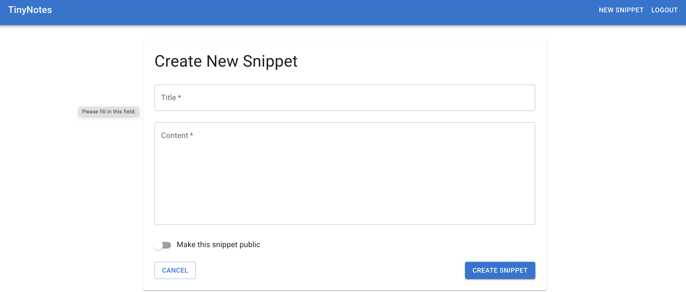
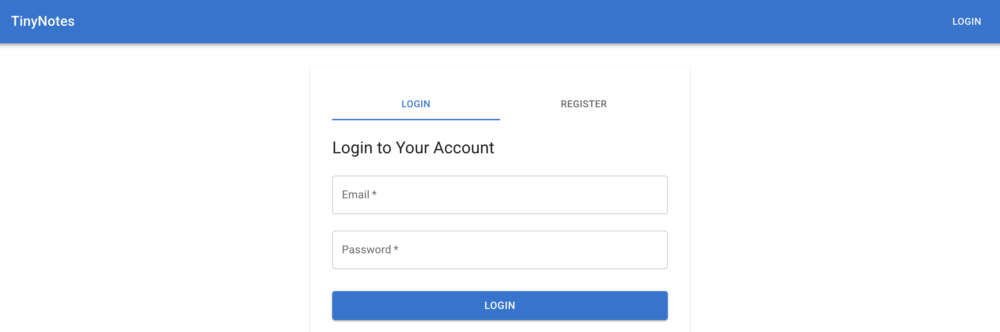

# TinyNotes

This is a quick demo to show how fast it is to create a (slightly) non-trivial web app using LLMs primarily for the purposes of evaluating how secure LLM-generated code is.

There is a short functional specification for the app listed in [FunctionalSpec.md](FunctionalSpec.md). This doc does not specify the technical solution.

[TechDefinition.md](TechDefinition.md) contains a brief "recipe" for an LLM to create a technical architecture using a given stack (e.g., NextJS) based on the functional spec.

I ran this recipe to create [Architecture.md](Architecture.md) (one-shot chat log in [Setup Cline Session Log.md](Setup%20Cline%20Session%20Log.md))

I then asked Cline to create an app based on [FunctionalSpec.md](FunctionalSpec.md) and [Architecture.md](Architecture.md) (see [Build Cline Session Log.md](Build%20Cline%20Session%20Log.md)).

This took about 30 minutes and generated the app you see here. It ran first time.

The resulting app should be complex enough to be susceptible to most of the OWASP Top 10, but the "build process" is cheap enough to repeat through multiple iterations with multiple LLMs and languages/frameworks.

Further work involves assessing the security of the generated codebase to make judgments about the security capabilities of LLMs and how those capabilities change across frameworks.
