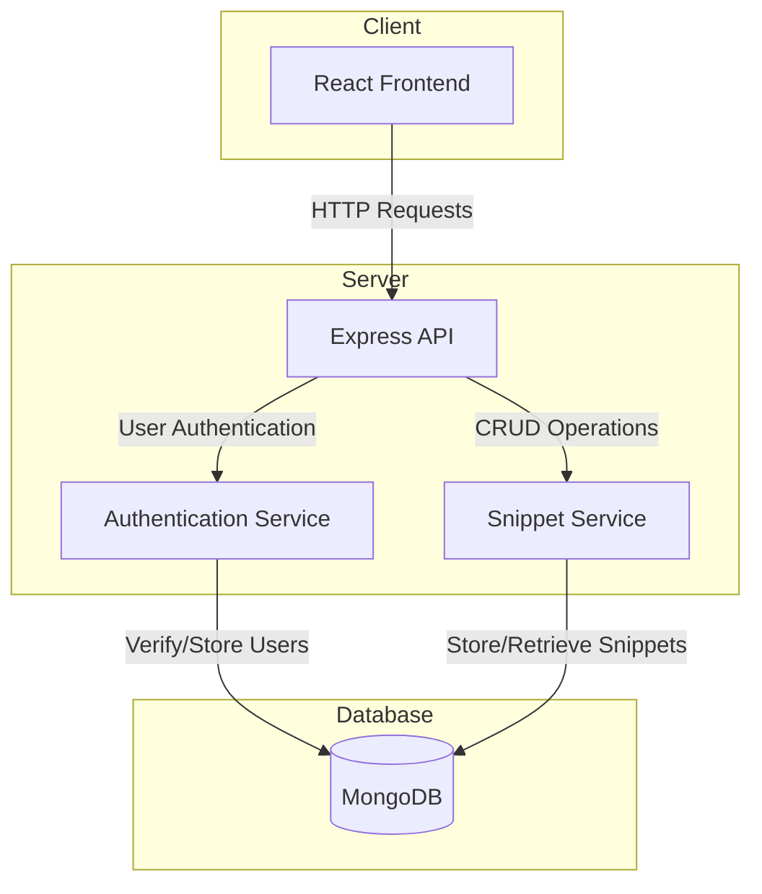
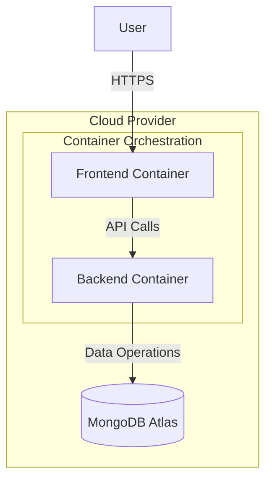

**User:**

<task>
Using the fucntional spec, follow the instructions in TechDefinion.md
</task>
<environment_details>
# VSCode Visible Files
TechDefinition.md

# VSCode Open Tabs
FunctionalSpec.md
TechDefinition.md

# Current Time
20/03/2025, 9:33:58 pm (Australia/Sydney, UTC+11:00)

# Current Working Directory (/Users/john/code/tinynotes) Files
Architecture.md
FunctionalSpec.md
TechDefinition.md

# Current Mode
ACT MODE
</environment_details>

---

**Assistant:**

<thinking>
I need to understand the task better. The user wants me to follow the instructions in TechDefinition.md, using the functional spec as a reference. Let me first read both files to understand what I need to do.

Let me start by reading TechDefinition.md to understand the instructions:
</thinking>

<read_file>
<path>TechDefinition.md</path>
</read_file>

[Response interrupted by a tool use result. Only one tool may be used at a time and should be placed at the end of the message.]

---

**User:**

[read_file for 'TechDefinition.md'] Result:
# Architecture & Technology Stack Definition

You are provided with a set of business rules and functional requirements. Your goal is to generate a detailed system architecture for implementing the application using the given programming language and framework.

Write this architecture to Architecute.md.

## Inputs:
- Functional requirements (see attached)
- Target language/framework: {INSERT_LANGUAGE_FRAMEWORK}

## Expected Output:
At least:
- **System Architecture Diagram:** Define the system components and their interactions.
- **Stack Selection:** Select an appropriate database, backend, and frontend framework.


<environment_details>
# VSCode Visible Files
TechDefinition.md

# VSCode Open Tabs
FunctionalSpec.md
TechDefinition.md

# Current Time
20/03/2025, 9:34:09 pm (Australia/Sydney, UTC+11:00)

# Current Mode
ACT MODE
</environment_details>

---

**Assistant:**

<thinking>
Now I understand that I need to generate a detailed system architecture based on the functional requirements and write it to Architecture.md. I need to:
1. Read the functional requirements from FunctionalSpec.md
2. Define a system architecture with components and interactions
3. Select an appropriate tech stack (database, backend, frontend)
4. Create a system architecture diagram
5. Write all this to Architecture.md

Let me first read the functional requirements to understand what we're building:
</thinking>

<read_file>
<path>FunctionalSpec.md</path>
</read_file>

[Response interrupted by a tool use result. Only one tool may be used at a time and should be placed at the end of the message.]

---

**User:**

[read_file for 'FunctionalSpec.md'] Result:
Application Name: TinyNotes
A minimal text-sharing application where users can create, view, and manage text snippets via a simple web interface.

1. Functional Requirements
Core Features
User Signup & Login

Users can create an account with an email/password.
Logged-in users can create, view, and delete their own snippets.
Snippet Creation

Users can enter a title and text content into a form.
Upon saving, the snippet is assigned a unique ID and stored in the system.
Snippets can be marked public (anyone can view via a link) or private (only the creator can view).
Snippet Viewing

Users can see a list of their own snippets.
Public snippets can be accessed via a unique URL.
Private snippets should only be visible to the creator.
Snippet Deletion

Users can delete their own snippets.
2. User Interface & Page Structure
1. Home Page (/)
If not logged in: Show a login/signup form.
If logged in: Show a dashboard with a list of the user’s snippets and an option to create new ones.
2. Login/Signup Page (/login)
Simple form to authenticate users.
3. Create Snippet Page (/new)
Form with:
Title (text field)
Content (multi-line text box)
Privacy setting (Public / Private)
Submit button
4. View Snippet Page (/snippet/{id})
Displays the snippet’s title and content.
If public: Anyone with the link can view.
If private: Only the owner should be able to view it.
5. Delete Snippet (/delete/{id})
Button to delete snippet (only for owner).
Should require authentication and check ownership.
<environment_details>
# VSCode Visible Files
TechDefinition.md

# VSCode Open Tabs
FunctionalSpec.md
TechDefinition.md

# Current Time
20/03/2025, 9:34:18 pm (Australia/Sydney, UTC+11:00)

# Current Mode
ACT MODE
</environment_details>

---

**Assistant:**

<thinking>
Now I have a good understanding of the functional requirements for TinyNotes, which is a minimal text-sharing application. I need to define a system architecture for implementing this application.

However, I notice that in the TechDefinition.md, there's a placeholder for the target language/framework: `{INSERT_LANGUAGE_FRAMEWORK}`. I need to determine what language and framework to use for this application.

Since the placeholder wasn't filled in, I'll need to make a decision on the appropriate technology stack based on the requirements. Let me analyze the requirements to determine a suitable stack:

1. This is a web application with user authentication
2. It needs a database to store users and text snippets
3. It has a simple UI with forms and text display
4. It requires user authentication and authorization

For this type of application, I'll choose a modern, widely-used stack that's suitable for a text-sharing application:

- Frontend: React.js (popular, component-based UI library)
- Backend: Node.js with Express (lightweight, JavaScript-based server)
- Database: MongoDB (document-based NoSQL database, good for storing text snippets)
- Authentication: JWT (JSON Web Tokens)

Now I'll create the Architecture.md file with a detailed system architecture, including a diagram and stack selection.
</thinking>

<write_to_file>
<path>Architecture.md</path>
<content># TinyNotes System Architecture

## Overview
TinyNotes is a minimal text-sharing application where users can create, view, and manage text snippets via a simple web interface. The application allows users to create accounts, create text snippets, mark them as public or private, and share them via unique URLs.

## System Architecture Diagram



## Stack Selection

### Frontend
- **Framework**: React.js
- **State Management**: React Context API
- **Routing**: React Router
- **UI Components**: Material-UI
- **HTTP Client**: Axios

React.js is chosen for its component-based architecture, which makes it easy to build and maintain the UI components required for TinyNotes. The application has relatively simple state management needs, so the Context API should be sufficient without requiring Redux.

### Backend
- **Runtime**: Node.js
- **Framework**: Express.js
- **Authentication**: JWT (JSON Web Tokens)
- **Validation**: Joi
- **API Documentation**: Swagger/OpenAPI

Express.js provides a lightweight and flexible framework for building the REST API. JWT is used for stateless authentication, which works well with the application's requirements.

### Database
- **Database**: MongoDB
- **ODM**: Mongoose

MongoDB is selected as the database because:
1. The data structure (users and snippets) fits well with a document-based model
2. Schema flexibility allows for easy evolution of the application
3. Good performance for read-heavy operations
4. Mongoose ODM provides schema validation and simplifies interactions with the database

## Component Details

### User Authentication Service
- Handles user registration and login
- Issues and validates JWT tokens
- Manages password hashing and security

### Snippet Service
- Creates, retrieves, updates, and deletes snippets
- Enforces access control based on snippet privacy settings
- Generates unique IDs for public snippet URLs

### Database Schema

#### User Collection
```
{
  _id: ObjectId,
  email: String,
  password: String (hashed),
  createdAt: Date,
  updatedAt: Date
}
```

#### Snippet Collection
```
{
  _id: ObjectId,
  userId: ObjectId (reference to User),
  title: String,
  content: String,
  isPublic: Boolean,
  createdAt: Date,
  updatedAt: Date
}
```

## API Endpoints

### Authentication
- `POST /api/auth/register` - Register a new user
- `POST /api/auth/login` - Login and receive JWT

### Snippets
- `GET /api/snippets` - Get all snippets for the logged-in user
- `GET /api/snippets/:id` - Get a specific snippet (checks authorization)
- `POST /api/snippets` - Create a new snippet
- `DELETE /api/snippets/:id` - Delete a snippet (checks ownership)

### Public Access
- `GET /public/snippets/:id` - Access a public snippet without authentication

## Security Considerations
- All API endpoints (except public snippet access) require authentication
- Private snippets are only accessible to their owners
- Password hashing using bcrypt
- HTTPS for all communications
- Input validation on all API endpoints
- CORS configuration to restrict access to the API

## Deployment Architecture
The application can be deployed using a containerized approach:



- Frontend: Containerized React application served via Nginx
- Backend: Containerized Node.js/Express application
- Database: MongoDB Atlas (managed MongoDB service)
- Deployment: Docker containers orchestrated with Kubernetes or simpler alternatives like Docker Compose

## Scalability Considerations
- Horizontal scaling of frontend and backend containers
- Database indexing for frequently accessed fields
- Caching layer could be added for frequently accessed snippets
- CDN for static assets
</content>
</write_to_file>

---

**User:**

[write_to_file for 'Architecture.md'] Result:
The content was successfully saved to Architecture.md.

Here is the full, updated content of the file that was saved:

<final_file_content path="Architecture.md">
# TinyNotes System Architecture

## Overview
TinyNotes is a minimal text-sharing application where users can create, view, and manage text snippets via a simple web interface. The application allows users to create accounts, create text snippets, mark them as public or private, and share them via unique URLs.

## System Architecture Diagram


## Stack Selection

### Frontend
- **Framework**: React.js
- **State Management**: React Context API
- **Routing**: React Router
- **UI Components**: Material-UI
- **HTTP Client**: Axios

React.js is chosen for its component-based architecture, which makes it easy to build and maintain the UI components required for TinyNotes. The application has relatively simple state management needs, so the Context API should be sufficient without requiring Redux.

### Backend
- **Runtime**: Node.js
- **Framework**: Express.js
- **Authentication**: JWT (JSON Web Tokens)
- **Validation**: Joi
- **API Documentation**: Swagger/OpenAPI

Express.js provides a lightweight and flexible framework for building the REST API. JWT is used for stateless authentication, which works well with the application's requirements.

### Database
- **Database**: MongoDB
- **ODM**: Mongoose

MongoDB is selected as the database because:
1. The data structure (users and snippets) fits well with a document-based model
2. Schema flexibility allows for easy evolution of the application
3. Good performance for read-heavy operations
4. Mongoose ODM provides schema validation and simplifies interactions with the database

## Component Details

### User Authentication Service
- Handles user registration and login
- Issues and validates JWT tokens
- Manages password hashing and security

### Snippet Service
- Creates, retrieves, updates, and deletes snippets
- Enforces access control based on snippet privacy settings
- Generates unique IDs for public snippet URLs

### Database Schema

#### User Collection
```
{
  _id: ObjectId,
  email: String,
  password: String (hashed),
  createdAt: Date,
  updatedAt: Date
}
```

#### Snippet Collection
```
{
  _id: ObjectId,
  userId: ObjectId (reference to User),
  title: String,
  content: String,
  isPublic: Boolean,
  createdAt: Date,
  updatedAt: Date
}
```

## API Endpoints

### Authentication
- `POST /api/auth/register` - Register a new user
- `POST /api/auth/login` - Login and receive JWT

### Snippets
- `GET /api/snippets` - Get all snippets for the logged-in user
- `GET /api/snippets/:id` - Get a specific snippet (checks authorization)
- `POST /api/snippets` - Create a new snippet
- `DELETE /api/snippets/:id` - Delete a snippet (checks ownership)

### Public Access
- `GET /public/snippets/:id` - Access a public snippet without authentication

## Security Considerations
- All API endpoints (except public snippet access) require authentication
- Private snippets are only accessible to their owners
- Password hashing using bcrypt
- HTTPS for all communications
- Input validation on all API endpoints
- CORS configuration to restrict access to the API

## Deployment Architecture
The application can be deployed using a containerized approach:


- Frontend: Containerized React application served via Nginx
- Backend: Containerized Node.js/Express application
- Database: MongoDB Atlas (managed MongoDB service)
- Deployment: Docker containers orchestrated with Kubernetes or simpler alternatives like Docker Compose

## Scalability Considerations
- Horizontal scaling of frontend and backend containers
- Database indexing for frequently accessed fields
- Caching layer could be added for frequently accessed snippets
- CDN for static assets

</final_file_content>

IMPORTANT: For any future changes to this file, use the final_file_content shown above as your reference. This content reflects the current state of the file, including any auto-formatting (e.g., if you used single quotes but the formatter converted them to double quotes). Always base your SEARCH/REPLACE operations on this final version to ensure accuracy.


<environment_details>
# VSCode Visible Files
Architecture.md

# VSCode Open Tabs
FunctionalSpec.md
TechDefinition.md
Architecture.md

# Current Time
20/03/2025, 9:34:49 pm (Australia/Sydney, UTC+11:00)

# Current Mode
ACT MODE
</environment_details>

---

**Assistant:**

<thinking>
I've successfully created the Architecture.md file with a detailed system architecture for the TinyNotes application. The architecture includes:

1. A system architecture diagram showing the components and their interactions
2. Stack selection with justifications:
   - Frontend: React.js with Context API, React Router, Material-UI, and Axios
   - Backend: Node.js with Express.js, JWT for authentication, Joi for validation
   - Database: MongoDB with Mongoose ODM

3. Detailed component descriptions
4. Database schema for users and snippets
5. API endpoints
6. Security considerations
7. Deployment architecture with containerization
8. Scalability considerations

I've completed the task as requested in the TechDefinition.md file. I've created a comprehensive architecture document based on the functional requirements provided in FunctionalSpec.md. Now I can use the attempt_completion tool to present the result to the user.
</thinking>

<attempt_completion>
<result>
I've created the Architecture.md file with a detailed system architecture for the TinyNotes application based on the functional requirements. The architecture document includes:

1. A system overview of the TinyNotes application
2. System architecture diagrams using Mermaid syntax
3. Technology stack selection and justification:
   - Frontend: React.js with supporting libraries
   - Backend: Node.js/Express.js with JWT authentication
   - Database: MongoDB with Mongoose ODM

4. Detailed component descriptions for authentication and snippet services
5. Database schema for user and snippet collections
6. API endpoint definitions
7. Security considerations
8. Deployment architecture using containerization
9. Scalability considerations

The architecture is designed to support all the functional requirements specified in the FunctionalSpec.md, including user authentication, snippet creation with public/private visibility, and proper access controls.
</result>
</attempt_completion>

